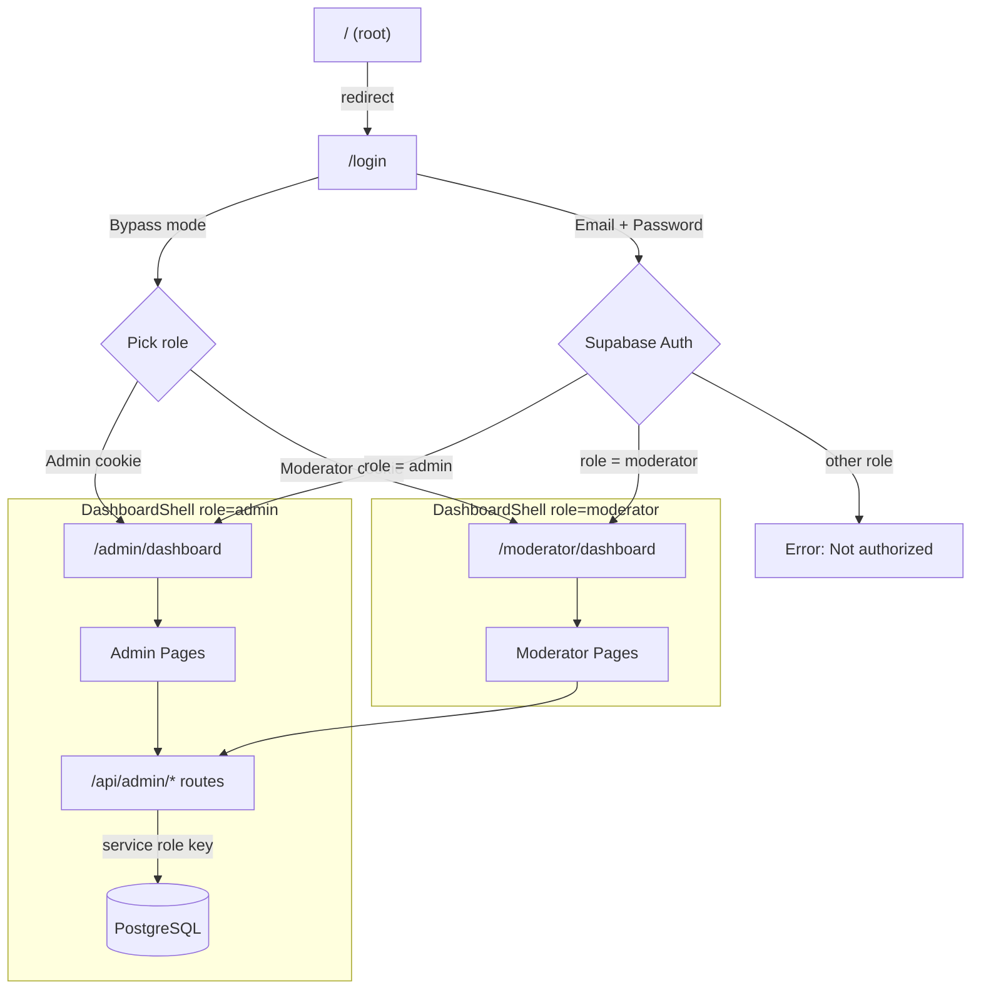
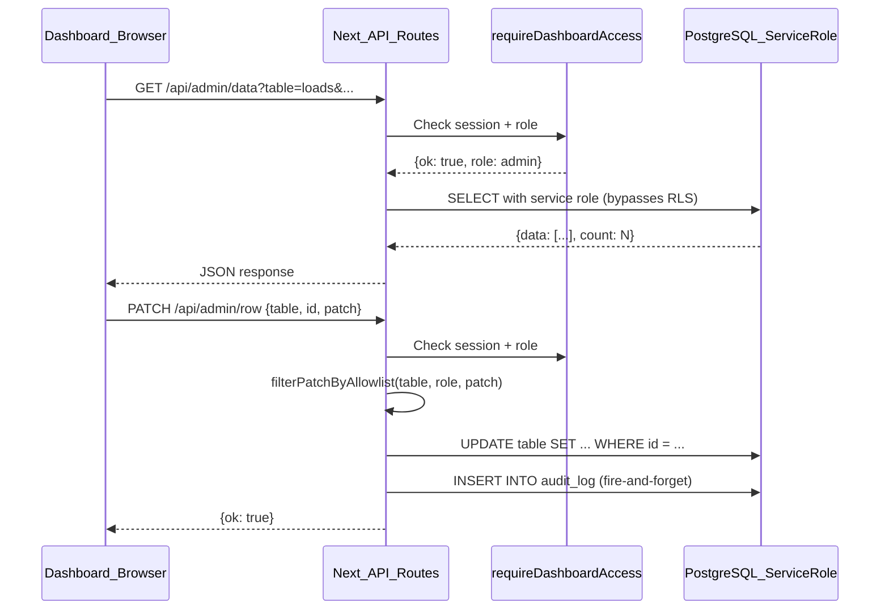
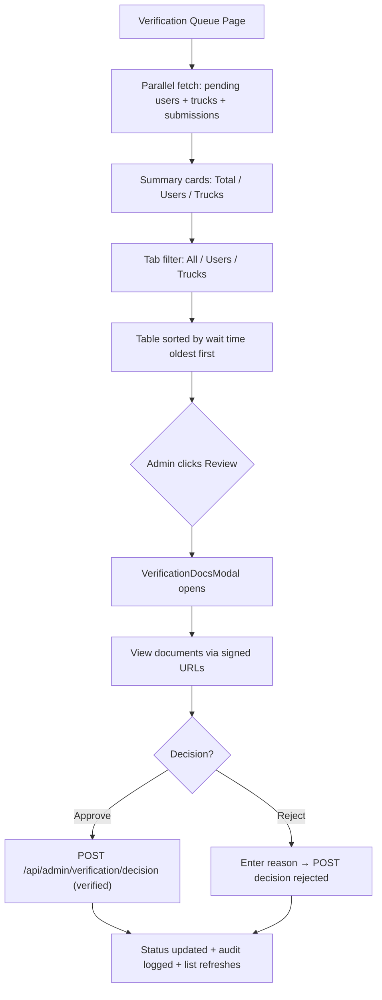
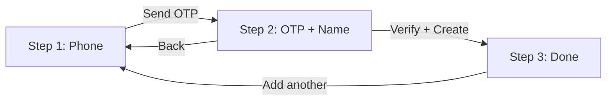
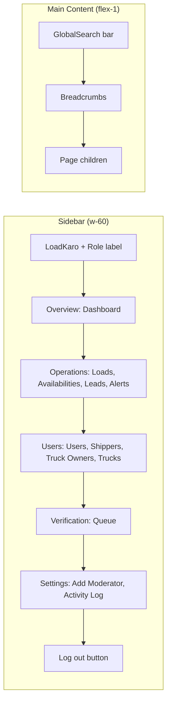
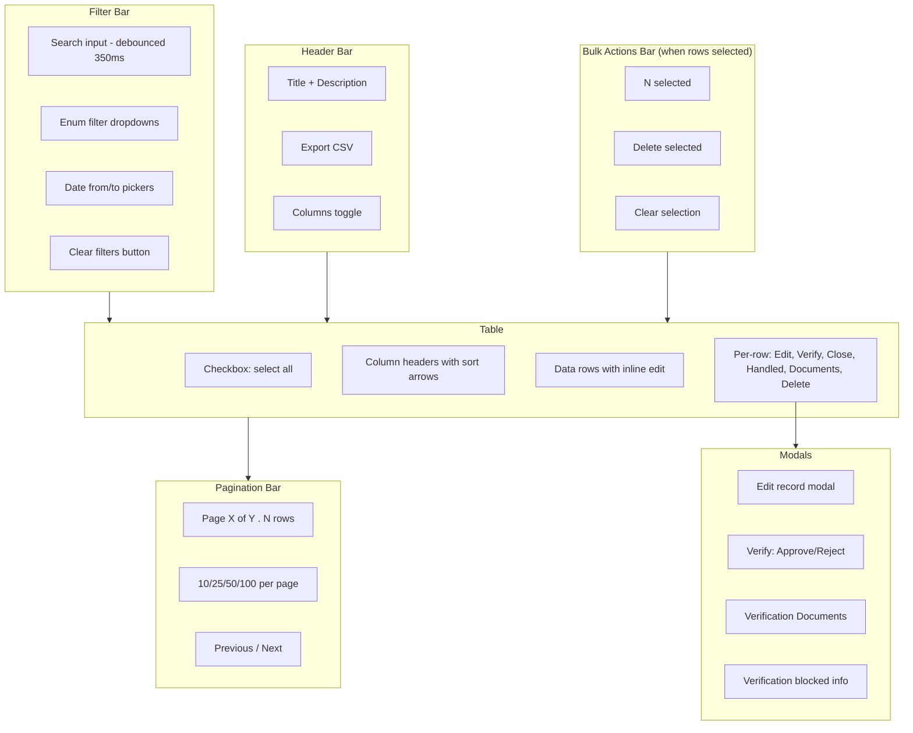

# Admin & Moderator Dashboard — Technical Documentation

> **Project:** LoadKaro Admin Dashboard  
> **Location:** `admin-dashboard/`  
> **Version:** 0.1.0  
> **Generated:** April 2026

---

## 1. Project Overview

### Tech Stack

| Layer | Technology | Version |
|---|---|---|
| Framework | Next.js (App Router) | 16.2.2 |
| UI Library | React | 19.2.4 |
| Language | TypeScript | ^5 |
| Backend-as-a-Service | Supabase (`@supabase/ssr` + `@supabase/supabase-js`) | ^0.10.0 / ^2.101.1 |
| Styling | Tailwind CSS | ^4 |
| Component Library | shadcn/ui (base-nova style) | ^4.1.2 |
| Table Engine | @tanstack/react-table (legacy ShippersTable only) | ^8.21.3 |
| Icons | lucide-react | ^1.7.0 |
| Fonts | Roboto (via `next/font/google`) + Geist Mono | — |

### Application Flow



All data operations go through `/api/admin/*` API routes which use the Supabase **service role key** to bypass RLS. The dashboard shares the same Supabase project as the LoadKaro mobile app (Expo/React Native).

### API Data Flow



---

## 2. Architecture

### 2.1 App Router Structure

```
src/app/
├── layout.tsx              # RootLayout (fonts, metadata, global CSS)
├── page.tsx                # Redirect → /login
├── globals.css             # Tailwind + shadcn CSS variables
├── login/page.tsx          # Auth page (bypass buttons + Supabase login form)
├── admin/
│   ├── layout.tsx          # DashboardShell(role="admin")
│   ├── dashboard/page.tsx  # Stats overview (server component)
│   ├── users/page.tsx      # Users table (CommonDataTable)
│   ├── users/[id]/page.tsx # User detail page
│   ├── shippers/page.tsx   # Shippers table (filtered users)
│   ├── truck-owners/page.tsx # Truck owners table (filtered users)
│   ├── trucks/page.tsx     # Trucks table
│   ├── trucks/[id]/page.tsx# Truck detail page
│   ├── loads/page.tsx      # Loads table
│   ├── availabilities/page.tsx # Availabilities table
│   ├── leads/page.tsx      # Leads/Interests table
│   ├── alerts/page.tsx     # Admin alerts table
│   ├── verifications/page.tsx # Verification queue
│   ├── add-moderator/page.tsx # OTP-based moderator creation
│   └── activity-log/page.tsx  # Audit trail viewer
├── moderator/
│   ├── layout.tsx          # DashboardShell(role="moderator")
│   ├── dashboard/page.tsx  # Stats overview (server component)
│   ├── users/page.tsx      # Users (read-only)
│   ├── shippers/page.tsx   # Shippers (read-only)
│   ├── truck-owners/page.tsx # Truck owners (read-only)
│   ├── trucks/page.tsx     # Trucks (read-only)
│   ├── loads/page.tsx      # Loads (read-only)
│   ├── availabilities/page.tsx # Availabilities (read-only)
│   └── verifications/page.tsx  # Verification queue
└── api/admin/
    ├── data/route.ts       # GET: universal data fetcher
    ├── row/route.ts        # PATCH + DELETE: row mutations
    ├── search/route.ts     # GET: global search
    ├── moderator/
    │   ├── send-otp/route.ts   # POST: send OTP
    │   └── create/route.ts     # POST: verify OTP + create moderator
    └── verification/
        ├── submissions/route.ts  # GET: list submissions
        ├── documents/route.ts    # GET: list documents
        ├── signed-url/route.ts   # POST: get signed storage URL
        └── decision/route.ts     # POST: approve/reject verification
```

### 2.2 Authentication Architecture

**Two modes:**

1. **Bypass mode** (local dev): `DASHBOARD_BYPASS_AUTH=true` + `NEXT_PUBLIC_DASHBOARD_BYPASS_AUTH=true`
   - No Supabase login required
   - Role is stored in `lk-bypass-role` cookie (set on /login click)
   - Middleware passes through without checking session
   - API routes still use `requireDashboardAccess()` but return bypass role

2. **Real Supabase session** (production):
   - Middleware intercepts `/admin/*`, `/moderator/*`, `/login`, `/api/admin/*`
   - Creates a Supabase SSR client bound to request cookies
   - Calls `supabase.auth.getUser()` → fetches `public.users.role`
   - Only `admin` can access `/admin/*`; only `moderator` can access `/moderator/*`
   - Redirects unauthorized users to `/login?next=...`
   - Already-logged-in users on `/login` are redirected to their dashboard

**Auth chain for API routes:**
```
Request → requireDashboardAccess() →
  if bypass: return { ok: true, role: cookie-role, userId: null }
  if real:   createSupabaseServerAuthClient() → getUser() → getDashboardRoleForUser()
           → return { ok: true, role, userId }
```

### 2.3 Service Role Pattern

All `/api/admin/*` routes use `createServiceRoleClient()` which creates a Supabase client with `SUPABASE_SERVICE_ROLE_KEY`. This bypasses Row Level Security (RLS) so the dashboard can read/write all rows regardless of which user is logged in. If the key is missing, routes return `503` with setup instructions.

### 2.4 CommonDataTable — Universal Table Component

Every list page in the dashboard (Users, Trucks, Loads, Availabilities, Shippers, Truck Owners, Leads, Alerts) uses `CommonDataTable`. It handles:
- Server-side pagination via `/api/admin/data`
- Column sorting, search, dropdown + date filters
- Inline editing (click for enums/booleans, double-click for text/number)
- Full-record edit modal
- Verification approve/reject modal
- Document review modal (VerificationDocsModal)
- Row selection + bulk delete
- CSV export
- Column visibility toggling
- Status badges with color coding
- Mark-as-handled action (for alerts)
- Close action (for loads/availabilities)

---

## 3. File Inventory

### Root Config Files

| File | Purpose |
|---|---|
| `package.json` | Dependencies and npm scripts (dev, build, start, lint) |
| `tsconfig.json` | TypeScript config with `@/*` path alias → `./src/*` |
| `next.config.ts` | Env var mapping (Expo→Next.js), Turbopack workspace root, allowed dev origins |
| `middleware.ts` | Auth guard for /admin/*, /moderator/*, /login, /api/admin/* |
| `components.json` | shadcn/ui configuration (base-nova style, Tailwind CSS vars, lucide icons) |
| `postcss.config.mjs` | PostCSS with @tailwindcss/postcss |
| `eslint.config.mjs` | ESLint with eslint-config-next |
| `next-env.d.ts` | Next.js TypeScript declarations |
| `.env` | Active environment variables (Supabase URL, keys, bypass flags) |
| `.env.example` | Template for NEXT_PUBLIC_SUPABASE_URL, anon key, service role |
| `.env.local.example` | Template showing both Next.js and Expo-style env var names |
| `.gitignore` | Standard Next.js ignores |
| `AGENTS.md` | Cursor agent instructions for Next.js 16 breaking changes |
| `CLAUDE.md` | References AGENTS.md for AI coding assistants |
| `README.md` | Project readme |

### Source Files — App (Pages & Layouts)

| File | Purpose |
|---|---|
| `src/app/layout.tsx` | Root layout: Roboto + Geist Mono fonts, metadata, body styling |
| `src/app/page.tsx` | Root redirect → `/login` |
| `src/app/globals.css` | Tailwind imports, CSS custom properties (light/dark), font stack |
| `src/app/login/page.tsx` | Login page: bypass buttons (dev) + email/password Supabase form |
| `src/app/admin/layout.tsx` | Admin layout wrapper → `DashboardShell(role="admin")` |
| `src/app/admin/dashboard/page.tsx` | Admin dashboard: server component, `fetchDashboardStats()` → `StatsGrid` |
| `src/app/admin/users/page.tsx` | Admin users list: `CommonDataTable` with role+verification filters, editable |
| `src/app/admin/users/[id]/page.tsx` | Admin user detail: profile, trucks, loads, verifications, audit log |
| `src/app/admin/shippers/page.tsx` | Admin shippers: `CommonDataTable` filtered to `role=shipper`, date filter |
| `src/app/admin/truck-owners/page.tsx` | Admin truck owners: `CommonDataTable` filtered to `role=truck_owner`, date filter |
| `src/app/admin/trucks/page.tsx` | Admin trucks list: `CommonDataTable` with joins to variants+owners |
| `src/app/admin/trucks/[id]/page.tsx` | Admin truck detail: specs, owner, availabilities, verifications, audit log |
| `src/app/admin/loads/page.tsx` | Admin loads list: `CommonDataTable` with route, payment, status columns |
| `src/app/admin/availabilities/page.tsx` | Admin availabilities: `CommonDataTable` with truck, owner, route, rate columns |
| `src/app/admin/leads/page.tsx` | Admin leads/interests: `CommonDataTable` with custom `renderCell` for parties |
| `src/app/admin/alerts/page.tsx` | Admin alerts: `CommonDataTable` with embedded load details, mark-handled |
| `src/app/admin/verifications/page.tsx` | Admin verification queue: custom page with summary cards, tabs, VerificationDocsModal |
| `src/app/admin/activity-log/page.tsx` | Admin audit trail: paginated, filtered by action/entity/date |
| `src/app/admin/add-moderator/page.tsx` | Admin add moderator: 3-step wizard (phone → OTP → done) |
| `src/app/moderator/layout.tsx` | Moderator layout wrapper → `DashboardShell(role="moderator")` |
| `src/app/moderator/dashboard/page.tsx` | Moderator dashboard: same StatsGrid, different description |
| `src/app/moderator/users/page.tsx` | Moderator users: read-only `CommonDataTable`, all editable=false |
| `src/app/moderator/shippers/page.tsx` | Moderator shippers: read-only `CommonDataTable` |
| `src/app/moderator/truck-owners/page.tsx` | Moderator truck owners: read-only `CommonDataTable` |
| `src/app/moderator/trucks/page.tsx` | Moderator trucks: read-only `CommonDataTable` |
| `src/app/moderator/loads/page.tsx` | Moderator loads: read-only `CommonDataTable` |
| `src/app/moderator/availabilities/page.tsx` | Moderator availabilities: read-only `CommonDataTable` |
| `src/app/moderator/verifications/page.tsx` | Moderator verification queue: simplified version (no submission lookup) |

### Source Files — API Routes

| File | Purpose |
|---|---|
| `src/app/api/admin/data/route.ts` | GET: universal paginated data fetch from any allowed table |
| `src/app/api/admin/row/route.ts` | PATCH: update a row; DELETE: delete a row (admin only) |
| `src/app/api/admin/search/route.ts` | GET: global search across users, trucks, loads |
| `src/app/api/admin/moderator/send-otp/route.ts` | POST: send OTP to phone for new moderator |
| `src/app/api/admin/moderator/create/route.ts` | POST: verify OTP + create/upgrade moderator account |
| `src/app/api/admin/verification/submissions/route.ts` | GET: list verification submissions by entity |
| `src/app/api/admin/verification/documents/route.ts` | GET: list documents for a submission |
| `src/app/api/admin/verification/signed-url/route.ts` | POST: generate signed URL for private storage object |
| `src/app/api/admin/verification/decision/route.ts` | POST: approve or reject a verification submission |

### Source Files — Components

| File | Purpose |
|---|---|
| `src/components/dashboard/dashboard-shell.tsx` | Main layout shell: sidebar nav, global search, breadcrumbs, logout |
| `src/components/dashboard/stats-grid.tsx` | Dashboard KPI cards + breakdown bars (users by role, loads by status) |
| `src/components/dashboard/global-search.tsx` | Cmd+K search bar with debounced API calls and keyboard navigation |
| `src/components/admin/common-data-table.tsx` | Universal CRUD data table (1400 lines) — the core UI component |
| `src/components/admin/verification-docs-modal.tsx` | Modal: list submissions, view documents via signed URLs, approve/reject |
| `src/components/shippers/shippers-table.tsx` | Legacy TanStack Table-based shipper table (kept for reference) |
| `src/components/placeholders/coming-soon.tsx` | Simple placeholder card for unimplemented sections |

### Source Files — UI Primitives (shadcn/ui)

| File | Purpose |
|---|---|
| `src/components/ui/button.tsx` | Button with variants: default, destructive, outline, secondary, ghost, link |
| `src/components/ui/card.tsx` | Card, CardHeader, CardTitle, CardDescription, CardContent, CardFooter |
| `src/components/ui/input.tsx` | Styled text input |
| `src/components/ui/label.tsx` | Form label |
| `src/components/ui/select.tsx` | Select dropdown (radix-based) |
| `src/components/ui/table.tsx` | Table, TableHeader, TableBody, TableRow, TableHead, TableCell, TableCaption, TableFooter |
| `src/components/ui/dialog.tsx` | Dialog (modal) with overlay, content, header, footer, title, description |
| `src/components/ui/alert-dialog.tsx` | Confirmation dialog with action/cancel buttons |
| `src/components/ui/badge.tsx` | Inline badge with variant support |
| `src/components/ui/separator.tsx` | Horizontal/vertical line separator |
| `src/components/ui/scroll-area.tsx` | Custom scrollbar wrapper |

### Source Files — Library / Auth Layer

| File | Purpose |
|---|---|
| `src/lib/auth/dashboard-access.ts` | `requireDashboardAccess()` — unified auth gate for API routes (bypass + real) |
| `src/lib/auth/bypass.ts` | `isDashboardAuthBypassed()`, `BYPASS_ROLE_COOKIE`, `parseBypassRole()` |
| `src/lib/auth/dashboard-role.ts` | `DashboardRole` type, `getDashboardRoleForUser()`, `requireDashboardAuth()` |
| `src/lib/supabase/service-role.ts` | `createServiceRoleClient()`, `hasServiceRoleKey()`, error messages |
| `src/lib/supabase/server.ts` | `createSupabaseServerClient()` — anon key server client for RSC |
| `src/lib/supabase/server-auth.ts` | `createSupabaseServerAuthClient()` — cookie-bound SSR client for auth |
| `src/lib/supabase/client.ts` | `createSupabaseBrowserClient()` — singleton browser client |
| `src/lib/supabase/env.ts` | `getSupabaseEnv()` — resolves URL + anon key from NEXT_PUBLIC or EXPO_PUBLIC vars |
| `src/lib/admin/patch-allowlist.ts` | `filterPatchByAllowlist()` — per-table, per-role column allowlists for PATCH |
| `src/lib/audit.ts` | `writeAuditLog()` — inserts into `audit_log` table via service role |
| `src/lib/supabase/queries/stats.ts` | `fetchDashboardStats()` — counts all entities for the dashboard page |
| `src/lib/schema/enums.ts` | Canonical enum arrays: user roles, verification statuses, truck categories, etc. |
| `src/lib/utils.ts` | `cn()` — Tailwind class merge utility |

### Source Files — Types

| File | Purpose |
|---|---|
| `src/types/users.ts` | `UserRow` type, re-exports `ROLE_OPTIONS` and `VERIFICATION_OPTIONS` |

---

## 4. Pages

### 4.1 Login Page

- **Path:** `src/app/login/page.tsx`
- **URL:** `/login`
- **Component type:** Client component (`"use client"`)
- **Props/params:** None
- **Data fetching:** `supabase.auth.signInWithPassword()` on form submit; then `supabase.from("users").select("role")` to validate dashboard access
- **User interactions:**
  - **Bypass mode:** Two buttons — "Open admin dashboard" (sets `lk-bypass-role=admin` cookie, navigates to `/admin/dashboard`) and "Open moderator dashboard" (same with `moderator`)
  - **Real mode:** Email + password form → sign in → check role → redirect to `/admin/dashboard` or `/moderator/dashboard`
  - Error display for invalid credentials, non-admin/moderator accounts
- **Conditional rendering:** Bypass buttons shown only when `NEXT_PUBLIC_DASHBOARD_BYPASS_AUTH === "true"`; email/password form always shown (with separator when bypass is active)

### 4.2 Admin Dashboard

- **Path:** `src/app/admin/dashboard/page.tsx`
- **URL:** `/admin/dashboard`
- **Component type:** Server component (`async function`)
- **Data fetching:** `fetchDashboardStats()` — 11 parallel Supabase count queries (totalUsers, totalTrucks, totalLoads, totalAvailabilities, openLoads, activeAvailabilities, pendingUserVerifications, pendingTruckVerifications, unhandledAlerts, usersByRole breakdown, loadsByStatus breakdown)
- **Renders:** `StatsGrid` with `basePath="/admin"` — 8 KPI cards (4 totals + 4 operational) and 2 breakdown bars (users by role, loads by status)
- **Error handling:** Try/catch wraps stats fetch; error string passed to StatsGrid for display

### 4.3 Moderator Dashboard

- **Path:** `src/app/moderator/dashboard/page.tsx`
- **URL:** `/moderator/dashboard`
- **Component type:** Server component
- **Data fetching:** Same `fetchDashboardStats()` as admin
- **Renders:** Same `StatsGrid` with `basePath="/moderator"`
- **Difference:** Description text says "approve / view only; destructive actions are disabled"

### 4.4 Admin Users Page

- **Path:** `src/app/admin/users/page.tsx`
- **URL:** `/admin/users`
- **Component type:** Client component
- **Configuration passed to CommonDataTable:**
  - `tableName="users"`, `role="admin"`
  - `selectQuery`: id, name, phone, role, verification_status, subscription_type, created_at
  - `search`: by phone
  - `filters`: Role (admin/moderator/shipper/truck_owner/broker), Verification (pending/verified/rejected/unverified)
  - `defaultSort`: created_at descending
  - `columns`: name (editable text), phone (read-only), role (editable enum), verification_status (editable enum), subscription_type (editable text), created_at (read-only)
  - `verificationColumn="verification_status"`, `verificationDocsEntityType="user"`
  - `allowDelete=true`, `adminOnlyEdit=true`, `useServiceRoleApi=true`

### 4.5 Admin User Detail Page

- **Path:** `src/app/admin/users/[id]/page.tsx`
- **URL:** `/admin/users/:id`
- **Component type:** Client component
- **Params:** `id` (UUID from URL)
- **Data fetching:** 5 parallel `fetch()` calls to `/api/admin/data` and `/api/admin/verification/submissions`:
  1. User profile (from `users` table, filtered by `id`)
  2. User's trucks (from `trucks`, filtered by `owner_id`, with variant display name)
  3. User's loads (from `loads`, filtered by `posted_by`, with origin/destination cities)
  4. Verification submissions (from `/api/admin/verification/submissions?entity_type=user&entity_id=...`)
  5. Audit log entries (from `audit_log`, filtered by `entity_id`)
- **Sections rendered:**
  - Profile header: name, phone, role, join date, verification status badge, "Documents" button
  - 4 info cards: Role, Subscription, Trucks count, Loads posted count
  - Trucks table (if any): category, variant, capacity, verification status, link to truck detail
  - Loads table (if any): category, route (origin→destination cities), loading date, status
  - Verification submissions table (if any): date, status, review decision
  - Activity history table (if any): date, action, entity type
  - `VerificationDocsModal` opened via "Documents" button
- **Not found state:** "User not found" with back link

### 4.6 Admin Shippers Page

- **Path:** `src/app/admin/shippers/page.tsx`
- **URL:** `/admin/shippers`
- **Component type:** Client component
- **CommonDataTable config:** Same as Users but pre-filtered with `Role=shipper` filter option, includes `dateFilter` for "Joined" on `created_at`

### 4.7 Admin Truck Owners Page

- **Path:** `src/app/admin/truck-owners/page.tsx`
- **URL:** `/admin/truck-owners`
- **Component type:** Client component
- **CommonDataTable config:** Same as Users but pre-filtered with `Role=truck_owner`, includes `dateFilter` for "Joined" on `created_at`

### 4.8 Admin Trucks Page

- **Path:** `src/app/admin/trucks/page.tsx`
- **URL:** `/admin/trucks`
- **Component type:** Client component
- **CommonDataTable config:**
  - `tableName="trucks"`, joins: `truck_variants(display_name)`, `users!trucks_owner_id_fkey(name)`
  - `search`: by category
  - `defaultSort`: created_at descending
  - `columns`: category (editable enum), variant (editable, custom accessor resolving display_name), capacity_tons (editable number), gps_available (editable boolean), permit_type (editable enum), owner_name (read-only accessor), verification_status (editable enum)
  - `verificationTriggerStatuses=["unverified"]` (verify button shows for "unverified" instead of "pending")
  - `allowDelete=true`, `verificationDocsEntityType="truck"`

### 4.9 Admin Truck Detail Page

- **Path:** `src/app/admin/trucks/[id]/page.tsx`
- **URL:** `/admin/trucks/:id`
- **Component type:** Client component
- **Params:** `id` (UUID)
- **Data fetching:** 4 parallel fetches:
  1. Truck profile (with variant display_name, owner id/name/phone)
  2. Availabilities for this truck (with origin/destination locations)
  3. Verification submissions
  4. Audit log entries
- **Sections:** Header (category · variant, capacity, permit, date), Specifications card (7 fields including axles/wheels/dimensions), Owner card (linked to user detail), Availabilities table, Verification submissions table, Activity history table, VerificationDocsModal

### 4.10 Admin Loads Page

- **Path:** `src/app/admin/loads/page.tsx`
- **URL:** `/admin/loads`
- **Component type:** Client component
- **CommonDataTable config:**
  - `tableName="loads"`, joins: `users!loads_posted_by_fkey(name)`, `origin:locations!loads_origin_location_id_fkey(city,state)`, `destination:locations!loads_destination_location_id_fkey(city,state)`
  - `search`: by truck_category_required
  - `filters`: Status (open/matched/cancelled/closed), Payment (advance/partial_advance/after_delivery)
  - `dateFilter`: "Loading date" on `loading_date`
  - `columns`: route (computed accessor), loading_date (editable text), truck_category_required (editable enum), capacity_required (editable number, formatted with "tons"), payment_type (editable enum), advance_percentage (editable number, hidden by default), rate_optional (editable number, formatted with ₹), status (editable enum), posted_by_name (read-only accessor), created_at age (hidden by default, computed "Xd ago")
  - `statusCloseColumn="status"`, `closeValue="closed"` — enables "Close" button
  - `allowDelete=true`

### 4.11 Admin Availabilities Page

- **Path:** `src/app/admin/availabilities/page.tsx`
- **URL:** `/admin/availabilities`
- **Component type:** Client component
- **CommonDataTable config:**
  - `tableName="availabilities"`, joins: users (owner name), trucks (category + variant), origin/destination locations
  - `search`: by current_location
  - `filters`: Status (available/closed/cancelled)
  - `dateFilter`: "Available from" on `available_from`
  - `columns`: truck_display (computed), owner_display (computed), route_display (computed with fallbacks), available_from dates (computed range), days_remaining (computed), expected_rate (formatted ₹), preferred_destination_1/2 (hidden by default), status (editable enum)
  - `statusCloseColumn="status"`, `closeValue="closed"`

### 4.12 Admin Leads Page

- **Path:** `src/app/admin/leads/page.tsx`
- **URL:** `/admin/leads`
- **Component type:** Client component
- **CommonDataTable config:**
  - `tableName="interests"`, joins: `interested_user:users!interests_interested_by_fkey(name,phone,role)`, `contacted_user:users!interests_contacted_party_fkey(name,phone,role)`
  - `filters`: Status (interested/contacted/matched/expired)
  - `dateFilter`: "Date" on `created_at`
  - `columns`: interested_user_name (custom renderCell with name+role), contacted_user_name (custom renderCell with name+phone), type (renderCell showing Load/Availability badge), status (editable enum, custom renderCell), created_at (formatted date)

### 4.13 Admin Alerts Page

- **Path:** `src/app/admin/alerts/page.tsx`
- **URL:** `/admin/alerts`
- **Component type:** Client component
- **CommonDataTable config:**
  - `tableName="admin_alerts"`, joins: `load:loads!admin_alerts_load_id_fkey(posted_by,users!loads_posted_by_fkey(name),origin:locations!...(city,state),destination:locations!...(city,state))`
  - `search`: by load_id
  - `filters`: Status (Handled=true / Unhandled=false)
  - `columns`: shipper (renderCell: name from nested load.users, origin location), route (renderCell: from→to), created_at (renderCell: full datetime), is_handled (renderCell: Handled/Needs review badges), handled_at (renderCell: datetime), handled_by (renderCell: truncated UUID)
  - `markHandledColumn="is_handled"` — enables "Mark handled" button
  - Wrapped in `max-w-6xl` container

### 4.14 Admin Verifications Page



- **Path:** `src/app/admin/verifications/page.tsx`
- **URL:** `/admin/verifications`
- **Component type:** Client component (custom, not CommonDataTable)
- **Data fetching:** 4 parallel fetches:
  1. Users with `verification_status=pending` (via `/api/admin/data`)
  2. Trucks with `verification_status=pending` (via `/api/admin/data`)
  3. User verification submissions with `status=submitted` (via `/api/admin/verification/submissions`)
  4. Truck verification submissions with `status=submitted` (same API)
- **UI sections:**
  - 3 summary cards: Total pending, Users count, Trucks count
  - Tab bar: All / Users / Trucks
  - Table: Type badge, Name, Detail (role+phone or category), Submitted date, Waiting days (color-coded: red ≥3d, amber ≥1d), Review button
  - `VerificationDocsModal` opened on Review click; refreshes data after decision

### 4.15 Admin Activity Log Page

- **Path:** `src/app/admin/activity-log/page.tsx`
- **URL:** `/admin/activity-log`
- **Component type:** Client component (custom, not CommonDataTable)
- **Data fetching:** `/api/admin/data?table=audit_log` with pagination, sort by created_at desc, filters (action, entity_type, date range)
- **Filters:** Action dropdown (10 actions with styled labels), Entity dropdown (7 types), From/To date inputs, Clear button
- **Table columns:** When (datetime), Action (color-coded badge), Entity type, Entity ID (truncated UUID), Actor (role + truncated actor ID), Details (summary of changed fields or decision)
- **Pagination:** Page X of Y · N entries, Previous/Next buttons, 25 per page

### 4.16 Admin Add Moderator Page

- **Path:** `src/app/admin/add-moderator/page.tsx`
- **URL:** `/admin/add-moderator`
- **Component type:** Client component



- **3-step wizard:**
  1. **Phone step:** Input phone in international format (+91...), "Send OTP" button → `POST /api/admin/moderator/send-otp`
  2. **OTP step:** OTP input + moderator name input, "Verify & Create" button → `POST /api/admin/moderator/create`. Back button returns to step 1
  3. **Done step:** Success message, "Add another moderator" button resets wizard
- **Step indicator:** 3 dots with connecting lines showing progress
- **Error display:** Red box with error message at each step

### 4.17 Moderator Users Page

- **Path:** `src/app/moderator/users/page.tsx`
- **URL:** `/moderator/users`
- **Component type:** Client component
- **Difference from admin:** All columns have `editable: false`; no `allowDelete`; same filters and search

### 4.18 Moderator Shippers Page

- **Path:** `src/app/moderator/shippers/page.tsx`
- **URL:** `/moderator/shippers`
- **Component type:** Client component
- **Difference from admin:** All `editable: false`, no `allowDelete`, no role column, no date filter

### 4.19 Moderator Truck Owners Page

- **Path:** `src/app/moderator/truck-owners/page.tsx`
- **URL:** `/moderator/truck-owners`
- **Component type:** Client component
- **Difference from admin:** All `editable: false`, no `allowDelete`

### 4.20 Moderator Trucks Page

- **Path:** `src/app/moderator/trucks/page.tsx`
- **URL:** `/moderator/trucks`
- **Component type:** Client component
- **Difference from admin:** All `editable: false`, no `allowDelete`

### 4.21 Moderator Loads Page

- **Path:** `src/app/moderator/loads/page.tsx`
- **URL:** `/moderator/loads`
- **Component type:** Client component
- **Difference from admin:** All `editable: false`, fewer columns (no advance_percentage, no age), no `allowDelete`

### 4.22 Moderator Availabilities Page

- **Path:** `src/app/moderator/availabilities/page.tsx`
- **URL:** `/moderator/availabilities`
- **Component type:** Client component
- **Difference from admin:** All `editable: false`, fewer columns (no preferred destinations, no days remaining)

### 4.23 Moderator Verifications Page

- **Path:** `src/app/moderator/verifications/page.tsx`
- **URL:** `/moderator/verifications`
- **Component type:** Client component (custom)
- **Difference from admin:** Simplified — no submission lookup (uses entity created_at instead), same summary cards/tabs/table layout, same VerificationDocsModal integration

---

## 5. API Routes

### 5.1 GET `/api/admin/data`

**Purpose:** Universal paginated data fetcher for any allowed table.

**Auth:** `requireDashboardAccess()` — both admin and moderator (except `admin_alerts` which is admin-only).

**Query parameters:**

| Param | Type | Default | Description |
|---|---|---|---|
| `table` | string | — | Table name (must be in allowed set) |
| `select` | string | `*` | PostgREST select expression (columns, embeds) |
| `page` | number | 1 | Page number (1-indexed) |
| `pageSize` | number | 25 | Rows per page (max 100) |
| `sortColumn` | string | `id` | Column to sort by |
| `sortAsc` | string | `true` | `"true"` or `"false"` |
| `searchColumn` | string | — | Column to search in |
| `searchValue` | string | — | Search term (UUID → `.eq()`, otherwise → `.ilike()`) |
| `filters` | JSON string | `{}` | Key-value pairs for `.eq()` filters |
| `dateColumn` | string | — | Column for date range filter |
| `dateFrom` | string | — | Lower bound (`.gte()`) |
| `dateTo` | string | — | Upper bound (`.lte()`) |

**Allowed tables:** `loads`, `availabilities`, `trucks`, `users`, `admin_alerts`, `locations`, `truck_variants`, `verification_submissions`, `verification_documents`, `audit_log`, `interests`

**Admin-only tables:** `admin_alerts`

**Response:**
```json
{ "data": [...rows], "count": 123 }
```

**Supabase operations:** `supabase.from(table).select(selectRaw, { count: "exact" }).order(...).ilike/eq(...).gte/lte(...).range(from, to)`

### 5.2 PATCH `/api/admin/row`

**Purpose:** Update a single row in an allowed table.

**Auth:** `requireDashboardAccess()` — role checked against `filterPatchByAllowlist()`.

**Request body:**
```json
{
  "table": "users",
  "id": "uuid-string",
  "idField": "id",
  "patch": { "name": "New Name", "role": "moderator" }
}
```

**Allowed tables:** `loads`, `availabilities`, `trucks`, `users`, `admin_alerts`, `interests`

**Processing:**
1. Patch is filtered through `filterPatchByAllowlist(table, role, patch)` — only allowed columns pass
2. Special case: `admin_alerts` with `is_handled=true` auto-sets `handled_at` and `handled_by`
3. Derives audit action from patch content (e.g., `verify_user`, `mark_alert_handled`, `close_record`, `update_record`)
4. Writes audit log entry (fire-and-forget)

**Response:** `{ "ok": true }` or `{ "error": "message" }`

### 5.3 DELETE `/api/admin/row`

**Purpose:** Delete a single row.

**Auth:** Admin only (`access.role !== "admin"` → 403).

**Request body:**
```json
{ "table": "users", "id": "uuid-string", "idField": "id" }
```

**Restrictions:** Cannot delete from `admin_alerts` (admin-only table but delete forbidden).

**Audit:** Writes `delete_record` to audit log.

**Response:** `{ "ok": true }` or `{ "error": "message" }`

### 5.4 GET `/api/admin/search`

**Purpose:** Global cross-entity search.

**Auth:** `requireDashboardAccess()` (admin or moderator).

**Query parameters:** `q` — search term (min 2 chars).

**Search strategy:** 3 parallel queries:
- **Users:** `name.ilike.%q%,phone.ilike.%q%` (or `.eq("id", q)` if UUID)
- **Trucks:** `category.ilike.%q%` (or `.eq("id", q)` if UUID), includes owner name
- **Loads:** `truck_category_required.ilike.%q%` (or `.eq("id", q)` if UUID), includes origin/destination

**Response:**
```json
{
  "results": [
    { "type": "user", "id": "...", "title": "Name", "subtitle": "role · phone" },
    { "type": "truck", "id": "...", "title": "category · X tons", "subtitle": "Owner: name" },
    { "type": "load", "id": "...", "title": "category · status", "subtitle": "city → city · date" }
  ]
}
```

Each type limited to 5 results.

### 5.5 POST `/api/admin/moderator/send-otp`

**Purpose:** Send OTP to a phone number for new moderator creation.

**Auth:** Admin only.

**Request body:** `{ "phone": "+919876543210" }`

**Validation:** Phone must match `/^\+\d{10,15}$/`.

**Operations:**
1. Check if user with this phone already exists → 409 if so
2. `supabase.auth.signInWithOtp({ phone })` → sends SMS

**Response:** `{ "ok": true, "message": "OTP sent to +91..." }`

### 5.6 POST `/api/admin/moderator/create`

**Purpose:** Verify OTP and create moderator account.

**Auth:** Admin only.

**Request body:** `{ "phone": "+919876543210", "otp": "123456", "name": "Moderator Name" }`

**Operations:**
1. `supabase.auth.verifyOtp({ phone, token: otp, type: "sms" })` → get auth user
2. Check if `public.users` row exists for auth user ID
   - **Exists:** Update role to `moderator` and set name
   - **New:** Insert row with id, name, phone, role=moderator, verification_status=verified
3. Write `create_moderator` audit log entry

**Response:** `{ "ok": true, "message": "Moderator created: Name (phone)", "userId": "..." }`

### 5.7 GET `/api/admin/verification/submissions`

**Purpose:** List verification submissions for an entity.

**Auth:** `requireDashboardAccess()` (admin or moderator).

**Query parameters:**

| Param | Required | Description |
|---|---|---|
| `entity_type` | Yes | `"user"` or `"truck"` |
| `entity_id` | No | Filter to specific entity UUID |
| `status` | No | `"submitted"` or `"reviewed"` |

**Response:** `{ "data": [...submissions] }` ordered by `created_at` descending.

### 5.8 GET `/api/admin/verification/documents`

**Purpose:** List document rows for a specific verification submission.

**Auth:** `requireDashboardAccess()`.

**Query parameters:** `submission_id` (required).

**Response:** `{ "data": [...documents] }` ordered by `created_at` ascending. Each doc has: id, doc_key, original_filename, mime_type, size_bytes, bucket, path.

### 5.9 POST `/api/admin/verification/signed-url`

**Purpose:** Generate a short-lived signed URL for viewing a private storage object.

**Auth:** `requireDashboardAccess()`.

**Request body:** `{ "bucket": "verification-docs", "path": "some/file/path.pdf" }`

**Validation:** Only `verification-docs` bucket allowed.

**Operations:** `supabase.storage.from(bucket).createSignedUrl(path, 300)` — 5-minute expiry.

**Response:** `{ "signedUrl": "https://..." }`

### 5.10 POST `/api/admin/verification/decision`

**Purpose:** Approve or reject a verification submission.

**Auth:** `requireDashboardAccess()` (admin or moderator).

**Request body:**
```json
{
  "entity_type": "user",
  "entity_id": "uuid",
  "submission_id": "uuid",
  "decision": "verified",
  "reason": "optional rejection reason"
}
```

**Operations:**
1. Update entity's `verification_status` to `decision` value on `users` or `trucks` table
2. Update submission: status=reviewed, review_decision, reviewed_at, reviewed_by, rejection_reason
3. Write `review_verification` audit log entry

**Response:** `{ "ok": true }`

---

## 6. Components

### 6.1 DashboardShell

**File:** `src/components/dashboard/dashboard-shell.tsx`



**Props:**
| Prop | Type | Description |
|---|---|---|
| `role` | `"admin" \| "moderator"` | Determines sidebar nav items |
| `children` | `React.ReactNode` | Page content |

**Features:**
- **Sidebar (240px):** Logo area ("LoadKaro" + role label), navigation sections with dividers, logout button
- **Navigation sections (admin):** Overview (Dashboard), Operations (Loads, Availabilities, Leads, Alerts), Users & Vehicles (Users, Shippers, Truck Owners, Trucks), Verification (Verification Queue), Settings (Add Moderator, Activity Log)
- **Navigation sections (moderator):** Overview, Operations (Loads, Availabilities), Users & Vehicles (same 4), Verification (same)
- **Badges:** Live counts for Alerts and Verifications, polled every 60 seconds via `usePendingCounts()` hook. Uses browser Supabase client to count `admin_alerts.is_handled=false` + `users.verification_status=pending` + `trucks.verification_status=pending`
- **Active link:** Highlighted with dark background (`bg-[#111827] text-white`)
- **Global search:** Rendered at top of main content area
- **Breadcrumbs:** Auto-generated from URL path (e.g., Dashboard / Trucks / [id]). Skipped on dashboard page
- **Logout:** Signs out via `supabase.auth.signOut()`, redirects to `/login`

### 6.2 CommonDataTable

**File:** `src/components/admin/common-data-table.tsx`



**Exported types:**
- `TableColumn` — column definition
- `PAGE_SIZE_OPTIONS` — `[10, 25, 50, 100]`

**Props (full list):**

| Prop | Type | Default | Description |
|---|---|---|---|
| `role` | `"admin" \| "moderator"` | — | Current user's role |
| `title` | `string` | — | Page heading |
| `description` | `string` | — | Subheading |
| `tableName` | `string` | — | Supabase table to query |
| `tableCandidates` | `string[]` | `[]` | Fallback table names (tried in order if primary fails) |
| `selectQuery` | `string` | — | PostgREST select expression |
| `columns` | `TableColumn[]` | — | Column definitions |
| `search` | `{ column, placeholder }` | — | Search configuration |
| `filters` | `FilterDef[]` | `[]` | Dropdown filter definitions |
| `dateFilter` | `{ label, column }` | — | Date range filter config |
| `defaultSort` | `{ column, ascending? }` | — | Initial sort state |
| `idField` | `string` | `"id"` | Primary key column name |
| `verificationColumn` | `string` | — | Column holding verification status |
| `statusCloseColumn` | `string` | — | Column for "Close" action |
| `closeValue` | `string` | `"closed"` | Value to set on close |
| `allowDelete` | `boolean` | `false` | Show delete buttons |
| `adminOnlyEdit` | `boolean` | `true` | Only admin can edit |
| `markHandledColumn` | `string` | — | Column for mark-as-handled action |
| `verificationTriggerStatuses` | `string[]` | `["pending","unverified"]` | Statuses that show active Verify button |
| `verificationAlreadyVerifiedMessage` | `string` | `"User already verified."` | Toast for verified items |
| `verificationRejectedMessage` | `string` | `"This record was rejected."` | Toast for rejected items |
| `verificationUnavailableMessage` | `string` | `"No verification action..."` | Toast for other statuses |
| `useServiceRoleApi` | `boolean` | `false` | Use `/api/admin/data` instead of direct Supabase |
| `verificationDocsEntityType` | `"user" \| "truck"` | — | Enables Documents button + modal |

**TableColumn type:**

| Field | Type | Description |
|---|---|---|
| `key` | `string` | Column identifier |
| `persistKey` | `string?` | Actual DB column for PATCH (if different from key) |
| `sortKey` | `string?` | Actual DB column for ORDER BY |
| `label` | `string` | Display header |
| `sortable` | `boolean?` | Enable sort toggle |
| `editable` | `boolean?` | Enable inline/modal editing |
| `type` | `"text" \| "enum" \| "boolean" \| "number"?` | Input type for editing |
| `enumOptions` | `string[]?` | Options for enum dropdowns |
| `accessor` | `(row) => string?` | Custom value formatter |
| `renderCell` | `(row) => ReactNode?` | Custom cell renderer |
| `hiddenByDefault` | `boolean?` | Initially hidden, togglable |

**Features in detail:**

1. **Data fetching:** Via `/api/admin/data` (when `useServiceRoleApi=true`) or direct Supabase client. Supports table candidate fallback with progressively relaxed query options
2. **Search:** Debounced (350ms) text input, searches via `ilike` or exact `eq` for UUIDs
3. **Filters:** Dropdown selects with "All" option; date range with From/To date inputs
4. **Sorting:** Click column header to toggle ascending/descending; indicator arrows ↑/↓
5. **Pagination:** Page size selector (10/25/50/100), Previous/Next buttons, "Page X of Y · N rows" display
6. **Row selection:** Checkbox per row + select-all header checkbox; blue highlight for selected rows
7. **Bulk actions:** "Delete selected" button (admin only) with confirmation, "Clear" button
8. **Inline editing:** Single-click for enum/boolean fields (opens dropdown); double-click for text/number fields (opens input). Auto-saves on blur
9. **Edit modal:** Full-record Dialog with all editable fields, Cancel/Save buttons
10. **Verify modal:** Dialog with Approve/Reject buttons for pending verification rows
11. **Verification blocked dialog:** Info dialog for already-verified/rejected items
12. **Documents button:** Opens VerificationDocsModal for verification document review
13. **Close action:** "Close" button sets status to closed value
14. **Mark handled:** "Mark handled" button for alert rows
15. **Delete action:** "Delete" button (admin only) with `window.confirm()`
16. **CSV export:** Generates CSV from visible columns and current page rows, downloads as `tableName-YYYY-MM-DD.csv`
17. **Column visibility:** "Columns" button opens picker to show/hide any column
18. **Status badges:** Auto-applied to columns matching `*status*` pattern; color-coded (blue=open, green=verified, amber=pending, red=rejected, etc.)
19. **Toast notifications:** Bottom-center fixed toast for errors and blocked-action messages, auto-dismisses after 2.8s
20. **Loading state:** Spinner with "Loading…" text
21. **Empty state:** "No records found." centered text

### 6.3 VerificationDocsModal

**File:** `src/components/admin/verification-docs-modal.tsx`

**Props:**

| Prop | Type | Description |
|---|---|---|
| `open` | `boolean` | Dialog visibility |
| `onClose` | `() => void` | Close handler |
| `entityType` | `"user" \| "truck"` | Entity being verified |
| `entityId` | `string` | Entity UUID |
| `onDecisionMade` | `() => void?` | Callback after approve/reject |

**Flow:**
1. On open: fetches submissions from `/api/admin/verification/submissions`
2. Auto-selects most recent submission
3. Fetches documents for selected submission from `/api/admin/verification/documents`
4. Each document row shows: doc_key (humanized), original_filename, size, "View" button
5. "View" button → `POST /api/admin/verification/signed-url` → opens signed URL in new tab
6. If submission status is "submitted": shows Approve/Reject buttons
7. Reject flow: first click shows reason input, second click confirms with optional reason
8. Decision → `POST /api/admin/verification/decision` → calls `onDecisionMade`

**Multi-submission support:** Dropdown selector when multiple submissions exist, showing date and status for each.

### 6.4 StatsGrid

**File:** `src/components/dashboard/stats-grid.tsx`

**Props:** `stats: DashboardStats | null`, `error: string | null`, `basePath: string`

**Renders:**
- **Error state:** Red alert box
- **No stats:** Message to configure `.env.local`
- **Primary KPIs (4 cards):** Total Users, Total Trucks, Total Loads, Total Availabilities — each links to its respective page
- **Operational KPIs (4 cards):** Open Loads (blue), Active Availabilities (green), Pending Verifications (amber if >0), Unhandled Alerts (red if >0) — each links to page
- **Breakdown bars (2 cards):** "Users by role" (colored bar + legend: shipper=blue, truck_owner=green, broker=purple, admin=dark, moderator=amber), "Loads by status" (open=blue, matched=green, cancelled=red, closed=gray)

### 6.5 GlobalSearch

**File:** `src/components/dashboard/global-search.tsx`

**Props:** `basePath: string` (e.g., `/admin` or `/moderator`)

**Features:**
- Input field with search icon and Ctrl+K keyboard shortcut badge
- **Keyboard shortcuts:** Ctrl+K / Cmd+K to focus, Escape to close, Arrow Up/Down to navigate results, Enter to select
- **Debounced search:** 300ms debounce, minimum 2 characters, calls `GET /api/admin/search?q=...`
- **Results dropdown:** Shows type badge (user=amber, truck=blue, load=green), title, subtitle for each result
- **Navigation:** Clicking user → `basePath/users/:id`; truck → `basePath/trucks/:id`; load → `basePath/loads`
- **Click outside to close**

### 6.6 ShippersTable (Legacy)

**File:** `src/components/shippers/shippers-table.tsx`

Legacy component using `@tanstack/react-table` with `createColumnHelper`. Features phone search, pending-only filter, edit modal (admin only), approve dialog, documents modal. Kept for reference but replaced by `CommonDataTable` on the shippers pages.

### 6.7 ComingSoon

**File:** `src/components/placeholders/coming-soon.tsx`

Simple placeholder card with title and "This section is a placeholder for the demo" message.

### 6.8 UI Primitives (shadcn/ui)

All from `src/components/ui/`:

- **Button:** Variants: `default` (dark), `destructive` (red), `outline`, `secondary`, `ghost`, `link`. Sizes: `default`, `sm`, `lg`, `icon`.
- **Card:** Card container with CardHeader, CardTitle, CardDescription, CardContent, CardFooter.
- **Input:** Styled `<input>` with focus ring and border.
- **Label:** Accessible form label (radix-based).
- **Select:** Radix-based select with trigger, content, items, groups, separators.
- **Table:** HTML table primitives with Tailwind styling, hover states.
- **Dialog:** Modal overlay with DialogContent, DialogHeader, DialogFooter, DialogTitle, DialogDescription. Includes close button (X).
- **AlertDialog:** Confirmation dialog with AlertDialogAction and AlertDialogCancel.
- **Badge:** Inline tag with variants: `default`, `secondary`, `destructive`, `outline`.
- **Separator:** Horizontal or vertical divider line.
- **ScrollArea:** Custom scrollbar container (radix-based).

---

## 7. Library / Auth Layer

### 7.1 `dashboard-access.ts`

**Exports:** `requireDashboardAccess()`, `DashboardAccess` type.

The primary auth gate for all API routes. Returns a discriminated union:

```typescript
type DashboardAccess =
  | { ok: true; bypass: boolean; role: DashboardRole; userId: string | null }
  | { ok: false; response: NextResponse }
```

- **Bypass path:** Checks `isDashboardAuthBypassed()`, reads role from `lk-bypass-role` cookie, returns `userId: null`
- **Real path:** Creates SSR auth client → `getUser()` → `getDashboardRoleForUser()` → returns `userId: user.id`
- **Failure:** Returns 401 (no session) or 403 (no dashboard role)

### 7.2 `bypass.ts`

**Exports:** `BYPASS_ROLE_COOKIE = "lk-bypass-role"`, `isDashboardAuthBypassed()`, `parseBypassRole()`

- `isDashboardAuthBypassed()` checks `DASHBOARD_BYPASS_AUTH` or `NEXT_PUBLIC_DASHBOARD_BYPASS_AUTH` env vars
- `parseBypassRole()` returns `"moderator"` if cookie value is exactly "moderator", otherwise defaults to `"admin"`

### 7.3 `dashboard-role.ts`

**Exports:** `DashboardRole` type (`"admin" | "moderator"`), `getDashboardRoleForUser()`, `requireDashboardAuth()`, `DashboardAuthOk`, `DashboardAuthFail`

- `getDashboardRoleForUser(supabase, userId)` queries `public.users.role` and returns the role only if it's "admin" or "moderator"
- `requireDashboardAuth()` — older auth function (wraps session + role check), returns user + role + supabase client. Used less than `requireDashboardAccess()` since it doesn't support bypass mode

### 7.4 `service-role.ts`

**Exports:** `createServiceRoleClient()`, `hasServiceRoleKey()`, `SERVICE_ROLE_SETUP_MESSAGE`, `MISSING_SERVICE_ROLE_CODE`

- Creates a Supabase client with `SUPABASE_SERVICE_ROLE_KEY` (bypasses RLS)
- `persistSession: false, autoRefreshToken: false` — stateless server usage
- `hasServiceRoleKey()` — boolean check if the env var is set
- Error constants used by all API routes for consistent 503 responses

### 7.5 `server.ts`

**Exports:** `createSupabaseServerClient()`

Simple server-side client using anon key. Used by `fetchDashboardStats()` as fallback when service role key is unavailable. Does NOT bind to cookies (no auth context).

### 7.6 `server-auth.ts`

**Exports:** `createSupabaseServerAuthClient()`

Cookie-bound SSR client using `@supabase/ssr`'s `createServerClient`. Reads/writes Next.js cookies for session management. Used for auth verification in `requireDashboardAccess()` and `requireDashboardAuth()`.

### 7.7 `client.ts`

**Exports:** `createSupabaseBrowserClient()`

Singleton browser client using `@supabase/ssr`'s `createBrowserClient`. Used in client components for direct Supabase queries (e.g., login form, ShippersTable legacy component, pending counts in DashboardShell).

### 7.8 `env.ts`

**Exports:** `getSupabaseEnv(): { url: string; key: string }`

Resolves Supabase URL and anon key from environment variables with fallback chain:
- URL: `NEXT_PUBLIC_SUPABASE_URL` (set by `next.config.ts` from `EXPO_PUBLIC_SUPABASE_URL`)
- Key: `NEXT_PUBLIC_SUPABASE_ANON_KEY` → `NEXT_PUBLIC_SUPABASE_KEY`

Throws descriptive error if either is missing.

### 7.9 `patch-allowlist.ts`

**Exports:** `filterPatchByAllowlist(table, role, patch)`

Per-table, per-role column allowlists that determine what fields each role can update:

| Table | Admin can edit | Moderator can edit |
|---|---|---|
| `users` | name, role, verification_status, subscription_type | verification_status |
| `loads` | loading_date, truck_category_required, capacity_required, payment_type, advance_percentage, rate_optional, status, origin/destination_location_id | status |
| `trucks` | category, variant_id, capacity_tons, gps_available, permit_type, verification_status | verification_status |
| `availabilities` | available_from/till, expected_rate, status, current_location, preferred_destination_1/2, origin/destination_location_id | status |
| `admin_alerts` | is_handled | (none) |
| `interests` | status | status |

**Sensitive columns blocked:** `phone`, `email` — always stripped from patches.

### 7.10 `audit.ts`

**Exports:** `writeAuditLog(entry)`, `AuditAction` type

Writes to `public.audit_log` table via service role client. Fire-and-forget (catches errors silently with `console.warn`).

**AuditAction values:** `update_record`, `delete_record`, `verify_user`, `reject_user`, `verify_truck`, `reject_truck`, `mark_alert_handled`, `close_record`, `create_moderator`, `review_verification`

**Entry shape:**
```typescript
{
  actorId: string | null,
  actorRole: string,
  action: AuditAction,
  entityType: string,
  entityId: string,
  details?: Record<string, unknown>
}
```

### 7.11 `stats.ts`

**Exports:** `fetchDashboardStats()`, `DashboardStats` type

Runs 11 parallel count queries against Supabase:
- Total counts: users, trucks, loads, availabilities
- Filtered counts: open loads, available availabilities, pending user verifications, pending truck verifications, unhandled alerts (is_handled=false)
- Breakdowns: users by role (5 values), loads by status (4 values)

Uses service role client if available, falls back to anon key server client.

### 7.12 `enums.ts`

**Exports:** Canonical enum arrays aligned with Postgres schema:

| Export | Values |
|---|---|
| `USER_ROLE_OPTIONS` | admin, moderator, shipper, truck_owner, broker |
| `USER_VERIFICATION_STATUS_OPTIONS` | pending, verified, rejected, unverified |
| `TRUCK_CATEGORY_OPTIONS` | open, container, lcv, mini_pickup, trailer, tipper, tanker, dumper, bulker |
| `LOAD_PAYMENT_TYPE_OPTIONS` | advance, partial_advance, after_delivery |
| `LOAD_STATUS_OPTIONS` | open, matched, cancelled, closed |
| `TRUCK_PERMIT_TYPE_OPTIONS` | national_permit, state_permit, all_india_permit, goods_carriage, contract_carriage |
| `TRUCK_VERIFICATION_STATUS_OPTIONS` | unverified, pending, verified, rejected |
| `AVAILABILITY_STATUS_OPTIONS` | available, closed, cancelled |

---

## 8. Environment Variables

| Variable | Required | Where Used | Description |
|---|---|---|---|
| `EXPO_PUBLIC_SUPABASE_URL` | Yes* | `next.config.ts` → mapped to `NEXT_PUBLIC_SUPABASE_URL` | Supabase project URL (shared with mobile app) |
| `EXPO_PUBLIC_SUPABASE_KEY` | Yes* | `next.config.ts` → mapped to `NEXT_PUBLIC_SUPABASE_ANON_KEY` | Supabase anon key (shared with mobile app) |
| `NEXT_PUBLIC_SUPABASE_URL` | Yes* | `env.ts`, `next.config.ts`, `middleware.ts` | Supabase project URL (Next.js style) |
| `NEXT_PUBLIC_SUPABASE_ANON_KEY` | Yes* | `env.ts`, `next.config.ts`, `middleware.ts` | Supabase anon/publishable key |
| `NEXT_PUBLIC_SUPABASE_KEY` | Alt | `env.ts`, `next.config.ts` | Alternative name for anon key |
| `SUPABASE_SERVICE_ROLE_KEY` | Yes | `service-role.ts` → all `/api/admin/*` routes | Service role secret (bypasses RLS) |
| `DASHBOARD_BYPASS_AUTH` | No | `bypass.ts` → middleware + API routes | Skip Supabase login (server-side) |
| `NEXT_PUBLIC_DASHBOARD_BYPASS_AUTH` | No | `bypass.ts` → login page client-side | Skip Supabase login (client-side UI) |

\* Either `EXPO_PUBLIC_*` or `NEXT_PUBLIC_*` variants required (one set is sufficient due to mapping in `next.config.ts`).

---

## 9. Role Permissions Matrix

| Feature / Action | Admin | Moderator |
|---|---|---|
| **View Dashboard (stats)** | Yes | Yes |
| **View Users table** | Yes | Yes |
| **Edit Users (name, role, subscription)** | Yes | No |
| **Edit User verification_status** | Yes | Via verify button only |
| **Delete Users** | Yes | No |
| **View User Detail (/users/[id])** | Yes | No (page only exists under /admin) |
| **View Shippers table** | Yes | Yes |
| **Edit Shippers** | Yes | No |
| **View Truck Owners table** | Yes | Yes |
| **Edit Truck Owners** | Yes | No |
| **View Trucks table** | Yes | Yes |
| **Edit Trucks (category, capacity, GPS, permit)** | Yes | No |
| **Edit Truck verification_status** | Yes | Via verify button only |
| **Delete Trucks** | Yes | No |
| **View Truck Detail (/trucks/[id])** | Yes | No (page only exists under /admin) |
| **View Loads table** | Yes | Yes |
| **Edit Loads (all fields)** | Yes | No |
| **Edit Load status (close)** | Yes | Status only (via Close) |
| **Delete Loads** | Yes | No |
| **View Availabilities table** | Yes | Yes |
| **Edit Availabilities (all fields)** | Yes | No |
| **Edit Availability status (close)** | Yes | Status only (via Close) |
| **View Leads table** | Yes | No (page only exists under /admin) |
| **Edit Lead status** | Yes | N/A |
| **View Alerts table** | Yes | No (admin-only table) |
| **Mark Alert as handled** | Yes | No |
| **View Verification Queue** | Yes | Yes |
| **Review documents** | Yes | Yes |
| **Approve/reject verification** | Yes | Yes |
| **View Activity Log** | Yes | No (page only exists under /admin) |
| **Add Moderator** | Yes | No (page only exists under /admin) |
| **Global Search** | Yes | Yes |
| **Export CSV** | Yes | Yes |
| **Bulk Delete** | Yes | No |
| **Column visibility toggle** | Yes | Yes |
| **Inline editing** | Yes | No (`adminOnlyEdit=true`) |
| **Edit modal** | Yes | No |

### Patch Allowlist (API-level enforcement)

Even if the UI allowed it, the API enforces per-role column restrictions:

| Table | Admin PATCH columns | Moderator PATCH columns |
|---|---|---|
| `users` | name, role, verification_status, subscription_type | verification_status |
| `loads` | 8 columns including dates, category, payment, status | status only |
| `trucks` | 6 columns including category, capacity, GPS, permit | verification_status only |
| `availabilities` | 9 columns including dates, rate, locations | status only |
| `admin_alerts` | is_handled | (none — empty set) |
| `interests` | status | status |

---

## 10. Testing Guide

### 10.1 Key UI Flows

**Login flow (bypass mode):**
1. Open `http://localhost:3000`
2. Redirected to `/login`
3. Click "Open admin dashboard" → verify cookie `lk-bypass-role=admin` is set → lands on `/admin/dashboard`
4. Click "Open moderator dashboard" → cookie set to `moderator` → lands on `/moderator/dashboard`

**Login flow (real auth):**
1. Disable bypass (remove `DASHBOARD_BYPASS_AUTH` from .env)
2. Enter admin email/password → signs in via Supabase Auth
3. Verify role check: non-admin/moderator accounts see error
4. Verify redirect after login to correct dashboard

**Dashboard stats:**
1. Navigate to `/admin/dashboard` or `/moderator/dashboard`
2. Verify 8 KPI cards render with correct counts
3. Verify breakdown bars show user roles and load statuses
4. Click KPI cards → navigate to respective list pages

**Data table operations:**
1. Navigate to any list page (e.g., `/admin/users`)
2. **Search:** Type in search box → verify debounced filtering (350ms)
3. **Filter:** Select dropdown filter → verify rows update
4. **Sort:** Click column header → verify ascending/descending toggle
5. **Pagination:** Change page, change page size → verify correct ranges
6. **Inline edit:** Double-click text cell → edit → blur → verify saved. Click enum cell → select → verify saved
7. **Edit modal:** Click "Edit" button → modify fields → Save → verify updated
8. **Verify:** Click "Verify" on pending row → Approve or Reject → verify status change
9. **Documents:** Click "Documents" → verify submissions load → click "View" → verify signed URL opens
10. **Close:** Click "Close" on open load/availability → verify status changes to closed
11. **Delete:** Click "Delete" → confirm → verify row removed
12. **Bulk delete:** Select multiple rows → click "Delete selected" → confirm → verify all removed
13. **CSV export:** Click "Export CSV" → verify file downloads with correct data
14. **Column toggle:** Click "Columns" → hide/show columns → verify table updates

**User detail page:**
1. Navigate to `/admin/users/[valid-uuid]`
2. Verify profile header, 4 info cards, trucks/loads/submissions/audit tables render
3. Click "Documents" → verify VerificationDocsModal opens
4. Navigate to `/admin/users/[invalid-uuid]` → verify "User not found" message

**Truck detail page:**
1. Navigate to `/admin/trucks/[valid-uuid]`
2. Verify specs card (7 fields), owner card (linked name), availabilities table
3. Click owner name link → verify navigation to user detail

**Verification queue:**
1. Navigate to `/admin/verifications` or `/moderator/verifications`
2. Verify summary cards show correct counts
3. Switch tabs (All/Users/Trucks) → verify filtering
4. Click "Review" → verify modal opens with documents
5. Approve/Reject → verify entity status updates + item removed from queue

**Add moderator (admin only):**
1. Navigate to `/admin/add-moderator`
2. Enter phone number → "Send OTP" → verify step advances
3. Enter OTP + name → "Verify & Create" → verify success
4. Test with existing phone → verify 409 error

**Activity log:**
1. Navigate to `/admin/activity-log`
2. Perform an edit on users page → return to activity log → verify entry appears
3. Filter by action type → verify correct rows shown
4. Filter by date range → verify filtering works
5. Page through results → verify pagination

**Global search:**
1. Press Ctrl+K → verify input focuses
2. Type user name → verify user results appear
3. Type truck category → verify truck results appear
4. Type UUID → verify exact match works
5. Click result → verify navigation to detail page
6. Press Escape → verify dropdown closes

**Moderator restrictions:**
1. Switch to moderator role
2. Verify no "Edit" buttons on any table
3. Verify no "Delete" buttons
4. Verify no "Add Moderator" or "Activity Log" or "Leads" or "Alerts" in sidebar
5. Verify verification actions (Approve/Reject) still work
6. Verify "Close" button works on loads/availabilities (moderator can set status)

### 10.2 API Testing

**GET /api/admin/data — Basic fetch:**
```bash
curl "http://localhost:3000/api/admin/data?table=users&select=id,name,phone,role&page=1&pageSize=10&sortColumn=created_at&sortAsc=false&filters=%7B%7D" \
  --cookie "lk-bypass-role=admin"
```

**GET /api/admin/data — With search and filter:**
```bash
curl "http://localhost:3000/api/admin/data?table=users&select=id,name,phone,role,verification_status&searchColumn=phone&searchValue=9876&filters=%7B%22role%22%3A%22shipper%22%7D&sortColumn=created_at&sortAsc=false&page=1&pageSize=25" \
  --cookie "lk-bypass-role=admin"
```

**GET /api/admin/data — With date filter:**
```bash
curl "http://localhost:3000/api/admin/data?table=loads&select=id,status,loading_date&dateColumn=loading_date&dateFrom=2025-01-01&dateTo=2025-12-31&sortColumn=loading_date&sortAsc=false&page=1&pageSize=25&filters=%7B%7D" \
  --cookie "lk-bypass-role=admin"
```

**PATCH /api/admin/row — Update a user:**
```bash
curl -X PATCH "http://localhost:3000/api/admin/row" \
  -H "Content-Type: application/json" \
  --cookie "lk-bypass-role=admin" \
  -d '{"table":"users","id":"<user-uuid>","patch":{"name":"Updated Name","verification_status":"verified"}}'
```

**DELETE /api/admin/row — Delete a record:**
```bash
curl -X DELETE "http://localhost:3000/api/admin/row" \
  -H "Content-Type: application/json" \
  --cookie "lk-bypass-role=admin" \
  -d '{"table":"loads","id":"<load-uuid>"}'
```

**GET /api/admin/search — Global search:**
```bash
curl "http://localhost:3000/api/admin/search?q=John" \
  --cookie "lk-bypass-role=admin"
```

**POST /api/admin/moderator/send-otp — Send OTP:**
```bash
curl -X POST "http://localhost:3000/api/admin/moderator/send-otp" \
  -H "Content-Type: application/json" \
  --cookie "lk-bypass-role=admin" \
  -d '{"phone":"+919876543210"}'
```

**POST /api/admin/moderator/create — Create moderator:**
```bash
curl -X POST "http://localhost:3000/api/admin/moderator/create" \
  -H "Content-Type: application/json" \
  --cookie "lk-bypass-role=admin" \
  -d '{"phone":"+919876543210","otp":"123456","name":"New Moderator"}'
```

**GET /api/admin/verification/submissions — List submissions:**
```bash
curl "http://localhost:3000/api/admin/verification/submissions?entity_type=user&entity_id=<uuid>" \
  --cookie "lk-bypass-role=admin"
```

**GET /api/admin/verification/documents — List documents:**
```bash
curl "http://localhost:3000/api/admin/verification/documents?submission_id=<uuid>" \
  --cookie "lk-bypass-role=admin"
```

**POST /api/admin/verification/signed-url — Get signed URL:**
```bash
curl -X POST "http://localhost:3000/api/admin/verification/signed-url" \
  -H "Content-Type: application/json" \
  --cookie "lk-bypass-role=admin" \
  -d '{"bucket":"verification-docs","path":"users/<user-id>/aadhaar.pdf"}'
```

**POST /api/admin/verification/decision — Approve verification:**
```bash
curl -X POST "http://localhost:3000/api/admin/verification/decision" \
  -H "Content-Type: application/json" \
  --cookie "lk-bypass-role=admin" \
  -d '{"entity_type":"user","entity_id":"<uuid>","submission_id":"<uuid>","decision":"verified"}'
```

**POST /api/admin/verification/decision — Reject with reason:**
```bash
curl -X POST "http://localhost:3000/api/admin/verification/decision" \
  -H "Content-Type: application/json" \
  --cookie "lk-bypass-role=admin" \
  -d '{"entity_type":"truck","entity_id":"<uuid>","submission_id":"<uuid>","decision":"rejected","reason":"Documents blurry"}'
```

### 10.3 Permission Testing

**Test moderator cannot delete:**
```bash
curl -X DELETE "http://localhost:3000/api/admin/row" \
  -H "Content-Type: application/json" \
  --cookie "lk-bypass-role=moderator" \
  -d '{"table":"users","id":"<uuid>"}'
# Expected: 403 Forbidden
```

**Test moderator limited PATCH:**
```bash
curl -X PATCH "http://localhost:3000/api/admin/row" \
  -H "Content-Type: application/json" \
  --cookie "lk-bypass-role=moderator" \
  -d '{"table":"users","id":"<uuid>","patch":{"name":"Hacked","verification_status":"verified"}}'
# Expected: only verification_status is applied; name is stripped by allowlist
```

**Test admin-only table access:**
```bash
curl "http://localhost:3000/api/admin/data?table=admin_alerts&select=*&page=1&pageSize=10&sortColumn=created_at&sortAsc=false&filters=%7B%7D" \
  --cookie "lk-bypass-role=moderator"
# Expected: 403 Forbidden
```

---

---

## Addendum: Features Added Since Initial Documentation

### Leads Page (`/admin/leads`)

- **Purpose:** Marketplace interest tracking for moderator facilitation
- **Table:** `interests` (via CommonDataTable with `useServiceRoleApi`)
- **Columns:** Interested party (name + role), Contacted party (name + phone), Type (Load/Availability badge), Status (editable enum: interested/contacted/matched/expired), Date
- **Filters:** Status dropdown, date range
- **Admin can:** Edit status to track facilitation progress (interested → contacted → matched → expired)

### Activity Log Page (`/admin/activity-log`)

- **Purpose:** Audit trail of all admin/moderator actions
- **Table:** `audit_log` (via `/api/admin/data`)
- **Columns:** When (datetime), Action (color-coded badge), Entity type, Entity ID, Actor (role + ID), Details
- **Filters:** Action type, entity type, date range
- **10 action types:** update_record, delete_record, verify_user, reject_user, verify_truck, reject_truck, mark_alert_handled, close_record, create_moderator, review_verification

### User Detail Page (`/admin/users/[id]`)

- **Purpose:** Complete view of one user's data
- **Sections:** Profile header, 4 KPI cards (role, subscription, truck count, load count), Trucks table, Loads table, Verification submissions, Activity history
- **Actions:** Documents button opens VerificationDocsModal

### Truck Detail Page (`/admin/trucks/[id]`)

- **Purpose:** Complete view of one truck's data
- **Sections:** Header (category, variant, capacity), Specifications card (7 fields), Owner card (linked to user detail), Availabilities table, Verification submissions, Activity history

### Global Search (`Ctrl+K`)

- **Location:** Top of every page in DashboardShell
- **Searches:** Users (name, phone), Trucks (category), Loads (category) — in parallel
- **Results:** Dropdown with type badges, click navigates to detail page
- **Keyboard:** Ctrl+K to focus, Arrow keys to navigate, Enter to select, Escape to close

### Sidebar Upgrades

- **Sections:** Overview, Operations, Users & Vehicles, Verification, Settings
- **Live badges:** Unhandled alerts count + pending verifications count (polled every 60s)
- **Breadcrumbs:** Auto-generated from URL path
- **New links:** Shippers, Truck Owners, Leads, Activity Log

### Table Features (CommonDataTable)

- **CSV Export:** "Export CSV" button exports all visible columns
- **Column Visibility:** "Columns" dropdown to show/hide columns
- **Page Size Selector:** 10/25/50/100 rows per page
- **Date Range Filter:** Optional `dateFilter` prop adds from/to date pickers
- **Bulk Selection:** Checkbox per row + select-all + bulk delete
- **Status Badges:** Automatic colored pill badges for status columns
- **Clear Filters:** Single button to reset all filters

### New API Routes

| Route | Method | Purpose |
|-------|--------|---------|
| `/api/admin/search` | GET | Global search across users, trucks, loads |
| `/api/admin/moderator/send-otp` | POST | Send OTP for new moderator |
| `/api/admin/moderator/create` | POST | Verify OTP + create moderator user |

### Audit Logging

All mutation routes (`PATCH /api/admin/row`, `DELETE /api/admin/row`, `POST /api/admin/verification/decision`, `POST /api/admin/moderator/create`) now write to the `audit_log` table via `writeAuditLog()` from `src/lib/audit.ts`.

---

*End of documentation.*
