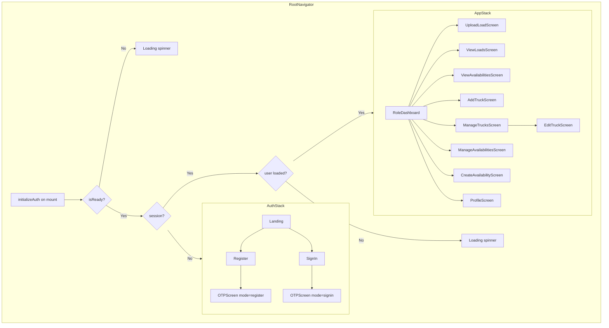
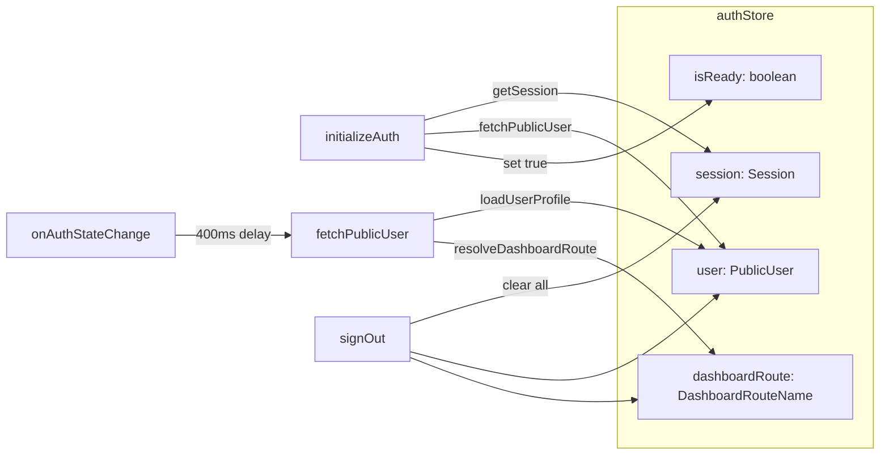
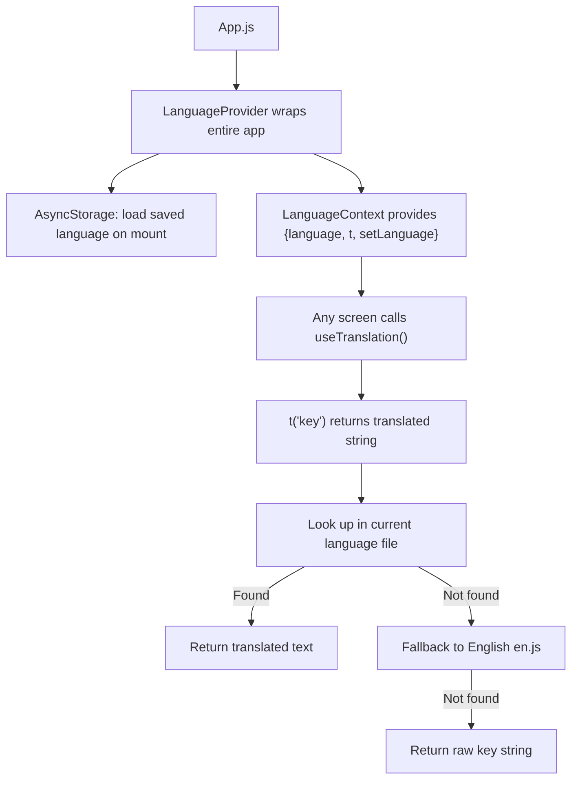

# LoadKaro Mobile App — Technical Documentation

> **Single source of truth for the LoadKaro React Native / Expo mobile application.**
> Audience: developers, QA engineers, testers, DevOps.

---

## 1. Project Overview

| Property | Value |
|---|---|
| Package name | `loadkaro` |
| Version | `1.0.0` |
| Entry point | `index.js` → `App.js` → `RootNavigator` |
| Framework | React Native **0.81.5**, Expo SDK **~54.0.0** |
| React | **19.1.0** |
| Navigation | `@react-navigation/native` **^7.1.34**, `@react-navigation/native-stack` **^7.14.6** |
| Backend client | `@supabase/supabase-js` **^2.99.3** |
| State management | Zustand **^5.0.12** |
| TypeScript | **^5.9.3** (dev) |
| Orientation | Portrait only (`app.json`) |

### Key Dependencies

| Package | Version | Purpose |
|---|---|---|
| `@react-native-async-storage/async-storage` | 2.2.0 | Persist Supabase auth session |
| `@react-native-community/datetimepicker` | 8.4.4 | Native date pickers (loading date, availability dates) |
| `expo-document-picker` | ~14.0.8 | File picker for verification uploads |
| `react-native-gesture-handler` | ~2.28.0 | Gesture support (required by navigation) |
| `react-native-safe-area-context` | ~5.6.2 | Safe area insets |
| `react-native-screens` | ~4.16.0 | Native screen containers |
| `react-native-url-polyfill` | ^3.0.0 | URL polyfill for Supabase on React Native |

### Boot Sequence

1. `index.js` — imports `react-native-gesture-handler`, registers `App` via `registerRootComponent`.
2. `App.js` — wraps everything in `GestureHandlerRootView` + `SafeAreaProvider`, calls `enableScreens()`, renders `<RootNavigator />`.
3. `RootNavigator` — calls `initializeAuth()` on mount, shows loading spinner until `isReady` is `true`, then renders `AuthNavigator` (no session) or `AppNavigator` (session + user loaded).

---

## 2. Architecture

### 2.1 Navigation



Two native stacks, conditionally rendered by `RootNavigator`:

**AuthStack** (when `session === null`):
| Screen name | Component | Header title |
|---|---|---|
| `Landing` | `LandingScreen` | `strings.app_name` ("LoadKaro") |
| `Register` | `RegisterScreen` | `strings.create_account` |
| `SignIn` | `SignInScreen` | `strings.sign_in` |
| `OTP` | `OTPScreen` | `strings.verify_otp` |

**AppStack** (when `session !== null && user !== null`):
| Screen name | Component | Header title |
|---|---|---|
| `AdminDashboard` | `RoleDashboardScreen` | "Admin" |
| `BrokerDashboard` | `RoleDashboardScreen` | "Broker" |
| `ShipperDashboard` | `RoleDashboardScreen` | "Shipper" |
| `TruckOwnerDashboard` | `RoleDashboardScreen` | "Truck owner" |
| `ModeratorDashboard` | `RoleDashboardScreen` | "Moderator" |
| `AddTruckScreen` | `AddTruckScreen` | "Add Truck" |
| `ManageTrucksScreen` | `ManageTrucksScreen` | "Manage Trucks" |
| `EditTruckScreen` | `EditTruckScreen` | "Edit Truck" |
| `CreateAvailabilityScreen` | `CreateAvailabilityScreen` | "Create Availability" |
| `ManageAvailabilitiesScreen` | `ManageAvailabilitiesScreen` | "Manage Availabilities" |
| `UploadLoadScreen` | `UploadLoadScreen` | "Upload Load" |
| `ViewLoadsScreen` | `ViewLoadsScreen` | "View Previous Loads" |
| `ViewAvailabilitiesScreen` | `ViewAvailabilitiesScreen` | "View Available Trucks" |
| `ProfileScreen` | `ProfileScreen` | "My Profile" |

`AppStack.Navigator` uses `key={dashboardRoute}` to force remount when role changes. `initialRouteName` is set to the resolved `dashboardRoute` from the store.

### 2.2 State Management



Single Zustand store: `store/authStore.ts` (see Section 8 for full details).

### 2.3 Data Layer

- No dedicated API service layer. All Supabase queries are performed inline in screens/services.
- Shared `supabase` client from `lib/supabase.js`.
- Shared `useLocations` hook for state/city dropdowns.
- Services: `syncUserAfterOtp`, `loadUserProfile`, `verificationUpload` (extracted logic).

### 2.4 Auth Flow

```
LandingScreen
├── "Create account" → RegisterScreen → (supabase.auth.signInWithOtp) → OTPScreen
└── "Sign In" → SignInScreen → (supabase.auth.signInWithOtp) → OTPScreen

OTPScreen
  ├── supabase.auth.verifyOtp (phone, token, type: 'sms')
  ├── syncUserAfterOtp → insert users row (register only) + loadUserProfile
  ├── resolveDashboardRouteFromProfile → set store (user, dashboardRoute, session)
  └── RootNavigator reacts: session + user present → AppNavigator mounts with correct initialRoute
```

---

## 3. File Inventory (48 source files)

| # | Path | Purpose |
|---|---|---|
| 1 | `index.js` | App entry — gesture handler import, `registerRootComponent` |
| 2 | `App.js` | Root component — GestureHandler, SafeArea, RootNavigator |
| 3 | `app.json` | Expo config (name, slug, version, icons, splash, plugins) |
| 4 | `package.json` | NPM manifest and dependency versions |
| 5 | `tsconfig.json` | TypeScript config extending `expo/tsconfig.base` |
| 6 | `navigation/RootNavigator.js` | AuthStack / AppStack conditional rendering |
| 7 | `navigation/types.ts` | TypeScript param list types for both stacks |
| 8 | `store/authStore.ts` | Zustand store for session, user, dashboardRoute |
| 9 | `lib/supabase.js` | Supabase client singleton |
| 10 | `lib/logger.js` | Dev-only logger wrapper |
| 11 | `lib/verificationUpload.js` | Document upload + verification status flip |
| 12 | `services/syncUserAfterOtp.js` | Post-OTP user insert + profile load |
| 13 | `services/loadUserProfile.js` | Fetch `public.users` row for current auth user |
| 14 | `hooks/useLocations.js` | Shared hook for state/city location data |
| 15 | `utils/phone.js` | Indian phone number validation and E.164 formatting |
| 16 | `utils/authErrors.ts` | Map Supabase errors to user-facing messages |
| 17 | `types/publicUser.ts` | `PublicUser` type definition |
| 18 | `constants/strings.ts` | Centralized UI copy / i18n strings |
| 19 | `constants/pagination.js` | `PAGE_SIZE = 20` |
| 20 | `constants/truckEnums.ts` | Truck categories, permit types, labels |
| 21 | `config/roleRoutes.ts` | Role → dashboard screen name mapping |
| 22 | `config/dashboardButtons.ts` | Per-role action button configs and labels |
| 23 | `config/dashboardUi.ts` | Dashboard screen titles, field labels, error copy |
| 24 | `config/truckLabels.ts` | Truck screen UI copy |
| 25 | `config/truckFieldConfig.ts` | Required/optional field config for AddTruck |
| 26 | `config/shipperLabels.ts` | Shipper screen UI copy |
| 27 | `config/availabilityLabels.ts` | Availability screen UI copy |
| 28 | `config/listScreenLabels.ts` | Pagination / filter button labels |
| 29 | `config/verificationUi.ts` | Verification modal copy + field definitions |
| 30 | `screens/LandingScreen.js` | Landing page with register/sign-in buttons |
| 31 | `screens/RegisterScreen.js` | Name + phone + role form → send OTP |
| 32 | `screens/SignInScreen.js` | Phone-only form → send OTP |
| 33 | `screens/OTPScreen.js` | 6-digit OTP entry → verify + sync user |
| 34 | `screens/RoleDashboardScreen.js` | Shared dashboard for all roles |
| 35 | `screens/ProfileScreen.js` | View/edit profile (name update) |
| 36 | `screens/UploadLoadScreen.js` | Create a new load (shipper) |
| 37 | `screens/ViewLoadsScreen.js` | List loads (posted or market) with filters |
| 38 | `screens/ViewAvailabilitiesScreen.js` | List truck availabilities with filters |
| 39 | `screens/ManageTrucksScreen.js` | List/edit/delete/verify own trucks |
| 40 | `screens/ManageAvailabilitiesScreen.js` | List/close/cancel own availabilities |
| 41 | `screens/AddTruckScreen.js` | Add a new truck |
| 42 | `screens/EditTruckScreen.js` | Edit an existing truck |
| 43 | `screens/CreateAvailabilityScreen.js` | Create a truck availability posting |
| 44 | `components/VerificationBadge.js` | Colored status badge |
| 45 | `components/VerificationModal.js` | Document upload modal (truck or user KYC) |
| 46 | `components/MyDocumentsModal.js` | View uploaded documents modal |
| 47 | `components/TruckCard.js` | Truck list item card |
| 48 | `components/RouteLocationFilters.js` | Origin/destination filter dropdowns |
| 49 | `components/SelectField.js` | Modal-based dropdown select |
| 50 | `components/PaginationBar.js` | Prev/Next page controls |
| 51 | `components/RoleToggle.js` | Shipper / Truck Owner toggle |
| 52 | `components/LabeledInput.js` | Label + TextInput pair |
| 53 | `components/PrimaryButton.js` | Styled button (primary / danger) |

---

## 4. Screens (14 screens)

### 4.1 LandingScreen

| Property | Value |
|---|---|
| **File** | `screens/LandingScreen.js` |
| **Purpose** | App entry screen — two buttons to register or sign in |
| **Navigation params (input)** | None |

**State variables:** None

**Supabase queries:** None

**User actions:**
| Action | Handler | Navigation |
|---|---|---|
| Press "Create account" | inline | `navigation.navigate('Register')` |
| Press "Sign In" | inline | `navigation.navigate('SignIn')` |

**Error handling:** None (no async operations)

**Expected behavior:** Screen renders two buttons centered vertically. Tapping either navigates to the respective auth screen.

---

### 4.2 RegisterScreen

| Property | Value |
|---|---|
| **File** | `screens/RegisterScreen.js` |
| **Purpose** | Collect name, phone, role and send OTP for registration |
| **Navigation params (input)** | `{ role?: 'shipper' \| 'truck_owner' }` (optional pre-selection) |

**State variables:**
| Name | Type | Initial |
|---|---|---|
| `name` | `string` | `''` |
| `phone` | `string` | `''` |
| `role` | `'shipper' \| 'truck_owner' \| null` | `route.params?.role ?? null` |
| `loading` | `boolean` | `false` |

**Supabase queries:**
| Operation | Table | Method | Details |
|---|---|---|---|
| Send OTP | — | `supabase.auth.signInWithOtp` | `{ phone: formattedPhone, options: { data: { name, role, phone } } }` |

**User actions:**
| Action | Handler | Behavior |
|---|---|---|
| Enter name | `setName` | Updates `name` state |
| Enter phone | `setPhone` | Updates `phone` state |
| Select role | `setRole` via `RoleToggle` | Toggles `'shipper'` / `'truck_owner'` |
| Press "Send OTP" | `onRegister` | Validates role, phone → sends OTP → navigates to OTP |

**Error handling:**
- No role selected → `Alert.alert(strings.error_title, strings.select_role)`
- Invalid phone → `Alert.alert(strings.error_title, strings.phone_invalid)`
- OTP send error → `Alert.alert(strings.error_title, getAuthErrorMessage(error))`

**Expected behavior:**
1. Mount → empty form with optional pre-selected role.
2. User fills name, phone, selects role.
3. Press "Send OTP" → validates phone with `formatPhoneOtpIndia` → calls `supabase.auth.signInWithOtp`.
4. Success → navigates to `OTP` with `{ mode: 'register', phone: formattedPhone, name, role }`.
5. Failure → alert with user-friendly error message; loading resets.

---

### 4.3 SignInScreen

| Property | Value |
|---|---|
| **File** | `screens/SignInScreen.js` |
| **Purpose** | Phone-only sign-in — send OTP to existing user |
| **Navigation params (input)** | None |

**State variables:**
| Name | Type | Initial |
|---|---|---|
| `phone` | `string` | `''` |
| `loading` | `boolean` | `false` |

**Supabase queries:**
| Operation | Table | Method | Details |
|---|---|---|---|
| Send OTP | — | `supabase.auth.signInWithOtp` | `{ phone: formattedPhone }` |

**User actions:**
| Action | Handler | Behavior |
|---|---|---|
| Enter phone | `setPhone` | Updates state |
| Press "Send OTP" | `onSendOtp` | Validates → sends OTP → navigates to OTP |

**Error handling:**
- Invalid phone → `Alert.alert(strings.error_title, strings.phone_invalid)`
- OTP send error → `Alert.alert(strings.error_title, getAuthErrorMessage(error))`

**Expected behavior:**
1. Mount → phone input field displayed.
2. User enters phone number.
3. Press "Send OTP" → validates → `signInWithOtp`.
4. Success → navigates to `OTP` with `{ mode: 'signin', phone: formattedPhone }`.

---

### 4.4 OTPScreen

| Property | Value |
|---|---|
| **File** | `screens/OTPScreen.js` |
| **Purpose** | Enter 6-digit OTP code, verify, sync user, transition to app |
| **Navigation params (input)** | `{ mode: 'register' \| 'signin', phone: string, name?: string, role?: 'shipper' \| 'truck_owner' }` |

**State variables:**
| Name | Type | Initial |
|---|---|---|
| `otp` | `string` | `''` |
| `loading` | `boolean` | `false` |

**Supabase queries:**
| Operation | Table | Method | Details |
|---|---|---|---|
| Verify OTP | — | `supabase.auth.verifyOtp` | `{ phone, token: code, type: 'sms' }` |
| Get user | — | `supabase.auth.getUser` | After OTP verify, get auth user |

**User actions:**
| Action | Handler | Behavior |
|---|---|---|
| Enter OTP | `setOtp` | Strips non-digits, caps at 6 chars |
| Press "Verify OTP" | `onVerify` | Validates 6-digit code → verifies → syncs → updates store |

**Error handling:**
- OTP not 6 digits → `Alert.alert(strings.error_title, strings.invalid_otp)`
- Verify error → `Alert.alert(strings.error_title, getAuthErrorMessage(error))`
- No session after verify → `Alert.alert(strings.error_title, strings.generic_error)`
- getUser error → `Alert.alert(strings.error_title, strings.generic_error)`
- syncUserAfterOtp error → alert with error message

**Expected behavior:**
1. Mount → displays mode (Register / Sign In) and phone number, OTP input.
2. User enters 6-digit code.
3. Press "Verify OTP" →
   a. `supabase.auth.verifyOtp` → gets session.
   b. `supabase.auth.getUser` → gets auth user.
   c. `syncUserAfterOtp({ mode, phoneE164: phone, name, role })` → inserts user row (register) + loads profile.
   d. `resolveDashboardRouteFromProfile(profile)` → gets correct dashboard route.
   e. `useAuthStore.setState({ user: profile, dashboardRoute, session })` → single atomic update.
   f. `RootNavigator` reacts: session + user present → mounts `AppNavigator`.

---

### 4.5 RoleDashboardScreen

| Property | Value |
|---|---|
| **File** | `screens/RoleDashboardScreen.js` |
| **Purpose** | Shared dashboard for all roles — shows user info, verification status, role-specific action buttons, logout |
| **Navigation params (input)** | `{ profile?: Record<string, unknown> }` (optional, falls back to store) |

**State variables:**
| Name | Type | Initial |
|---|---|---|
| `loggingOut` | `boolean` | `false` |
| `localVerification` | `string \| null` | `null` |
| `verifyModalVisible` | `boolean` | `false` |
| `docsModalVisible` | `boolean` | `false` |

**Derived values:**
| Name | Source | Description |
|---|---|---|
| `profile` | `route.params?.profile ?? profileFromStore` | Profile data |
| `name` | `profile?.name ?? '—'` | Display name |
| `phone` | `profile?.phone ?? '—'` | Display phone |
| `roleRaw` | `profile?.role ?? '—'` | Raw role string |
| `verification` | `localVerification ?? profile?.verification_status ?? '—'` | Verification status |
| `showUserVerify` | `verificationLower === 'unverified'` | Show "Verify" button |
| `showViewDocs` | `verificationLower === 'pending' \|\| 'rejected'` | Show "View Documents" button |
| `buttonKeys` | `getDashboardButtonKeys(profile?.role)` | Array of action button IDs |

**Supabase queries (via `submitVerificationDocs`):**
| Operation | Table | Method | Details |
|---|---|---|---|
| Submit verification | `verification_submissions`, `verification_documents`, `users` | insert, insert, update | Upload user KYC docs |

**User actions:**
| Action | Handler | Navigation/Effect |
|---|---|---|
| Press action button | `onActionPress(btnKey)` | Navigates to corresponding screen based on `btnKey` |
| Press "Verify" | opens `VerificationModal` | `setVerifyModalVisible(true)` |
| Press "View Documents" | opens `MyDocumentsModal` | `setDocsModalVisible(true)` |
| Submit verification docs | `onUserVerificationSubmit` | Uploads docs → sets `localVerification = 'pending'` → updates store user |
| Press "Log out" | `onLogout` | `signOut()` → store clears → RootNavigator shows AuthStack |

**Action button navigation mapping:**
| `btnKey` | Navigates to |
|---|---|
| `upload_loads` | `UploadLoadScreen` |
| `view_previous_loads` | `ViewLoadsScreen` (variant: `'posted'`) |
| `view_loads` | `ViewLoadsScreen` (variant: `'market'`) |
| `view_availabilities` | `ViewAvailabilitiesScreen` |
| `add_trucks` | `AddTruckScreen` |
| `manage_trucks` | `ManageTrucksScreen` |
| `add_availabilities` | `CreateAvailabilityScreen` |
| `manage_availabilities` | `ManageAvailabilitiesScreen` |
| `find_return_load` | `CreateAvailabilityScreen` |
| `profile` | `ProfileScreen` |

**Buttons by role:**
- **Shipper:** Upload Loads, View Previous Loads, View Availabilities, My Profile
- **Truck Owner:** Find Return Load, Add Trucks, Manage Trucks, Manage Availabilities, View Loads, My Profile
- **Admin / Broker / Moderator:** No buttons (empty arrays)

**Error handling:**
- Verification upload failure → `Alert.alert('Upload failed', result.error)`
- Logout error → `Alert.alert('Something went wrong', error.message)`

**Expected behavior:**
1. Mount → displays user info block (name, phone, role, verification badge).
2. If `unverified` → "Verify" button shown; tapping opens `VerificationModal`.
3. If `pending` or `rejected` → "View Documents" button shown; tapping opens `MyDocumentsModal`.
4. Role-specific action buttons rendered dynamically.
5. "Log out" button at bottom.

---

### 4.6 ProfileScreen

| Property | Value |
|---|---|
| **File** | `screens/ProfileScreen.js` |
| **Purpose** | View profile details and edit name |
| **Navigation params (input)** | None |

**State variables:**
| Name | Type | Initial |
|---|---|---|
| `name` | `string` | `profile?.name ?? ''` |
| `saving` | `boolean` | `false` |

**Supabase queries:**
| Operation | Table | Method | Columns | Filters |
|---|---|---|---|---|
| Update name | `users` | `.update({ name: trimmed })` | `name` | `.eq('id', profile.id)` |

**User actions:**
| Action | Handler | Behavior |
|---|---|---|
| Edit name | `setName` | Updates local state |
| Press "Save changes" | `onSave` | Validates non-empty → updates DB → updates store |

**Error handling:**
- Empty name → `Alert.alert('Required', 'Name cannot be empty.')`
- Update error → `Alert.alert('Error', error.message)`

**Expected behavior:**
1. Mount → shows read-only info card (phone, role, verification badge).
2. Editable name field pre-filled.
3. Press "Save changes" → trims name → updates `users` table → updates Zustand store → success alert.
4. If `profile` is null → shows "Profile not available."

---

### 4.7 UploadLoadScreen

| Property | Value |
|---|---|
| **File** | `screens/UploadLoadScreen.js` |
| **Purpose** | Create and post a new load (shipper role) |
| **Navigation params (input)** | None |

**State variables:**
| Name | Type | Initial |
|---|---|---|
| `loading` | `boolean` | `true` |
| `saving` | `boolean` | `false` |
| `states` | `string[]` | `[]` |
| `originCities` | `Array<{id, city}>` | `[]` |
| `destinationCities` | `Array<{id, city}>` | `[]` |
| `originState` | `string` | `''` |
| `originCityId` | `string` | `''` |
| `destinationState` | `string` | `''` |
| `destinationCityId` | `string` | `''` |
| `selectedLoadingDate` | `Date \| null` | `null` |
| `showLoadingPicker` | `boolean` | `false` |
| `truckCategoryRequired` | `string` | `''` |
| `capacityRequired` | `string` | `''` |
| `paymentType` | `string` | `''` |
| `advancePercentage` | `string` | `''` |
| `rateOptional` | `string` | `''` |

**Required fields (FIELD_CONFIG):**
`origin_state`, `origin_city`, `destination_state`, `destination_city`, `loading_date`, `truck_category_required`

**Supabase queries:**
| Operation | Table | Method | Columns | Filters |
|---|---|---|---|---|
| Fetch states | `locations` | `.select('state')` | `state` | None |
| Fetch cities | `locations` | `.select('id, city')` | `id, city` | `.eq('state', selectedState)` |
| Get user | — | `supabase.auth.getUser()` | — | — |
| Insert load | `loads` | `.insert({...})` | `posted_by, origin_location_id, destination_location_id, loading_date, truck_category_required, capacity_required, payment_type, advance_percentage, rate_optional` | — |

**Payment types:** `'advance'`, `'partial_advance'`, `'after_delivery'`

**Payment logic:**
- `advance` → `advance_percentage = 100`
- `partial_advance` → `advance_percentage = user input (parsed float)`
- `after_delivery` → `advance_percentage = null`

**User actions:**
| Action | Handler | Behavior |
|---|---|---|
| Select origin state | inline | Sets state, clears city, fetches cities |
| Select origin city | `setOriginCityId` | Updates state |
| Select destination state | inline | Sets state, clears city, fetches cities |
| Select destination city | `setDestinationCityId` | Updates state |
| Tap loading date | toggles `showLoadingPicker` | Shows native DateTimePicker |
| Select truck category | `setTruckCategoryRequired` | Updates state |
| Enter capacity | `setCapacityRequired` | Updates state |
| Select payment type | inline | Sets type, clears advance% if not partial |
| Enter advance % | `setAdvancePercentage` | Only visible when partial_advance |
| Enter rate | `setRateOptional` | Updates state |
| Press "Submit" | `onSubmit` | Validates → inserts → navigates |

**Error handling:**
- Missing required fields → alert with first missing field name
- No payment type → `Alert.alert(t('field_required'), t('payment_type'))`
- Past loading date → `Alert.alert(t('error_invalid_date'), ...)`
- Invalid capacity → alert
- Partial advance without % → alert
- Insert error → `Alert.alert(t('save_error'), error.message)`

**Expected behavior:**
1. Mount → fetches states, shows loading spinner.
2. States loaded → form appears with all fields.
3. Selecting a state triggers city fetch for that state.
4. Submit → validates all required fields + date + capacity + payment → inserts into `loads` → `navigation.replace('ViewLoadsScreen')`.

---

### 4.8 ViewLoadsScreen

| Property | Value |
|---|---|
| **File** | `screens/ViewLoadsScreen.js` |
| **Purpose** | Paginated list of loads — "posted" (own loads) or "market" (all loads for truck owners) |
| **Navigation params (input)** | `{ variant?: 'posted' \| 'market' }` (defaults to `'posted'`) |

**State variables:**
| Name | Type | Initial |
|---|---|---|
| `page` | `number` | `1` |
| `data` | `Array<Load>` | `[]` |
| `totalCount` | `number` | `0` |
| `loading` | `boolean` | `false` |
| `refreshing` | `boolean` | `false` |
| `pendingOriginState` | `string` | `''` |
| `pendingOriginCityId` | `string` | `''` |
| `pendingDestinationState` | `string` | `''` |
| `pendingDestinationCityId` | `string` | `''` |
| `activeOriginLocationId` | `string \| null` | `null` |
| `activeDestinationLocationId` | `string \| null` | `null` |
| `states` | `string[]` | `[]` |
| `originCities` | `Array<{id, city}>` | `[]` |
| `destinationCities` | `Array<{id, city}>` | `[]` |

**Supabase queries:**
| Operation | Table | Method | Details |
|---|---|---|---|
| Fetch states | `locations` | `.select('state').order('state')` | On mount |
| Fetch cities | `locations` | `.select('id, city').eq('state', s)` | When state changes |
| Fetch loads | `loads` | `.select('*, users!loads_posted_by_fkey(name, phone, verification_status), origin:locations!loads_origin_location_id_fkey(city, state), destination:locations!loads_destination_location_id_fkey(city, state)', { count: 'exact' })` | Paginated, ordered by `created_at DESC` |
| Filter (posted) | `loads` | `.eq('posted_by', user.id)` | Only for variant `'posted'` |
| Filter (origin) | `loads` | `.eq('origin_location_id', activeOriginLocationId)` | When filter active |
| Filter (destination) | `loads` | `.eq('destination_location_id', activeDestinationLocationId)` | When filter active |
| Insert interest | `interests` | `.insert({ load_id, interested_by, contacted_party })` | When "Show Interest" pressed |

**User actions:**
| Action | Handler | Behavior |
|---|---|---|
| Select origin state/city | state setters | Pending filter values |
| Select destination state/city | state setters | Pending filter values |
| Press "Apply filter" | `applyFilter` | Copies pending → active, resets page to 1 |
| Press "Clear filter" | `clearFilter` | Resets all filter state |
| Press "Previous"/"Next" | `goToPage` | Changes page within bounds |
| Pull to refresh | `fetchData` | Refetches current page |
| Press "Call Shipper" | `handleCall` | `Linking.openURL('tel:${phone}')` |
| Press "Show Interest" | `handleInterest` | Inserts into `interests` table |

**Card rendering (market variant):**
- Shows: origin → destination, loading date, truck category, capacity, payment type, rate, status
- Shows poster info: name, verification badge, call button, interest button

**Error handling:**
- Fetch error → `Alert.alert(t('load_error'), error.message)`
- No phone for call → `Alert.alert('Unavailable', 'Phone number not available for this user.')`
- Interest insert error → `Alert.alert('Error', error.message)`

**Expected behavior:**
1. Mount → fetches states + loads.
2. Variant resets filters when changed.
3. FlatList with pull-to-refresh.
4. Filters: origin/destination state → city cascading dropdowns.
5. Pagination via `PaginationBar` (page size = 20).
6. Empty state: "No loads posted yet" (posted) / "No loads found" (market).
7. Market cards include poster contact section.

---

### 4.9 ViewAvailabilitiesScreen

| Property | Value |
|---|---|
| **File** | `screens/ViewAvailabilitiesScreen.js` |
| **Purpose** | Paginated list of truck availabilities for shippers to browse |
| **Navigation params (input)** | None |

**State variables:**
| Name | Type | Initial |
|---|---|---|
| `page` | `number` | `1` |
| `data` | `Array<Availability>` | `[]` |
| `totalCount` | `number` | `0` |
| `loading` | `boolean` | `false` |
| `refreshing` | `boolean` | `false` |
| `pendingOriginState` | `string` | `''` |
| `pendingOriginCityId` | `string` | `''` |
| `pendingDestinationState` | `string` | `''` |
| `pendingDestinationCityId` | `string` | `''` |
| `activeOriginLocationId` | `string \| null` | `null` |
| `activeDestinationLocationId` | `string \| null` | `null` |
| `states` | `string[]` | `[]` |
| `originCities` | `Array<{id, city}>` | `[]` |
| `destinationCities` | `Array<{id, city}>` | `[]` |

**Supabase queries:**
| Operation | Table | Method | Details |
|---|---|---|---|
| Fetch states | `locations` | `.select('state').order('state')` | On mount |
| Fetch cities | `locations` | `.select('id, city').eq('state', s)` | When state changes |
| Fetch availabilities (primary) | `availabilities` | `.select('*, trucks(category, capacity_tons, gps_available, verification_status, truck_variants(display_name), owner:users!trucks_owner_id_fkey(name, phone)), origin:locations!...(city, state), destination:locations!...(city, state)', { count: 'exact' }).eq('status', 'available')` | Paginated, filtered to `status = 'available'` |
| Fetch availabilities (fallback) | `availabilities` | Same without owner join | If primary query fails (RLS) |
| Merge trucks/owners (fallback) | `trucks`, `users` | Separate queries + manual join | When owner join fails |
| Insert interest | `interests` | `.insert({ availability_id, interested_by, contacted_party })` | On "Show Interest" |

**User actions:**
| Action | Handler | Behavior |
|---|---|---|
| Filter by origin/destination | state setters + apply/clear | Same pattern as ViewLoads |
| Paginate | `goToPage` | Page navigation |
| Pull to refresh | `fetchData` | Refetch |
| Press "Call Owner" | `handleCall` | `Linking.openURL('tel:${phone}')` |
| Press "Show Interest" | `handleInterest` | Inserts into `interests` |

**Card rendering:**
- Truck name (variant display_name or category), owner name, capacity, GPS (Yes/No), verification badge
- Origin/destination cities, available from/till dates, expected rate
- Contact section: Call Owner + Show Interest buttons

**Error handling:**
- Primary query fail → tries fallback without owner join, then `mergeTrucksAndOwners`
- Interest error → `Alert.alert('Error', error.message)`

---

### 4.10 ManageTrucksScreen

| Property | Value |
|---|---|
| **File** | `screens/ManageTrucksScreen.js` |
| **Purpose** | List, edit, delete, and verify own trucks |
| **Navigation params (input)** | None |

**State variables:**
| Name | Type | Initial |
|---|---|---|
| `trucks` | `Array<Truck>` | `[]` |
| `loading` | `boolean` | `true` |
| `refreshing` | `boolean` | `false` |
| `verificationOverrides` | `Record<string, string>` | `{}` |
| `verifyModalVisible` | `boolean` | `false` |
| `truckForVerify` | `Truck \| null` | `null` |
| `docsModalTruck` | `Truck \| null` | `null` |

**Derived values:**
- `trucksWithOverrides` — merges `verificationOverrides` into each truck's `verification_status`

**Supabase queries:**
| Operation | Table | Method | Details |
|---|---|---|---|
| Fetch trucks | `trucks` | `.select('*, truck_variants(display_name)').eq('owner_id', user.id)` | On focus |
| Delete truck | `trucks` | `.delete().eq('id', truckId)` | On confirm delete |
| Submit verification | (via `submitVerificationDocs`) | `verification_submissions`, `verification_documents`, `trucks` | Upload truck docs |

**User actions:**
| Action | Handler | Behavior |
|---|---|---|
| Pull to refresh | `fetchTrucks` | Refetches all trucks |
| Press "Edit" | `onEditTruck` | Guards pending/verified → navigates to `EditTruckScreen` |
| Press "Delete" | `onDeleteTruck` | Confirmation alert → deletes → refetches |
| Press "Verify" | opens `VerificationModal` | Sets `truckForVerify`, shows modal |
| Press "View Documents" | opens `MyDocumentsModal` | Sets `docsModalTruck` |
| Submit verification docs | `onTruckVerificationSubmit` | Uploads → sets override to `'pending'` → success alert |

**Edit guards:**
- `pending` → `Alert.alert(LABELS.edit_not_allowed_title, LABELS.cannot_edit_pending)`
- `verified` → `Alert.alert(LABELS.edit_not_allowed_title, LABELS.cannot_edit_verified)`
- Only `unverified` trucks can be edited

**Error handling:**
- Fetch user error → `Alert.alert(LABELS.load_error)`
- Fetch trucks error → `Alert.alert(LABELS.load_error, error.message)`
- Delete error → `Alert.alert(LABELS.delete_error, error.message)`
- Verification upload fail → `Alert.alert('Upload failed', result.error)`

**Expected behavior:**
1. `useFocusEffect` → refetches trucks each time screen is focused.
2. FlatList with pull-to-refresh.
3. Each truck rendered via `TruckCard` with edit/delete/verify buttons.
4. Verification overrides persist locally until refetch.

---

### 4.11 ManageAvailabilitiesScreen

| Property | Value |
|---|---|
| **File** | `screens/ManageAvailabilitiesScreen.js` |
| **Purpose** | List own availabilities, close or cancel them |
| **Navigation params (input)** | None |

**State variables:**
| Name | Type | Initial |
|---|---|---|
| `loading` | `boolean` | `true` |
| `rows` | `Array<Availability>` | `[]` |
| `refreshing` | `boolean` | `false` |

**Supabase queries:**
| Operation | Table | Method | Details |
|---|---|---|---|
| Fetch availabilities | `availabilities` | `.select('*, trucks(id, category, capacity_tons, gps_available, verification_status, truck_variants(display_name)), origin:locations!...(city, state), destination:locations!...(city, state)').eq('owner_id', user.id).order('created_at', { ascending: false })` | On focus |
| Update status | `availabilities` | `.update({ status }).eq('id', id)` | Close or cancel |

**User actions:**
| Action | Handler | Behavior |
|---|---|---|
| Pull to refresh | `fetchAvailabilities` | Refetches all |
| Press "Close Availability" | `handleClose` | Guards closed/cancelled → confirmation → updates status to `'closed'` |
| Press "Cancel Availability" | `handleCancel` | Guards closed/cancelled → confirmation → updates status to `'cancelled'` |

**Guards (`guardClosedOrCancelled`):**
- Already `closed` → `Alert.alert(t('confirm_action_title'), t('already_closed'))` → returns `true`
- Already `cancelled` → `Alert.alert(t('confirm_action_title'), t('already_cancelled'))` → returns `true`

**Card rendering:**
- Truck name, category, capacity, GPS, verification badge
- Origin/destination, available from/till, status
- Two action buttons (Close / Cancel), disabled when not `'available'`

**Error handling:**
- Update error → `Alert.alert(t('error'), error.message)`
- Fetch error → `Alert.alert(t('load_error'), error.message)`

---

### 4.12 AddTruckScreen

| Property | Value |
|---|---|
| **File** | `screens/AddTruckScreen.js` |
| **Purpose** | Add a new truck with category, variant, capacity, permit, axle/wheel, GPS |
| **Navigation params (input)** | None |

**State variables:**
| Name | Type | Initial |
|---|---|---|
| `variants` | `Array<TruckVariant>` | `[]` |
| `loading` | `boolean` | `false` |
| `saving` | `boolean` | `false` |
| `category` | `string` | `''` |
| `variantId` | `string` | `''` |
| `capacityTons` | `string` | `''` |
| `permitType` | `string` | `''` |
| `axleCount` | `string` | `''` |
| `wheelCount` | `string` | `''` |
| `gpsAvailable` | `boolean` | `false` |
| `missingFields` | `string[]` | `[]` |

**Required fields (from `FIELD_CONFIG`):**
- `category` ✓
- `variant_id` ✓
- `capacity_tons` ✓
- `permit_type` ✗ (optional)
- `axle_count` ✗ (optional)
- `wheel_count` ✗ (optional)
- `gps_available` ✗ (optional)

**Supabase queries:**
| Operation | Table | Method | Columns | Filters |
|---|---|---|---|---|
| Fetch variants | `truck_variants` | `.select('*')` | `*` | `.eq('category', selectedCategory).eq('is_active', true)` |
| Get user | — | `supabase.auth.getUser()` | — | — |
| Insert truck | `trucks` | `.insert({...})` | `owner_id, category, variant_id, capacity_tons, permit_type, axle_count, wheel_count, gps_available` | — |

**User actions:**
| Action | Handler | Behavior |
|---|---|---|
| Select category | inline | Sets category, clears variant, fetches variants, clears field errors |
| Select variant | inline | Sets variant, clears field error |
| Enter capacity | inline | Sets capacity, clears field error |
| Select permit type | `setPermitType` | Updates state |
| Enter axle count | `setAxleCount` | Updates state |
| Enter wheel count | `setWheelCount` | Updates state |
| Toggle GPS | `setGpsAvailable` | Toggle switch |
| Press "Submit" | `onSubmit` | Validates → inserts → resets form → navigates to ManageTrucks |

**Error handling:**
- Missing required fields → `setMissingFields(errors)` → red error text below fields
- Invalid capacity (NaN) → `setMissingFields(['capacity_tons'])`
- User not authenticated → `Alert.alert(LABELS.save_error)`
- Insert error → `Alert.alert(LABELS.save_error, error.message)`

**Expected behavior:**
1. Mount → form with category dropdown.
2. Selecting category triggers variant fetch from `truck_variants` table.
3. Fill required fields + optional fields.
4. Submit → validates → inserts → clears form → `navigation.replace('ManageTrucksScreen')`.
5. Success alert: "Truck added successfully."

---

### 4.13 EditTruckScreen

| Property | Value |
|---|---|
| **File** | `screens/EditTruckScreen.js` |
| **Purpose** | Edit an existing (unverified) truck |
| **Navigation params (input)** | `{ truck: Record<string, unknown> }` |

**State variables:**
| Name | Type | Initial |
|---|---|---|
| `variants` | `Array<TruckVariant>` | `[]` |
| `loading` | `boolean` | `true` |
| `saving` | `boolean` | `false` |
| `category` | `string` | `''` (set from truck on mount) |
| `variantId` | `string` | `''` (set from truck on mount) |
| `capacityTons` | `string` | `''` (set from truck on mount) |
| `permitType` | `string` | `''` (set from truck on mount) |
| `axleCount` | `string` | `''` (set from truck on mount) |
| `wheelCount` | `string` | `''` (set from truck on mount) |
| `gpsAvailable` | `boolean` | `false` (set from truck on mount) |

**Supabase queries:**
| Operation | Table | Method | Columns | Filters |
|---|---|---|---|---|
| Load variants | `truck_variants` | `.select('*').eq('is_active', true)` | `*` | `.eq('category', cat)` (optional) |
| Update truck | `trucks` | `.update({...}).eq('id', truck.id)` | `category, variant_id, capacity_tons, permit_type, axle_count, wheel_count, gps_available` | `.eq('id', truck.id)` |

**User actions:**
| Action | Handler | Behavior |
|---|---|---|
| Change category | inline | Sets category, clears variant, reloads variants |
| Change variant | `setVariantId` | Updates state |
| Change capacity/permit/axle/wheel/GPS | respective setters | Updates state |
| Press "Save" | `onSave` | Validates → updates → goes back |

**Error handling:**
- No truck in params → shows "Could not load data."
- Missing category, variant, or invalid capacity → `Alert.alert(LABELS.save_error)`
- Update error → `Alert.alert(LABELS.save_error, error.message)`

**Permit type edge case:** If the truck's existing `permit_type` is not in `PERMIT_TYPES`, it's prepended with a hint label.

**Expected behavior:**
1. Mount → loads variants for truck's category → pre-fills all fields from truck params.
2. Edit fields → press "Save" → validates → updates row → success alert → `navigation.goBack()`.

---

### 4.14 CreateAvailabilityScreen

| Property | Value |
|---|---|
| **File** | `screens/CreateAvailabilityScreen.js` |
| **Purpose** | Create a truck availability posting for a selected truck |
| **Navigation params (input)** | None |

**State variables:**
| Name | Type | Initial |
|---|---|---|
| `loading` | `boolean` | `true` |
| `saving` | `boolean` | `false` |
| `trucks` | `Array<{id, category, truck_variants}>` | `[]` |
| `states` | `string[]` | `[]` |
| `originCities` | `Array<{id, city}>` | `[]` |
| `destinationCities` | `Array<{id, city}>` | `[]` |
| `selectedTruckId` | `string` | `''` |
| `originState` | `string` | `''` |
| `originCityId` | `string` | `''` |
| `destinationState` | `string` | `''` |
| `destinationCityId` | `string` | `''` |
| `selectedFromDate` | `Date \| null` | `null` |
| `selectedTillDate` | `Date \| null` | `null` |
| `showFromPicker` | `boolean` | `false` |
| `showTillPicker` | `boolean` | `false` |

**Required fields (FIELD_CONFIG):**
`truck_id`, `origin_state`, `origin_city`, `destination_state`, `destination_city`, `available_from`, `available_till`

**Supabase queries:**
| Operation | Table | Method | Details |
|---|---|---|---|
| Fetch user's trucks | `trucks` | `.select('id, category, truck_variants(display_name)').eq('owner_id', user.id)` | On mount |
| Fetch states | `locations` | `.select('state').order('state')` | On mount (parallel with trucks) |
| Fetch cities | `locations` | `.select('id, city').eq('state', s)` | When state selected |
| Check overlap | `availabilities` | `.select('*').eq('truck_id', selectedTruckId).or('and(available_from.lte.${till},available_till.gte.${from})')` | Before insert |
| Insert availability | `availabilities` | `.insert({ owner_id, truck_id, origin_location_id, destination_location_id, available_from, available_till, status: 'available' })` | On submit |

**User actions:**
| Action | Handler | Behavior |
|---|---|---|
| Select truck | `setSelectedTruckId` | Updates state |
| Select origin state | inline | Sets state, clears city, fetches cities |
| Select origin city | `setOriginCityId` | Updates state |
| Select destination state | inline | Sets state, clears city, fetches cities |
| Select destination city | `setDestinationCityId` | Updates state |
| Tap "Available From" | toggles `showFromPicker` | Shows DateTimePicker |
| Tap "Available Till" | toggles `showTillPicker` | Shows DateTimePicker |
| Press "Create" | `onCreate` | Validates → checks overlap → inserts → goes back |

**Error handling:**
- Missing required fields → `Alert.alert(t('field_required'), ...)`
- `available_till < available_from` → `Alert.alert(t('save_error'), t('date_range_error'))`
- Past dates → `Alert.alert(t('error_invalid_date_title'), t('error_past_date'))`
- Overlap detected → `Alert.alert(t('error_overlap_title'), t('error_overlap_message'))`
- Insert error → `Alert.alert(t('save_error'), error.message)`

**Expected behavior:**
1. Mount → parallel fetch of user's trucks + states.
2. User selects truck, origin, destination, date range.
3. Press "Create" → validates → checks for existing overlapping availabilities for the same truck → inserts → success alert → `navigation.goBack()`.

---

## 5. Components (10 components)

### 5.1 VerificationBadge

| Property | Value |
|---|---|
| **File** | `components/VerificationBadge.js` |

**Props:**
| Prop | Type | Default | Description |
|---|---|---|---|
| `status` | `string \| null \| undefined` | — | Verification status value |
| `compact` | `boolean` | `false` | Removes top margin when `true` |

**Renders:** A `View` with colored background + `Text` showing the status string.

**Color logic:**
| Status (lowercased) | Background | Text color |
|---|---|---|
| `verified` | `#d1fae5` (green) | `#111827` |
| `pending` | `#fef3c7` (yellow) | `#111827` |
| `rejected` | `#fecaca` (red) | `#991b1b` |
| anything else | `#f3f4f6` (gray) | `#111827` |

**Dependencies:** None (pure presentational).

---

### 5.2 VerificationModal

| Property | Value |
|---|---|
| **File** | `components/VerificationModal.js` |

**Props:**
| Prop | Type | Default | Description |
|---|---|---|---|
| `visible` | `boolean` | — | Controls modal visibility |
| `onClose` | `() => void` | — | Close handler |
| `onSubmit` | `(files: VerificationFiles) => void` | — | Submit handler with selected files |
| `submitDisabled` | `boolean` | `false` | Disables submit button |
| `variant` | `'truck' \| 'user'` | `'truck'` | Determines which documents to show |

**Internal state:**
| Name | Type | Initial |
|---|---|---|
| `shipperType` | `'individual' \| 'organization' \| null` | `null` |
| `selectedFiles` | `Record<string, PickedDoc \| null>` | Empty map from fields |

**Behavior by variant:**

**Truck variant:**
- Shows 4 upload fields: Registration Certificate (RC), Insurance Policy, Current Driver's License, Fitness Certificate

**User variant — shows a choice screen first:**
- **Individual:** Aadhaar card, PAN card, Driving License, Other valid ID
- **Organization:** GST Certificate, Company PAN card, Certificate of Incorporation, Trade License / MSME

**File picking:** Uses `expo-document-picker` with allowed types: `image/jpeg`, `image/png`, `image/webp`, `application/pdf`. Validates extension against allowed set.

**Callbacks:**
- `pickDocument(key)` → opens document picker → validates extension → stores in `selectedFiles`
- `handleSubmit()` → calls `onSubmit(selectedFiles)`

**Dependencies:** `expo-document-picker`, `config/verificationUi`

---

### 5.3 MyDocumentsModal

| Property | Value |
|---|---|
| **File** | `components/MyDocumentsModal.js` |

**Props:**
| Prop | Type | Default | Description |
|---|---|---|---|
| `visible` | `boolean` | — | Controls modal visibility |
| `onClose` | `() => void` | — | Close handler |
| `entityType` | `'user' \| 'truck'` | — | Entity type to query |
| `entityId` | `string` | — | Entity ID to query |
| `onChangeDocuments` | `() => void` | — | Opens re-upload flow (optional) |

**Internal state:**
| Name | Type | Initial |
|---|---|---|
| `latestSubmission` | `object \| null` | `null` |
| `loading` | `boolean` | `false` |
| `docs` | `Array<Doc>` | `[]` |
| `docsLoading` | `boolean` | `false` |
| `openingDoc` | `string \| null` | `null` |

**Supabase queries:**
| Operation | Table | Method | Details |
|---|---|---|---|
| Fetch latest submission | `verification_submissions` | `.select('*').eq('entity_type', entityType).eq('entity_id', entityId).order('created_at', {ascending: false}).limit(1).maybeSingle()` | When visible |
| Fetch documents | `verification_documents` | `.select('*').eq('submission_id', submissionId).order('created_at', {ascending: true})` | When submission loaded |
| Get signed URL | `supabase.storage.from(bucket).createSignedUrl(path, 300)` | When "View" pressed |

**User actions:**
- View document → opens signed URL via `Linking.openURL`
- Change documents → closes modal → calls `onChangeDocuments()` after 350ms delay

**Doc key label mapping:** `aadhar` → "Aadhaar card", `pan` → "PAN card", `driving_license` → "Driving License", `gst_certificate` → "GST Certificate", etc.

---

### 5.4 TruckCard

| Property | Value |
|---|---|
| **File** | `components/TruckCard.js` |

**Props:**
| Prop | Type | Default | Description |
|---|---|---|---|
| `truck` | `Record<string, unknown>` | — | Truck data object |
| `variantDisplayName` | `string \| null` | — | Display name from truck_variants |
| `onEditPress` | `() => void` | — | Edit button handler |
| `onDeletePress` | `() => void` | — | Delete button handler |
| `isEditDisabled` | `boolean` | `false` | Dims edit button if true |
| `onVerifyPress` | `() => void` | — | Verify button handler (optional) |
| `onViewDocsPress` | `() => void` | — | View docs button handler (optional) |

**Renders:**
- Variant name, category, capacity
- Verification status badge + conditional "Verify" button (unverified) or "View Documents" button (pending/rejected)
- Action row: Edit button (dimmed if disabled) + Delete button (red)

**Dependencies:** `VerificationBadge`, `config/truckLabels`

---

### 5.5 RouteLocationFilters

| Property | Value |
|---|---|
| **File** | `components/RouteLocationFilters.js` |

**Props:**
| Prop | Type | Description |
|---|---|---|
| `originState` | `string` | Current origin state |
| `setOriginState` | `(v: string) => void` | Origin state setter |
| `originCityId` | `string` | Current origin city ID |
| `setOriginCityId` | `(v: string) => void` | Origin city setter |
| `destinationState` | `string` | Current destination state |
| `setDestinationState` | `(v: string) => void` | Destination state setter |
| `destinationCityId` | `string` | Current destination city ID |
| `setDestinationCityId` | `(v: string) => void` | Destination city setter |
| `stateOptions` | `Array<{value, label}>` | State dropdown options |
| `originCityOptions` | `Array<{value, label}>` | Origin city dropdown options |
| `destinationCityOptions` | `Array<{value, label}>` | Destination city dropdown options |
| `onApply` | `() => void` | Apply filter handler |
| `onClear` | `() => void` | Clear filter handler |
| `t` | `(key: string) => string` | Translation function |
| `selectPlaceholder` | `string` | Placeholder text for selects |
| `destinationOptionalHint` | `string \| null` | Optional hint text below destination |

**Renders:** 4 `SelectField` dropdowns (origin state, origin city, destination state, destination city) + "Apply filter" (primary) + "Clear filter" (danger) buttons.

**Dependencies:** `SelectField`, `PrimaryButton`

---

### 5.6 SelectField

| Property | Value |
|---|---|
| **File** | `components/SelectField.js` |

**Props:**
| Prop | Type | Default | Description |
|---|---|---|---|
| `label` | `string` | — | Field label |
| `value` | `string \| null \| undefined` | — | Currently selected value |
| `options` | `Array<{value: string, label: string}>` | — | Dropdown options |
| `onChange` | `(value: string) => void` | — | Selection handler |
| `placeholder` | `string` | — | Placeholder when no selection |

**Internal state:**
| Name | Type | Initial |
|---|---|---|
| `open` | `boolean` | `false` |

**Renders:** Touchable area showing current selection → opens bottom sheet `Modal` with scrollable option list. Selecting an option calls `onChange` and closes the modal.

**Dependencies:** `constants/strings` (for `modal_ok`)

---

### 5.7 PaginationBar

| Property | Value |
|---|---|
| **File** | `components/PaginationBar.js` |

**Props:**
| Prop | Type | Description |
|---|---|---|
| `page` | `number` | Current page |
| `totalPages` | `number` | Total pages |
| `totalCount` | `number` | Total item count |
| `onPrev` | `() => void` | Previous page handler |
| `onNext` | `() => void` | Next page handler |
| `t` | `(key: string) => string` | Translation function |

**Renders:** Row with Previous button, "Page X / Y" text, Next button. Buttons auto-disable at boundaries.

---

### 5.8 RoleToggle

| Property | Value |
|---|---|
| **File** | `components/RoleToggle.js` |

**Props:**
| Prop | Type | Description |
|---|---|---|
| `value` | `'shipper' \| 'truck_owner' \| null` | Currently selected role |
| `onChange` | `(role: 'shipper' \| 'truck_owner') => void` | Role change handler |

**Renders:** Row of two toggle chips ("Shipper" / "Truck Owner"). Active chip has dark background + white text.

**Dependencies:** `constants/strings`

---

### 5.9 LabeledInput

| Property | Value |
|---|---|
| **File** | `components/LabeledInput.js` |

**Props:**
| Prop | Type | Default | Description |
|---|---|---|---|
| `label` | `string` | — | Input label |
| `value` | `string` | — | Input value |
| `onChangeText` | `(t: string) => void` | — | Text change handler |
| `placeholder` | `string` | — | Placeholder text |
| `keyboardType` | `KeyboardTypeOptions` | `'default'` | Keyboard type |
| `editable` | `boolean` | `true` | Input editability |
| `secureTextEntry` | `boolean` | `false` | Secure entry mode |

**Renders:** Label text + styled `TextInput` with `autoCapitalize="none"` and `autoCorrect={false}`.

---

### 5.10 PrimaryButton

| Property | Value |
|---|---|
| **File** | `components/PrimaryButton.js` |

**Props:**
| Prop | Type | Default | Description |
|---|---|---|---|
| `title` | `string` | — | Button text |
| `onPress` | `() => void` | — | Press handler |
| `disabled` | `boolean` | — | Disabled state (50% opacity) |
| `variant` | `'primary' \| 'danger'` | `'primary'` | Color variant |

**Renders:** `TouchableOpacity` with dark background (`#111827`) or red (`#b91c1c` for danger). White text, rounded corners.

---

## 6. Configuration (9 config files)

### 6.1 `config/roleRoutes.ts`

**Exports:**
| Export | Type | Description |
|---|---|---|
| `ROLE_ROUTES` | `Record<RoleKey, DashboardRouteName>` | Maps role keys to screen names |
| `RoleKey` | type | `'admin' \| 'broker' \| 'shipper' \| 'truck_owner' \| 'moderator'` |
| `DashboardRouteName` | type | Union of dashboard screen name strings |
| `DEFAULT_ROLE_KEY` | `RoleKey` | `'shipper'` |
| `normalizeRoleKey(role)` | function | Normalizes various role strings to canonical keys |
| `resolveDashboardRoute(role)` | function | Returns dashboard screen name for a role |
| `resolveDashboardRouteFromProfile(profile)` | function | Extracts role from profile → resolves route |

**Role → Screen mapping:**
| Role | Screen Name |
|---|---|
| `admin` | `AdminDashboard` |
| `broker` | `BrokerDashboard` |
| `shipper` | `ShipperDashboard` |
| `truck_owner` | `TruckOwnerDashboard` |
| `moderator` | `ModeratorDashboard` |

**Alias handling:** `"truckowner"`, `"truckowners"` → `"truck_owner"`. Also handles spaces, hyphens, camelCase variations.

### 6.2 `config/dashboardButtons.ts`

**Exports:**
| Export | Type | Description |
|---|---|---|
| `BUTTON_CONFIG` | `Record<RoleKey, readonly string[]>` | Action button IDs per role |
| `LABELS` | `Record<string, string>` | Display labels for each button ID |
| `DASHBOARD_USER_COPY` | object | User info block copy: `hi`, `phone`, `role`, `status` |
| `getDashboardButtonKeys(role)` | function | Returns button IDs for a normalized role |

**Button IDs per role:**
- **shipper:** `upload_loads`, `view_previous_loads`, `view_availabilities`, `profile`
- **truck_owner:** `find_return_load`, `add_trucks`, `manage_trucks`, `manage_availabilities`, `view_loads`, `profile`
- **admin / broker / moderator:** empty arrays

### 6.3 `config/dashboardUi.ts`

**Exports:**
| Export | Description |
|---|---|
| `dashboardUi.fieldLabels` | `{ name, phone, role, verification }` |
| `dashboardUi.errors` | `{ title: 'Something went wrong', generic: 'Please try again.' }` |
| `dashboardUi.logoutLabel` | `'Log out'` |
| `dashboardUi.screenTitles` | Dashboard screen titles per route name |

### 6.4 `config/truckLabels.ts`

**Exports:** `LABELS` — flat object with 40+ keys for truck UI copy: field names, actions, errors, confirmations.

Key labels: `category`, `variant_id`, `capacity_tons`, `permit_type`, `axle_count`, `wheel_count`, `gps_available`, `add_truck`, `manage_trucks`, `edit_truck`, `save`, `submit`, `edit`, `delete`, `verify`, `truck_added`, `truck_updated`, `truck_deleted`, `cannot_edit_pending`, `cannot_edit_verified`, etc.

### 6.5 `config/truckFieldConfig.ts`

**Exports:**
| Export | Type | Description |
|---|---|---|
| `FIELD_CONFIG` | object | Required/optional flags per truck field |
| `TruckFieldKey` | type | Union of field keys |

**Fields:**
| Field | Required |
|---|---|
| `category` | `true` |
| `variant_id` | `true` |
| `capacity_tons` | `true` |
| `permit_type` | `false` |
| `axle_count` | `false` |
| `wheel_count` | `false` |
| `gps_available` | `false` |

### 6.6 `config/shipperLabels.ts`

**Exports:** `SHIPPER_LABELS` — flat object with 40+ keys for shipper screens: field labels (`origin_state`, `loading_date`, `truck_category_required`, `capacity_required`, `payment_type`), payment type labels, error/success messages.

### 6.7 `config/availabilityLabels.ts`

**Exports:** `AVAILABILITY_LABELS` — flat object with 50+ keys for availability screens: field labels, status labels (`status_available`, `status_closed`, `status_cancelled`), action labels (`close_availability`, `cancel_availability`), error messages, confirmations.

### 6.8 `config/listScreenLabels.ts`

**Exports:** `LIST_SCREEN_LABELS` — `{ next, previous, page, apply_filter, clear_filter, destination_optional }`

### 6.9 `config/verificationUi.ts`

**Exports:**
| Export | Description |
|---|---|
| `VERIFICATION_UI` | Common copy: `verifyButton`, `uploadFile`, `submit`, `successTitle`, `successMessage` |
| `TRUCK_VERIFICATION_COPY` | Modal title/subtitle for truck verification |
| `TRUCK_VERIFICATION_FIELDS` | Array of `{ key, label }` for truck docs (RC, Insurance, Driver's License, Fitness Certificate) |
| `USER_KYC_INDIVIDUAL_COPY` | Modal title/subtitle for individual KYC |
| `USER_KYC_INDIVIDUAL_FIELDS` | Array of `{ key, label }` for individual docs (Aadhaar, PAN, Driving License, Other) |
| `USER_KYC_ORG_COPY` | Modal title/subtitle for organization KYC |
| `USER_KYC_ORG_FIELDS` | Array of `{ key, label }` for org docs (GST, Company PAN, Incorporation, Trade License) |
| `VerificationVariant` | type: `'truck' \| 'user'` |
| `ShipperKycType` | type: `'individual' \| 'organization'` |

---

## 7. Services & Utilities

### 7.1 `services/syncUserAfterOtp.js`

**Function:** `syncUserAfterOtp({ mode, phoneE164, name, role })`

**Flow:**
1. `supabase.auth.getUser()` → get authenticated user
2. Check if user exists in `public.users`: `.select('id').eq('id', user.id).maybeSingle()`
3. If `mode === 'register'` AND no existing row:
   - Validate `role` is present
   - Normalize role via `normalizeRoleKey(role)`
   - Insert `{ id: user.id, name, phone: phoneE164, role: canonicalRole }` into `users`
4. Return `loadUserProfile()` result

**Throws on:**
- `getUser()` error
- No authenticated user
- Existing row check error
- Missing role for register
- Insert error

### 7.2 `services/loadUserProfile.js`

**Function:** `loadUserProfile()`

**Flow:**
1. `supabase.auth.getUser()` → get user
2. `supabase.from('users').select('*').eq('id', user.id).single()`
3. Return profile

**Throws on:** auth error, not authenticated, select error.

### 7.3 `lib/verificationUpload.js`

**Functions:**

**`validateFileFormats(entries)`** — Validates file extensions against allowed set.
- Allowed: `jpg`, `jpeg`, `png`, `webp`, `pdf`
- Returns `{ valid: boolean, badKey?, badName? }`

**`submitVerificationDocs({ variant, entityId, userId, files })`** — Multi-step upload pipeline.
- Steps:
  1. Filter non-null files from `files` record
  2. Validate file formats
  3. Insert `verification_submissions` row (entity_type, entity_id, submitted_by)
  4. For each file: `fetch(uri)` → blob → arrayBuffer → `supabase.storage.from('verification-docs').upload(path, arrayBuf, { contentType })`
  5. Insert `verification_documents` rows (submission_id, entity_type, entity_id, doc_key, bucket, path, original_filename, mime_type, size_bytes)
  6. Update `users` or `trucks` table: set `verification_status = 'pending'`
- Returns `{ ok: boolean, error?: string }`
- Storage path format: `{entityType}/{entityId}/{submissionId}/{docKey}/{timestamp}-{safeName}`
- MIME detection from file extension

### 7.4 `utils/authErrors.ts`

**Function:** `getAuthErrorMessage(error: unknown): string`

Maps Supabase/Postgres errors to user-facing copy:
| Pattern | Returns |
|---|---|
| OTP/SMS related invalid/expired | `strings.invalid_otp` |
| Duplicate/unique/23505 | `strings.duplicate_phone` |
| Role/mandatory/null/23502 | `strings.missing_role` |
| Fallback | Raw error message or `strings.generic_error` |

### 7.5 `utils/phone.js`

**Function:** `formatPhoneOtpIndia(phoneInput)`

Validates and formats Indian mobile numbers:
- Strips non-digits
- Accepts: 10 digits, 12 digits starting with `91`, 11 digits starting with `0`
- Validates: starts with `6-9`, exactly 10 digits
- Returns `{ ok: true, formattedPhone: '+91XXXXXXXXXX', tenDigits: 'XXXXXXXXXX' }` or `{ ok: false }`

**Deprecated alias:** `formatIndianPhoneE164(input)` — wraps `formatPhoneOtpIndia`, returns `{ ok, e164, tenDigits }` or `{ ok: false, reason: 'invalid' }`

### 7.6 `lib/logger.js`

**Object:** `logger` with methods: `log`, `warn`, `error`
- `log` and `warn` only output when `__DEV__` is `true` (Expo dev mode)
- `error` always outputs (for future crash reporting)

---

## 8. Store (`authStore.ts`)

### State Shape

```typescript
type AuthState = {
  session: Session | null;        // Supabase auth session
  user: PublicUser | null;        // Row from public.users
  isReady: boolean;               // True after initial auth check
  dashboardRoute: DashboardRouteName; // Resolved screen name
  setSession: (session: Session | null) => void;
  setUser: (user: PublicUser | null) => void;
  setDashboardRoute: (route: DashboardRouteName) => void;
  setReady: (ready: boolean) => void;
  fetchPublicUser: () => Promise<void>;
  initializeAuth: () => Promise<void>;
  signOut: () => Promise<void>;
};
```

### Initial Values

| Field | Initial |
|---|---|
| `session` | `null` |
| `user` | `null` |
| `isReady` | `false` |
| `dashboardRoute` | `ROLE_ROUTES['shipper']` = `'ShipperDashboard'` |

### Actions

**`setSession(session)`** — Sets session state.

**`setUser(user)`** — Sets user state.

**`setDashboardRoute(route)`** — Sets dashboard route.

**`setReady(isReady)`** — Sets ready flag.

**`fetchPublicUser()`**
1. Gets session from state; if no `session.user.id` → sets `user: null`, returns.
2. Calls `loadUserProfile()`.
3. Calls `resolveDashboardRouteFromProfile(profile)`.
4. Sets `{ user: profile, dashboardRoute }`.
5. On error: if no previous user exists, sets `user: null`; otherwise preserves existing user (handles transient OTP race).

**`initializeAuth()`**
1. `supabase.auth.getSession()` → sets session + default dashboard.
2. If session exists → calls `fetchPublicUser()`.
3. Sets `isReady: true`.
4. Subscribes to `supabase.auth.onAuthStateChange`:
   - Sets session on every event.
   - If new session → delays `fetchPublicUser()` by 400ms (avoids race with OTP insert).
   - If null session → resets `user: null`, `dashboardRoute: default`.
   - Uses `clearTimeout` to debounce rapid auth events.

**`signOut()`**
1. `supabase.auth.signOut()`.
2. On error → throws.
3. On success → sets `{ session: null, user: null, dashboardRoute: default }`.

### Auth Listener Delay

`AUTH_LISTENER_FETCH_DELAY_MS = 400`

After OTP verification, `syncUserAfterOtp` inserts the user row. The auth state change listener fires immediately, but the insert may not be complete. The 400ms delay ensures the profile exists before fetching.

### Selectors Used in Components

| Component | Selector |
|---|---|
| `RootNavigator` | `s.session`, `s.user`, `s.isReady` |
| `AppNavigator` | `s.dashboardRoute` |
| `RoleDashboardScreen` | `s.user`, `s.signOut`, `s.setUser` |
| `ProfileScreen` | `s.user`, `s.setUser` |

---

## 9. Navigation (`RootNavigator.js`, `types.ts`)

### RootNavigator Logic

```
if (!isReady) → Loading spinner
if (session && !user) → Loading spinner (waiting for profile after OTP)
if (session && user) → <AppNavigator />
if (!session) → <AuthNavigator />
```

### Param Types

**`AuthStackParamList`:**
```typescript
Landing: undefined
Register: { role?: 'shipper' | 'truck_owner' }
SignIn: undefined
OTP: {
  mode: 'register' | 'signin';
  phone: string;
  name?: string;
  role?: 'shipper' | 'truck_owner';
}
```

**`AppStackParamList`:**
```typescript
// Dynamic dashboard screens (one per role):
[K in DashboardRouteName]: { profile?: Record<string, unknown> } | undefined

// Feature screens:
AddTruckScreen: undefined
ManageTrucksScreen: undefined
EditTruckScreen: { truck: Record<string, unknown> }
CreateAvailabilityScreen: undefined
ManageAvailabilitiesScreen: undefined
UploadLoadScreen: undefined
ViewLoadsScreen: { variant?: 'posted' | 'market' } | undefined
ViewAvailabilitiesScreen: undefined
ProfileScreen: undefined  // not in types.ts but registered in navigator
```

### Stack Options

**AuthStack:**
- `headerShown: true`
- `animation: 'slide_from_right'`

**AppStack:**
- `headerShown: true`
- `key={dashboardRoute}` — forces full remount when dashboard route changes

---

## 10. Environment Variables

| Variable | Description | Required |
|---|---|---|
| `EXPO_PUBLIC_SUPABASE_URL` | Supabase project URL (e.g., `https://xxx.supabase.co`) | Yes |
| `EXPO_PUBLIC_SUPABASE_ANON_KEY` | Supabase anonymous/public API key | Yes |
| `EXPO_PUBLIC_SUPABASE_KEY` | Fallback alias for anon key (legacy) | No (fallback) |

**Source:** Read via `process.env` (Expo injects `EXPO_PUBLIC_*` at build time).

**Fallback behavior:** If either variable is missing, `isSupabaseConfigured` is `false`. The app logs a warning but uses placeholder values to avoid crash. All Supabase operations short-circuit when `isSupabaseConfigured` is `false`.

---

## 11. Testing Guide

### 11.1 Key User Flows

#### Flow 1: Registration (New User)
1. Open app → LandingScreen appears.
2. Tap "Create account" → RegisterScreen.
3. Enter name, phone (10-digit Indian mobile), select "Shipper" or "Truck Owner".
4. Tap "Send OTP" → OTP sent via Supabase.
5. Enter 6-digit OTP → OTPScreen.
6. Tap "Verify OTP" → user row inserted in `public.users` → profile loaded → dashboard shown.
7. **Verify:** Correct dashboard appears (ShipperDashboard or TruckOwnerDashboard). User info block shows name, phone, role, "unverified" badge.

#### Flow 2: Sign In (Existing User)
1. LandingScreen → Tap "Sign In" → SignInScreen.
2. Enter registered phone number.
3. Tap "Send OTP" → OTP sent.
4. OTPScreen → enter OTP → verify.
5. **Verify:** Existing profile loaded, correct role-based dashboard shown.

#### Flow 3: Post a Load (Shipper)
1. ShipperDashboard → Tap "Upload Loads" → UploadLoadScreen.
2. Select origin state → origin city (cascading dropdown).
3. Select destination state → destination city.
4. Select loading date (native picker, must be today or future).
5. Select truck category.
6. Enter capacity (decimal number).
7. Select payment type. If "Partial Advance" → enter advance %.
8. Optionally enter rate.
9. Tap "Submit" → load inserted into `loads` → navigates to ViewLoadsScreen.
10. **Verify:** Load appears in "View Previous Loads" list.

#### Flow 4: Create Availability (Truck Owner)
1. TruckOwnerDashboard → Tap "Find Return Load" or "Add Availabilities" → CreateAvailabilityScreen.
2. Select truck from dropdown (only user's trucks shown).
3. Select origin and destination (state → city).
4. Select "Available From" and "Available Till" dates.
5. Tap "Create" → checks for date overlap → inserts into `availabilities` → goes back.
6. **Verify:** Availability appears in "Manage Availabilities" list with status "Available".

#### Flow 5: Add a Truck (Truck Owner)
1. TruckOwnerDashboard → "Add Trucks" → AddTruckScreen.
2. Select category → variants fetched for that category.
3. Select variant, enter capacity.
4. Optionally: permit type, axle count, wheel count, GPS toggle.
5. Tap "Submit" → inserted into `trucks` → navigates to ManageTrucksScreen.
6. **Verify:** Truck appears in list with "unverified" status.

#### Flow 6: Verify a Truck
1. ManageTrucksScreen → on an unverified truck card, tap "Verify".
2. VerificationModal opens → upload RC, Insurance, Driver's License, Fitness Certificate.
3. Tap "Submit for Verification".
4. **Verify:** Documents uploaded to `verification-docs` bucket. `verification_submissions` and `verification_documents` rows created. Truck status flips to "pending".

#### Flow 7: Verify User (KYC)
1. Dashboard → tap "Verify" button next to status badge (only visible when "unverified").
2. Choose Individual or Organization.
3. Upload required documents.
4. Submit.
5. **Verify:** User `verification_status` changes to "pending". Badge updates immediately.

#### Flow 8: View Available Trucks (Shipper)
1. ShipperDashboard → "View Availabilities" → ViewAvailabilitiesScreen.
2. Browse list of available trucks with route filters.
3. Tap "Call Owner" → opens phone dialer.
4. Tap "Show Interest" → inserts into `interests` table.
5. **Verify:** Interest row created. Alert confirms.

#### Flow 9: View Market Loads (Truck Owner)
1. TruckOwnerDashboard → "View Loads" → ViewLoadsScreen (variant: `'market'`).
2. Browse all loads with route filters.
3. Tap "Call Shipper" → opens dialer.
4. Tap "Show Interest" → inserts into `interests`.
5. **Verify:** Interest row created. Alert confirms.

#### Flow 10: Manage Availabilities
1. TruckOwnerDashboard → "Manage Availabilities" → ManageAvailabilitiesScreen.
2. View list of own availabilities.
3. For an "Available" availability:
   - Tap "Close Availability" → confirmation → status updated to `'closed'`.
   - Tap "Cancel Availability" → confirmation → status updated to `'cancelled'`.
4. **Verify:** Status change reflected. Buttons disabled for closed/cancelled items.

#### Flow 11: Edit a Truck
1. ManageTrucksScreen → tap "Edit" on an unverified truck.
2. EditTruckScreen → pre-filled form.
3. Modify fields → tap "Save" → updated in DB → goes back.
4. **Verify:** Truck details updated in list.

#### Flow 12: Delete a Truck
1. ManageTrucksScreen → tap "Delete" on any truck.
2. Confirmation dialog → confirm.
3. **Verify:** Truck removed from list.

#### Flow 13: Edit Profile
1. Dashboard → "My Profile" → ProfileScreen.
2. Edit name → tap "Save changes".
3. **Verify:** Name updated in DB and store. Success alert.

#### Flow 14: Sign Out
1. Dashboard → tap "Log out".
2. **Verify:** Session cleared. App returns to LandingScreen.

### 11.2 Edge Cases

| Edge Case | Expected Behavior |
|---|---|
| **No network** | Supabase queries fail → error alerts shown. App does not crash. |
| **Missing required fields** | Submit blocked; alert with first missing field name (loads/trucks) or inline error text (AddTruck). |
| **Invalid phone format** | `formatPhoneOtpIndia` returns `{ ok: false }` → alert with phone format guidance. |
| **Duplicate interest** | If Supabase has unique constraint on `interests`, insert fails → error alert. No client-side dedup. |
| **Expired OTP** | `verifyOtp` returns error → `getAuthErrorMessage` maps to `strings.invalid_otp`. |
| **Wrong OTP** | Same as expired OTP — user-facing message: "Invalid or expired OTP." |
| **OTP code not 6 digits** | Client-side validation blocks → immediate alert. |
| **Duplicate phone (register)** | Supabase returns 23505 → mapped to `strings.duplicate_phone`. |
| **Edit pending/verified truck** | `onEditTruck` guards: shows "cannot edit" alert. Navigation blocked. |
| **Close/cancel already closed** | `guardClosedOrCancelled` shows "already closed/cancelled" alert. |
| **Availability date overlap** | Overlap check query runs before insert → alert with conflict message. |
| **Past loading/availability date** | Client-side date validation blocks → alert. |
| **Unsupported file format** | `VerificationModal` validates extension → alert listing allowed formats. |
| **File upload failure** | `submitVerificationDocs` catches per-file errors → returns `{ ok: false, error }`. |
| **Session flip before profile loaded** | `RootNavigator` shows spinner when `session && !user` — prevents AppStack from mounting with wrong dashboard. |
| **Auth listener race** | 400ms delay on `fetchPublicUser` after auth state change prevents reading `users` before `syncUserAfterOtp` insert completes. |
| **Empty truck list** | AddTruck → submit blocked by required field validation. ManageTrucks → empty state UI. |
| **No locations seeded** | State dropdowns empty → no cities fetched → location-dependent forms cannot be submitted. |
| **No truck_variants seeded** | Variant dropdown empty after category select → variant_id required → submit blocked. |
| **Supabase not configured** | `isSupabaseConfigured = false` → all queries short-circuit → appropriate error alerts or empty states. |

### 11.3 Data Dependencies

| Dependency | Table | Required For |
|---|---|---|
| Location data (states + cities) | `locations` | All screens with origin/destination fields |
| Truck variants | `truck_variants` | AddTruckScreen, EditTruckScreen (must have `is_active = true` rows) |
| Supabase Storage bucket | `verification-docs` | Verification document uploads |
| RLS policies | Various | All data access must work with anon key + auth token |

### 11.4 Supabase Tables Referenced

| Table | Used In | Operations |
|---|---|---|
| `users` (public) | syncUserAfterOtp, loadUserProfile, ProfileScreen, RoleDashboardScreen, ViewAvailabilities, verificationUpload | SELECT, INSERT, UPDATE |
| `loads` | UploadLoadScreen, ViewLoadsScreen | INSERT, SELECT |
| `trucks` | AddTruckScreen, EditTruckScreen, ManageTrucksScreen, CreateAvailabilityScreen, ViewAvailabilities, verificationUpload | INSERT, SELECT, UPDATE, DELETE |
| `truck_variants` | AddTruckScreen, EditTruckScreen, ManageTrucksScreen, ViewAvailabilities, ManageAvailabilities, CreateAvailability | SELECT |
| `availabilities` | CreateAvailabilityScreen, ManageAvailabilitiesScreen, ViewAvailabilitiesScreen | INSERT, SELECT, UPDATE |
| `locations` | UploadLoadScreen, ViewLoadsScreen, ViewAvailabilitiesScreen, CreateAvailabilityScreen, useLocations | SELECT |
| `interests` | ViewLoadsScreen, ViewAvailabilitiesScreen | INSERT |
| `verification_submissions` | verificationUpload, MyDocumentsModal | INSERT, SELECT |
| `verification_documents` | verificationUpload, MyDocumentsModal | INSERT, SELECT |

### 11.5 Supabase Storage Buckets

| Bucket | Purpose | Access |
|---|---|---|
| `verification-docs` | Stores uploaded verification documents | Upload (insert), signed URL (read, 300s expiry) |

---

## Appendix A: Constants Reference

### `constants/truckEnums.ts`

**TRUCK_CATEGORIES:** `open`, `container`, `lcv`, `mini_pickup`, `trailer`, `tipper`, `tanker`, `dumper`, `bulker`

**CATEGORY_LABELS:**
| Value | Label |
|---|---|
| `open` | Open Body |
| `container` | Container |
| `lcv` | LCV |
| `mini_pickup` | Mini Pickup |
| `trailer` | Trailer |
| `tipper` | Tipper |
| `tanker` | Tanker |
| `dumper` | Dumper |
| `bulker` | Bulker |

**PERMIT_TYPES:** `national_permit`, `state_permit`, `all_india_permit`, `goods_carriage`, `contract_carriage`

**PERMIT_TYPE_LABELS:**
| Value | Label |
|---|---|
| `national_permit` | National permit |
| `state_permit` | State permit |
| `all_india_permit` | All India permit |
| `goods_carriage` | Goods carriage |
| `contract_carriage` | Contract carriage |

### `constants/pagination.js`

`PAGE_SIZE = 20`

### `constants/strings.ts`

Full copy dictionary with 30+ keys used across auth screens and common UI elements. Key entries:
- `app_name`: "LoadKaro"
- `phone_invalid`: "Enter a valid 10-digit Indian mobile number (will be saved as +91…)."
- `invalid_otp`: "Invalid or expired OTP. Please try again."
- `duplicate_phone`: "This phone number is already registered."
- `missing_role`: "Role is required for this account."

---

## Appendix B: `PublicUser` Type

```typescript
type PublicUser = {
  id: string;
  name?: string | null;
  phone?: string | null;
  role?: string | null;
  verification_status?: string | null;
  [key: string]: unknown;  // extensible for additional DB columns
};
```

---

## Appendix C: Expo Configuration (`app.json`)

| Field | Value |
|---|---|
| name | LoadKaro |
| slug | LoadKaro |
| version | 1.0.0 |
| orientation | portrait |
| userInterfaceStyle | light |
| icon | `./assets/icon.png` |
| splash image | `./assets/splash-icon.png` |
| splash backgroundColor | `#ffffff` |
| iOS supportsTablet | `true` |
| Android adaptive icon bg | `#E6F4FE` |
| plugins | `@react-native-community/datetimepicker` |

---

*Document generated from source code analysis — LoadKaro v1.0.0*

---

## Addendum: Multi-Language (i18n) System

Added post-initial documentation. The app supports **4 languages**: English, Hindi, Telugu, Kannada.

### Architecture

| File | Purpose |
|------|---------|
| `i18n/LanguageContext.js` | React Context + Provider + `useTranslation()` hook |
| `i18n/en.js` | English translations (~250 keys, master file) |
| `i18n/hi.js` | Hindi translations (हिन्दी) |
| `i18n/te.js` | Telugu translations (తెలుగు) |
| `i18n/kn.js` | Kannada translations (ಕನ್ನಡ) |
| `components/LanguagePicker.js` | Modal UI for language selection |

### How it works



### Translation key structure

All keys are flat strings (no nesting). Examples:

| Key | English | Hindi | Telugu | Kannada |
|-----|---------|-------|--------|---------|
| `create_account` | Create account | खाता बनाएं | ఖాతా సృష్టించండి | ಖಾತೆ ರಚಿಸಿ |
| `call_shipper` | Call Shipper | शिपर को कॉल करें | షిప్పర్‌కు కాల్ చేయండి | ಶಿಪ್ಪರ್‌ಗೆ ಕರೆ ಮಾಡಿ |
| `find_return_load` | Find Return Load | वापसी लोड खोजें | రిటర్న్ లోడ్ కనుగొనండి | ರಿಟರ್ನ್ ಲೋಡ್ ಹುಡುಕಿ |
| `verify` | Verify | सत्यापित करें | ధృవీకరించండి | ಪರಿಶೀಲಿಸಿ |

### Screens fully wired to `useTranslation()`

LandingScreen, RegisterScreen, SignInScreen, OTPScreen, RoleDashboardScreen, ProfileScreen, ViewLoadsScreen, ViewAvailabilitiesScreen, ManageTrucksScreen, ManageAvailabilitiesScreen

### Components fully wired

RoleToggle, TruckCard, LanguagePicker

### Language persistence

Language choice is saved to `AsyncStorage` under key `loadkaro_language`. On app start, `LanguageProvider` loads this value; if not set, defaults to `'en'`.

### Adding a new language

1. Copy `i18n/en.js` to `i18n/xx.js`
2. Translate all ~250 values
3. In `i18n/LanguageContext.js`: import and add to `LANGUAGES` object
4. It automatically appears in the picker

---

## Addendum: Marketplace Connection Features

### Call Shipper / Call Owner

On marketplace cards (ViewLoadsScreen market variant, ViewAvailabilitiesScreen), users see:
- **"Call Shipper"** / **"Call Owner"** button
- Tapping opens the device phone dialer via `Linking.openURL('tel:+91...')`
- If phone number is unavailable, shows an Alert

### Show Interest

- **"Show Interest"** button on each marketplace card
- Inserts a row into `interests` table: `{ load_id/availability_id, interested_by, contacted_party, status: 'interested' }`
- Shows confirmation Alert to user
- Interests are visible to moderators in the admin dashboard Leads page

### Trust Indicators

- Shipper verification badge shown next to poster name on load cards
- Truck verification badge shown on availability cards
- Rate (₹) shown when available

### Find Return Load

- "Find Return Load" button on truck owner dashboard
- Routes to `CreateAvailabilityScreen` (same form, different UX framing)
- Positioned as the first action button for truck owners

---

## Addendum: New Files Since Initial Documentation

| File | Purpose |
|------|---------|
| `i18n/LanguageContext.js` | i18n context, provider, hook |
| `i18n/en.js` | English translations |
| `i18n/hi.js` | Hindi translations |
| `i18n/te.js` | Telugu translations |
| `i18n/kn.js` | Kannada translations |
| `components/LanguagePicker.js` | Language selection modal |
| `hooks/useLocations.js` | Shared location data hook |
| `lib/logger.js` | Production-safe logging utility |
| `screens/ProfileScreen.js` | User profile view/edit |
| `docs/diagrams/*.txt` | 12 diagram generation prompts |
