# Supabase Database — Technical Documentation

> **Generated:** 2026-04-08  
> **Source of truth:** Live introspection of Supabase project via MCP SQL queries

---

## 1. Project Info

| Key | Value |
|---|---|
| **Project ID** | `ffbbujudebmtbuyssnsn` |
| **Region** | `ap-south-1` (Mumbai) |
| **Postgres Version** | 17.6.1 |
| **Status** | `ACTIVE_HEALTHY` |
| **Schema** | `public` (application tables) + `auth` (Supabase Auth) + `storage` (Supabase Storage) |

---

## 2. Tables (11 tables)

### 2.1 `users`

Links each Supabase Auth user to an application profile with role and verification state.

| Column | Data Type | Nullable | Default | Constraints |
|---|---|---|---|---|
| `id` | `uuid` | NO | — | **PK**, FK → `auth.users(id) ON DELETE CASCADE` |
| `name` | `text` | YES | — | — |
| `phone` | `text` | YES | — | **UNIQUE** (`users_phone_key`) |
| `role` | `user_role_enum` | NO | — | Enum: `truck_owner, broker, shipper, moderator, admin` |
| `verification_status` | `user_verification_status_enum` | NO | `'unverified'` | Enum: `unverified, verified, rejected, pending` |
| `subscription_type` | `subscription_type_enum` | NO | `'free'` | Enum: `free, premium, enterprise` |
| `created_at` | `timestamptz` | NO | `now()` | — |
| `updated_at` | `timestamptz` | NO | `now()` | — |

**Primary Key:** `id`  
**Foreign Keys (outbound):**
- `users_id_fkey`: `users.id` → `auth.users(id)` ON DELETE CASCADE

**Foreign Keys (inbound):**
- `admin_alerts.handled_by` → `users.id`
- `availabilities.owner_id` → `users.id`
- `trucks.owner_id` → `users.id`
- `loads.posted_by` → `users.id`

**Indexes:**
| Index Name | Definition | Type |
|---|---|---|
| `users_pkey` | `USING btree (id)` | UNIQUE |
| `users_phone_key` | `USING btree (phone)` | UNIQUE |

**RLS:** Enabled

---

### 2.2 `truck_variants`

Lookup table of truck variant/model names grouped by category. Seeded with 31 variants.

| Column | Data Type | Nullable | Default | Constraints |
|---|---|---|---|---|
| `id` | `uuid` | NO | `extensions.uuid_generate_v4()` | **PK** |
| `category` | `truck_category_enum` | NO | — | Enum: `open, container, lcv, mini_pickup, trailer, tipper, tanker, dumper, bulker` |
| `display_name` | `text` | NO | — | — |
| `is_active` | `boolean` | NO | `true` | — |
| `created_at` | `timestamptz` | NO | `now()` | — |

**Primary Key:** `id`  
**Foreign Keys (outbound):** None  
**Foreign Keys (inbound):**
- `trucks.variant_id` → `truck_variants.id`

**Indexes:**
| Index Name | Definition | Type |
|---|---|---|
| `truck_variants_pkey` | `USING btree (id)` | UNIQUE |

**RLS:** Enabled

---

### 2.3 `trucks`

Each truck registered by a truck owner, with physical specs and verification status.

| Column | Data Type | Nullable | Default | Constraints |
|---|---|---|---|---|
| `id` | `uuid` | NO | `extensions.uuid_generate_v4()` | **PK** |
| `owner_id` | `uuid` | NO | — | FK → `users(id) ON DELETE CASCADE` |
| `category` | `truck_category_enum` | NO | — | Enum |
| `variant_id` | `uuid` | YES | — | FK → `truck_variants(id)` |
| `capacity_tons` | `numeric` | YES | — | — |
| `permit_type` | `permit_type_enum` | YES | — | Enum: `national_permit, state_permit, all_india_permit, goods_carriage, contract_carriage` |
| `axle_count` | `integer` | YES | — | — |
| `wheel_count` | `integer` | YES | — | — |
| `internal_length` | `numeric` | YES | — | — |
| `internal_width` | `numeric` | YES | — | — |
| `internal_height` | `numeric` | YES | — | — |
| `gps_available` | `boolean` | NO | `false` | — |
| `verification_status` | `truck_verification_status_enum` | NO | `'unverified'` | Enum: `unverified, verified, rejected, pending` |
| `created_at` | `timestamptz` | NO | `now()` | — |
| `updated_at` | `timestamptz` | NO | `now()` | — |

**Primary Key:** `id`  
**Foreign Keys (outbound):**
- `trucks_owner_id_fkey`: `trucks.owner_id` → `users(id)` ON DELETE CASCADE
- `trucks_variant_id_fkey`: `trucks.variant_id` → `truck_variants(id)`

**Foreign Keys (inbound):**
- `availabilities.truck_id` → `trucks.id`

**Indexes:**
| Index Name | Definition | Type |
|---|---|---|
| `trucks_pkey` | `USING btree (id)` | UNIQUE |
| `idx_trucks_owner_id` | `USING btree (owner_id)` | btree |
| `idx_trucks_category` | `USING btree (category)` | btree |
| `idx_trucks_variant_id` | `USING btree (variant_id)` | btree |

**RLS:** Enabled

---

### 2.4 `locations`

Master list of Indian cities with state and optional coordinates. Pre-seeded with 2166 locations.

| Column | Data Type | Nullable | Default | Constraints |
|---|---|---|---|---|
| `id` | `uuid` | NO | `gen_random_uuid()` | **PK** |
| `state` | `text` | NO | — | — |
| `city` | `text` | NO | — | — |
| `latitude` | `double precision` | YES | — | — |
| `longitude` | `double precision` | YES | — | — |
| `created_at` | `timestamptz` | YES | `now()` | — |

**Primary Key:** `id`  
**Foreign Keys (outbound):** None  
**Foreign Keys (inbound):**
- `loads.origin_location_id` → `locations.id`
- `loads.destination_location_id` → `locations.id`
- `availabilities.origin_location_id` → `locations.id`
- `availabilities.destination_location_id` → `locations.id`

**Indexes:**
| Index Name | Definition | Type |
|---|---|---|
| `locations_pkey` | `USING btree (id)` | UNIQUE |

**RLS:** Enabled

---

### 2.5 `availabilities`

A truck owner posts when/where their truck is available for loading.

| Column | Data Type | Nullable | Default | Constraints |
|---|---|---|---|---|
| `id` | `uuid` | NO | `extensions.uuid_generate_v4()` | **PK** |
| `owner_id` | `uuid` | NO | — | FK → `users(id) ON DELETE CASCADE` |
| `truck_id` | `uuid` | NO | — | FK → `trucks(id) ON DELETE CASCADE` |
| `origin_location_id` | `uuid` | YES | — | FK → `locations(id)` |
| `destination_location_id` | `uuid` | YES | — | FK → `locations(id)` |
| `current_location` | `text` | YES | — | — |
| `preferred_destination_1` | `text` | YES | — | — |
| `preferred_destination_2` | `text` | YES | — | — |
| `available_from` | `date` | NO | — | — |
| `available_till` | `date` | YES | — | CHECK: `available_till IS NULL OR available_till >= available_from` |
| `expected_rate` | `numeric` | YES | — | — |
| `status` | `truck_availability_status_enum` | NO | `'available'` | Enum: `available, closed, cancelled` |
| `current_latitude` | `double precision` | YES | — | — |
| `current_longitude` | `double precision` | YES | — | — |
| `created_at` | `timestamptz` | NO | `now()` | — |
| `updated_at` | `timestamptz` | NO | `now()` | — |

**Primary Key:** `id`  
**Foreign Keys (outbound):**
- `availabilities_owner_id_fkey`: `availabilities.owner_id` → `users(id)` ON DELETE CASCADE
- `availabilities_truck_id_fkey`: `availabilities.truck_id` → `trucks(id)` ON DELETE CASCADE
- `availabilities_origin_location_id_fkey`: `availabilities.origin_location_id` → `locations(id)`
- `availabilities_destination_location_id_fkey`: `availabilities.destination_location_id` → `locations(id)`

**Foreign Keys (inbound):**
- `interests.availability_id` → `availabilities.id`

**Check Constraints:**
- `check_dates`: `(available_till IS NULL) OR (available_till >= available_from)`

**Indexes:**
| Index Name | Definition | Type |
|---|---|---|
| `availabilities_pkey` | `USING btree (id)` | UNIQUE |
| `idx_availabilities_owner_id` | `USING btree (owner_id)` | btree |
| `idx_availabilities_truck_id` | `USING btree (truck_id)` | btree |
| `idx_availabilities_origin` | `USING btree (origin_location_id)` | btree |
| `idx_availabilities_destination` | `USING btree (destination_location_id)` | btree |
| `idx_availabilities_status` | `USING btree (status)` | btree |
| `idx_availabilities_dates` | `USING btree (available_from, available_till)` | btree |

**RLS:** Enabled

---

### 2.6 `loads`

A shipper posts a load that needs to be transported between two locations.

| Column | Data Type | Nullable | Default | Constraints |
|---|---|---|---|---|
| `id` | `uuid` | NO | `extensions.uuid_generate_v4()` | **PK** |
| `posted_by` | `uuid` | NO | — | FK → `users(id) ON DELETE CASCADE` |
| `origin_location_id` | `uuid` | NO | — | FK → `locations(id) ON DELETE RESTRICT` |
| `destination_location_id` | `uuid` | NO | — | FK → `locations(id) ON DELETE RESTRICT` |
| `loading_date` | `date` | NO | — | — |
| `truck_category_required` | `truck_category_enum` | NO | — | Enum |
| `capacity_required` | `numeric` | YES | — | — |
| `payment_type` | `payment_type_enum` | NO | — | Enum: `advance, partial_advance, after_delivery` |
| `advance_percentage` | `integer` | YES | — | CHECK (see below) |
| `rate_optional` | `numeric` | YES | — | — |
| `status` | `load_status_enum` | NO | `'open'` | Enum: `open, matched, cancelled, closed` |
| `load_latitude` | `double precision` | YES | — | — |
| `load_longitude` | `double precision` | YES | — | — |
| `created_at` | `timestamptz` | NO | `now()` | — |
| `updated_at` | `timestamptz` | NO | `now()` | — |

**Primary Key:** `id`  
**Foreign Keys (outbound):**
- `loads_posted_by_fkey`: `loads.posted_by` → `users(id)` ON DELETE CASCADE
- `loads_origin_location_id_fkey`: `loads.origin_location_id` → `locations(id)` ON DELETE RESTRICT
- `loads_destination_location_id_fkey`: `loads.destination_location_id` → `locations(id)` ON DELETE RESTRICT

**Foreign Keys (inbound):**
- `admin_alerts.load_id` → `loads.id`
- `interests.load_id` → `loads.id`

**Check Constraints:**
- `loads_advance_percentage_check`: `advance_percentage IS NULL OR (advance_percentage >= 1 AND advance_percentage <= 100)`
- `check_advance_logic`: Enforces business rules:
  - If `payment_type = 'advance'` → `advance_percentage` MUST be `100`
  - If `payment_type = 'partial_advance'` → `advance_percentage` MUST be between `1` and `99`
  - If `payment_type = 'after_delivery'` → `advance_percentage` MUST be `NULL`

**Indexes:**
| Index Name | Definition | Type |
|---|---|---|
| `loads_pkey` | `USING btree (id)` | UNIQUE |
| `idx_load_posted_by` | `USING btree (posted_by)` | btree |
| `idx_loads_origin_location` | `USING btree (origin_location_id)` | btree |
| `idx_loads_destination_location` | `USING btree (destination_location_id)` | btree |
| `idx_load_category` | `USING btree (truck_category_required)` | btree |
| `idx_loads_created_at` | `USING btree (created_at DESC)` | btree |
| `idx_loads_route_date` | `USING btree (origin_location_id, destination_location_id, loading_date)` | btree (composite) |
| `idx_open_loads` | `USING btree (status) WHERE (status = 'open')` | btree (**partial**) |

**RLS:** Enabled

---

### 2.7 `admin_alerts`

Auto-generated alerts for moderators/admins when a load is posted (one alert per load).

| Column | Data Type | Nullable | Default | Constraints |
|---|---|---|---|---|
| `id` | `uuid` | NO | `extensions.uuid_generate_v4()` | **PK** |
| `load_id` | `uuid` | NO | — | **UNIQUE**, FK → `loads(id) ON DELETE CASCADE` |
| `is_handled` | `boolean` | NO | `false` | — |
| `handled_by` | `uuid` | YES | — | FK → `users(id)` |
| `handled_at` | `timestamptz` | YES | — | — |
| `created_at` | `timestamptz` | NO | `now()` | — |

**Primary Key:** `id`  
**Foreign Keys (outbound):**
- `admin_alerts_load_id_fkey`: `admin_alerts.load_id` → `loads(id)` ON DELETE CASCADE
- `admin_alerts_handled_by_fkey`: `admin_alerts.handled_by` → `users(id)`

**Indexes:**
| Index Name | Definition | Type |
|---|---|---|
| `admin_alerts_pkey` | `USING btree (id)` | UNIQUE |
| `admin_alerts_load_id_key` | `USING btree (load_id)` | UNIQUE |

**RLS:** Enabled

---

### 2.8 `verification_submissions`

A verification request submitted by a user for themselves (`entity_type = 'user'`) or for a truck (`entity_type = 'truck'`).

| Column | Data Type | Nullable | Default | Constraints |
|---|---|---|---|---|
| `id` | `uuid` | NO | `gen_random_uuid()` | **PK** |
| `entity_type` | `text` | NO | — | CHECK: `entity_type IN ('user', 'truck')` |
| `entity_id` | `uuid` | NO | — | — |
| `submitted_by` | `uuid` | NO | — | FK → `auth.users(id)` |
| `status` | `text` | NO | `'submitted'` | CHECK: `status IN ('submitted', 'reviewed')` |
| `reviewed_by` | `uuid` | YES | — | FK → `auth.users(id)` |
| `reviewed_at` | `timestamptz` | YES | — | — |
| `review_decision` | `text` | YES | — | CHECK: `review_decision IS NULL OR review_decision IN ('verified', 'rejected')` |
| `rejection_reason` | `text` | YES | — | — |
| `created_at` | `timestamptz` | NO | `now()` | — |

**Primary Key:** `id`  
**Foreign Keys (outbound):**
- `verification_submissions_submitted_by_fkey`: `submitted_by` → `auth.users(id)`
- `verification_submissions_reviewed_by_fkey`: `reviewed_by` → `auth.users(id)`

**Foreign Keys (inbound):**
- `verification_documents.submission_id` → `verification_submissions.id`

**Check Constraints:**
- `verification_submissions_entity_type_check`: `entity_type IN ('user', 'truck')`
- `verification_submissions_status_check`: `status IN ('submitted', 'reviewed')`
- `verification_submissions_review_decision_check`: `review_decision IS NULL OR review_decision IN ('verified', 'rejected')`

**Indexes:**
| Index Name | Definition | Type |
|---|---|---|
| `verification_submissions_pkey` | `USING btree (id)` | UNIQUE |
| `idx_vs_entity_lookup` | `USING btree (entity_type, entity_id, created_at DESC)` | btree (composite) |
| `idx_vs_status` | `USING btree (status, created_at DESC)` | btree (composite) |

**RLS:** Enabled

---

### 2.9 `verification_documents`

Individual document files attached to a verification submission. Points to a file in Storage.

| Column | Data Type | Nullable | Default | Constraints |
|---|---|---|---|---|
| `id` | `uuid` | NO | `gen_random_uuid()` | **PK** |
| `submission_id` | `uuid` | NO | — | FK → `verification_submissions(id) ON DELETE CASCADE` |
| `entity_type` | `text` | NO | — | CHECK: `entity_type IN ('user', 'truck')` |
| `entity_id` | `uuid` | NO | — | — |
| `doc_key` | `text` | NO | — | Document identifier (e.g., `aadhaar_front`, `rc_book`) |
| `bucket` | `text` | NO | `'verification-docs'` | — |
| `path` | `text` | NO | — | Full path in Storage bucket |
| `original_filename` | `text` | YES | — | — |
| `mime_type` | `text` | YES | — | — |
| `size_bytes` | `bigint` | YES | — | — |
| `created_at` | `timestamptz` | NO | `now()` | — |

**Primary Key:** `id`  
**Foreign Keys (outbound):**
- `verification_documents_submission_id_fkey`: `submission_id` → `verification_submissions(id)` ON DELETE CASCADE

**Check Constraints:**
- `verification_documents_entity_type_check`: `entity_type IN ('user', 'truck')`

**Indexes:**
| Index Name | Definition | Type |
|---|---|---|
| `verification_documents_pkey` | `USING btree (id)` | UNIQUE |
| `idx_vd_submission` | `USING btree (submission_id)` | btree |
| `idx_vd_entity_lookup` | `USING btree (entity_type, entity_id, created_at DESC)` | btree (composite) |

**RLS:** Enabled

---

### 2.10 `audit_log`

Immutable append-only log of admin/moderator actions for compliance and debugging.

| Column | Data Type | Nullable | Default | Constraints |
|---|---|---|---|---|
| `id` | `uuid` | NO | `gen_random_uuid()` | **PK** |
| `actor_id` | `uuid` | YES | — | FK → `auth.users(id)` |
| `actor_role` | `text` | YES | — | — |
| `action` | `text` | NO | — | Freeform action key (e.g., `verify_user`, `reject_truck`) |
| `entity_type` | `text` | NO | — | — |
| `entity_id` | `text` | YES | — | — |
| `details` | `jsonb` | YES | `'{}'::jsonb` | Arbitrary JSON payload |
| `created_at` | `timestamptz` | NO | `now()` | — |

**Primary Key:** `id`  
**Foreign Keys (outbound):**
- `audit_log_actor_id_fkey`: `actor_id` → `auth.users(id)`

**Indexes:**
| Index Name | Definition | Type |
|---|---|---|
| `audit_log_pkey` | `USING btree (id)` | UNIQUE |
| `idx_audit_log_actor` | `USING btree (actor_id, created_at DESC)` | btree (composite) |
| `idx_audit_log_action` | `USING btree (action, created_at DESC)` | btree (composite) |
| `idx_audit_log_entity` | `USING btree (entity_type, entity_id, created_at DESC)` | btree (composite) |
| `idx_audit_log_created` | `USING btree (created_at DESC)` | btree |

**RLS:** Enabled

---

### 2.11 `interests`

Tracks when a user expresses interest in a load or truck availability. Acts as a lead/contact request.

| Column | Data Type | Nullable | Default | Constraints |
|---|---|---|---|---|
| `id` | `uuid` | NO | `gen_random_uuid()` | **PK** |
| `load_id` | `uuid` | YES | — | FK → `loads(id)` |
| `availability_id` | `uuid` | YES | — | FK → `availabilities(id)` |
| `interested_by` | `uuid` | NO | — | FK → `auth.users(id)` |
| `contacted_party` | `uuid` | NO | — | FK → `auth.users(id)` |
| `status` | `text` | NO | `'interested'` | CHECK: `status IN ('interested', 'contacted', 'matched', 'expired')` |
| `created_at` | `timestamptz` | NO | `now()` | — |

**Primary Key:** `id`  
**Foreign Keys (outbound):**
- `interests_load_id_fkey`: `load_id` → `loads(id)`
- `interests_availability_id_fkey`: `availability_id` → `availabilities(id)`
- `interests_interested_by_fkey`: `interested_by` → `auth.users(id)`
- `interests_contacted_party_fkey`: `contacted_party` → `auth.users(id)`

**Check Constraints:**
- `interests_status_check`: `status IN ('interested', 'contacted', 'matched', 'expired')`

**Indexes:**
| Index Name | Definition | Type |
|---|---|---|
| `interests_pkey` | `USING btree (id)` | UNIQUE |
| `idx_interests_load` | `USING btree (load_id, created_at DESC)` | btree (composite) |
| `idx_interests_avail` | `USING btree (availability_id, created_at DESC)` | btree (composite) |
| `idx_interests_by` | `USING btree (interested_by, created_at DESC)` | btree (composite) |
| `idx_interests_status` | `USING btree (status, created_at DESC)` | btree (composite) |

**RLS:** Enabled

---

## 3. Enums (10 application enums)

### Status State Machines

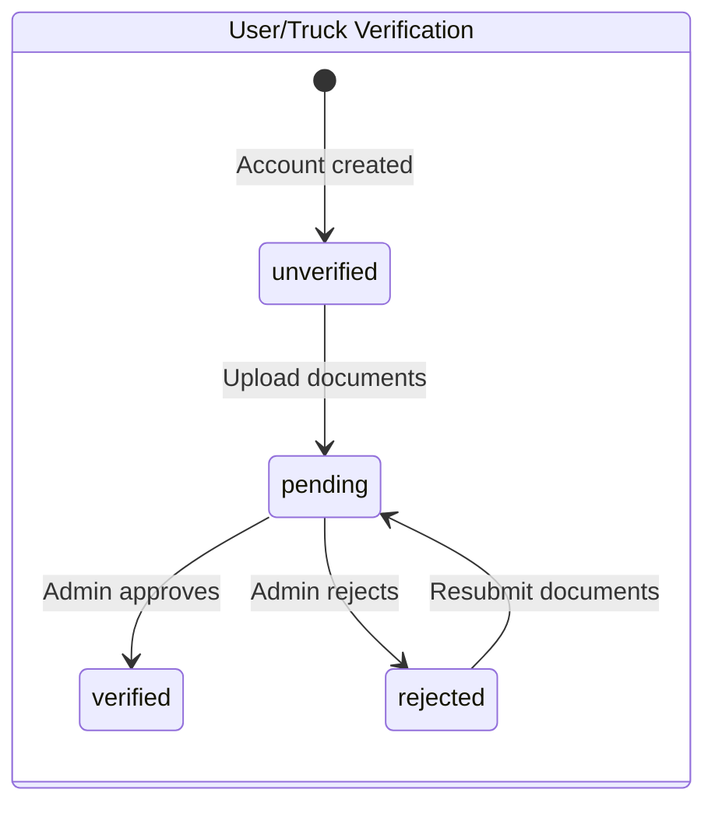

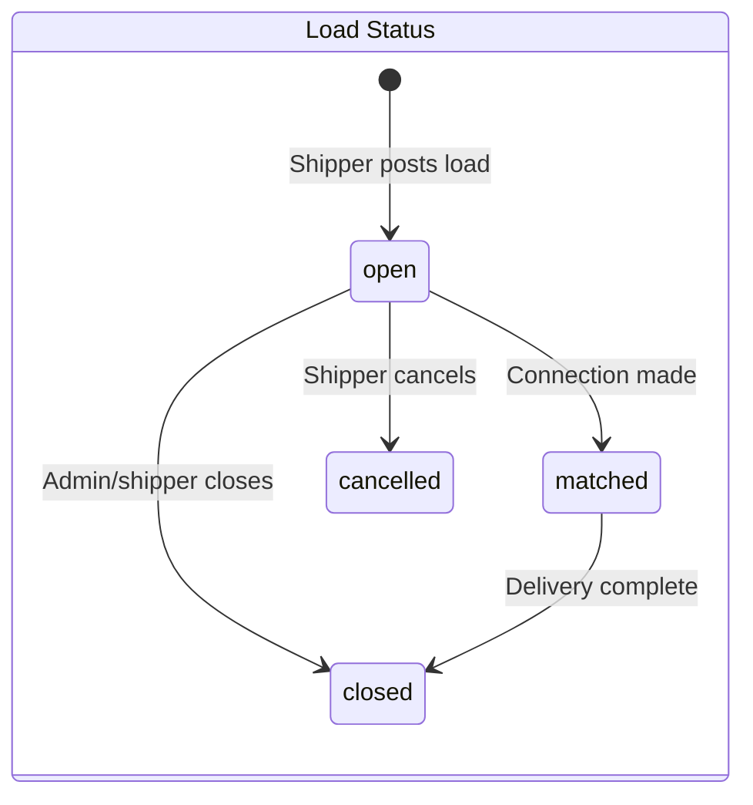

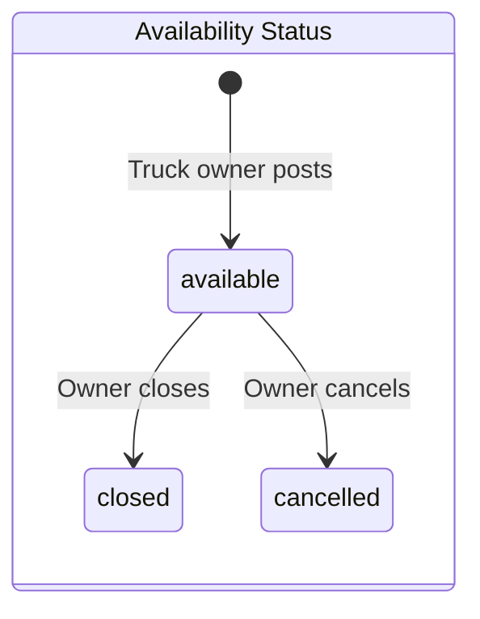

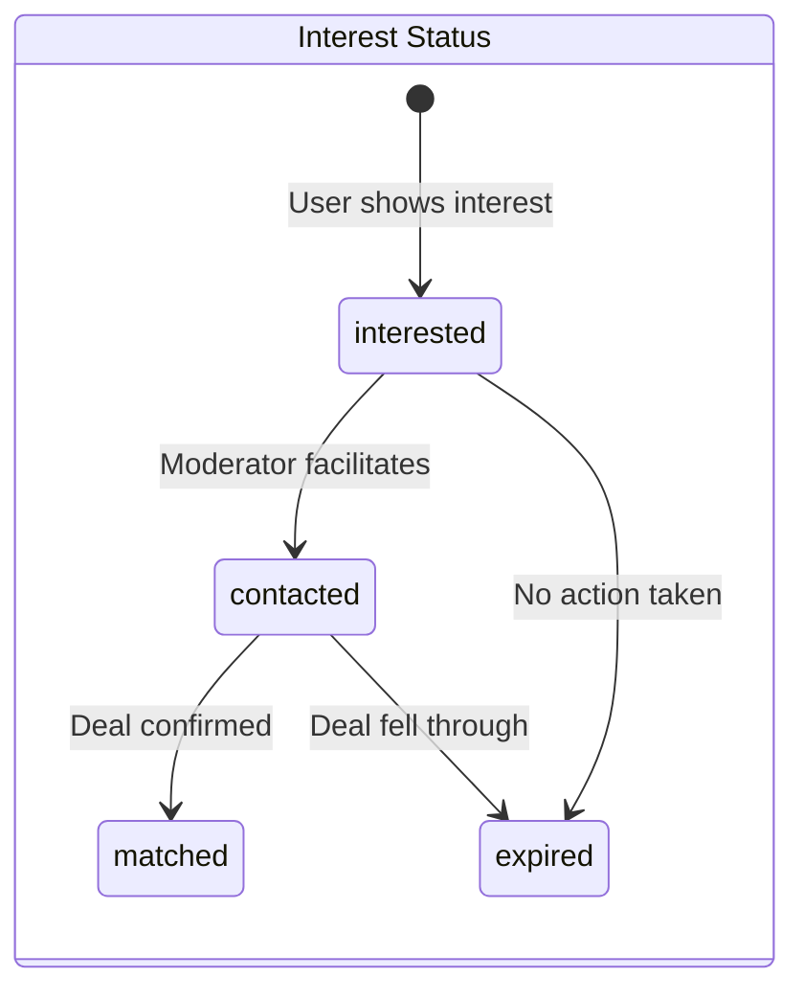

### 3.1 `user_role_enum`

| # | Value |
|---|---|
| 1 | `truck_owner` |
| 2 | `broker` |
| 3 | `shipper` |
| 4 | `moderator` |
| 5 | `admin` |

### 3.2 `user_verification_status_enum`

| # | Value |
|---|---|
| 1 | `unverified` |
| 2 | `verified` |
| 3 | `rejected` |
| 4 | `pending` |

### 3.3 `subscription_type_enum`

| # | Value |
|---|---|
| 1 | `free` |
| 2 | `premium` |
| 3 | `enterprise` |

### 3.4 `truck_category_enum`

| # | Value |
|---|---|
| 1 | `open` |
| 2 | `container` |
| 3 | `lcv` |
| 4 | `mini_pickup` |
| 5 | `trailer` |
| 6 | `tipper` |
| 7 | `tanker` |
| 8 | `dumper` |
| 9 | `bulker` |

### 3.5 `truck_verification_status_enum`

| # | Value |
|---|---|
| 1 | `unverified` |
| 2 | `verified` |
| 3 | `rejected` |
| 4 | `pending` |

### 3.6 `permit_type_enum`

| # | Value |
|---|---|
| 1 | `national_permit` |
| 2 | `state_permit` |
| 3 | `all_india_permit` |
| 4 | `goods_carriage` |
| 5 | `contract_carriage` |

### 3.7 `truck_availability_status_enum`

| # | Value |
|---|---|
| 1 | `available` |
| 2 | `closed` |
| 3 | `cancelled` |

### 3.8 `load_status_enum`

| # | Value |
|---|---|
| 1 | `open` |
| 2 | `matched` |
| 3 | `cancelled` |
| 4 | `closed` |

### 3.9 `load_rate_visibility_enum`

| # | Value |
|---|---|
| 1 | `visible` |
| 2 | `hidden` |

> **Note:** This enum exists in the schema but is not currently referenced by any table column.

### 3.10 `payment_type_enum`

| # | Value |
|---|---|
| 1 | `advance` |
| 2 | `partial_advance` |
| 3 | `after_delivery` |

---

## 4. Foreign Key Map (20 FKs)

| # | Constraint Name | Source Table.Column | Target Table.Column | ON DELETE |
|---|---|---|---|---|
| 1 | `users_id_fkey` | `users.id` | `auth.users(id)` | CASCADE |
| 2 | `trucks_owner_id_fkey` | `trucks.owner_id` | `users(id)` | CASCADE |
| 3 | `trucks_variant_id_fkey` | `trucks.variant_id` | `truck_variants(id)` | NO ACTION |
| 4 | `availabilities_owner_id_fkey` | `availabilities.owner_id` | `users(id)` | CASCADE |
| 5 | `availabilities_truck_id_fkey` | `availabilities.truck_id` | `trucks(id)` | CASCADE |
| 6 | `availabilities_origin_location_id_fkey` | `availabilities.origin_location_id` | `locations(id)` | NO ACTION |
| 7 | `availabilities_destination_location_id_fkey` | `availabilities.destination_location_id` | `locations(id)` | NO ACTION |
| 8 | `loads_posted_by_fkey` | `loads.posted_by` | `users(id)` | CASCADE |
| 9 | `loads_origin_location_id_fkey` | `loads.origin_location_id` | `locations(id)` | RESTRICT |
| 10 | `loads_destination_location_id_fkey` | `loads.destination_location_id` | `locations(id)` | RESTRICT |
| 11 | `admin_alerts_load_id_fkey` | `admin_alerts.load_id` | `loads(id)` | CASCADE |
| 12 | `admin_alerts_handled_by_fkey` | `admin_alerts.handled_by` | `users(id)` | NO ACTION |
| 13 | `verification_submissions_submitted_by_fkey` | `verification_submissions.submitted_by` | `auth.users(id)` | NO ACTION |
| 14 | `verification_submissions_reviewed_by_fkey` | `verification_submissions.reviewed_by` | `auth.users(id)` | NO ACTION |
| 15 | `verification_documents_submission_id_fkey` | `verification_documents.submission_id` | `verification_submissions(id)` | CASCADE |
| 16 | `audit_log_actor_id_fkey` | `audit_log.actor_id` | `auth.users(id)` | NO ACTION |
| 17 | `interests_load_id_fkey` | `interests.load_id` | `loads(id)` | NO ACTION |
| 18 | `interests_availability_id_fkey` | `interests.availability_id` | `availabilities(id)` | NO ACTION |
| 19 | `interests_interested_by_fkey` | `interests.interested_by` | `auth.users(id)` | NO ACTION |
| 20 | `interests_contacted_party_fkey` | `interests.contacted_party` | `auth.users(id)` | NO ACTION |

---

## 5. Indexes (41 indexes)

### 5.1 `users` (2 indexes)

| Index Name | Definition | Type |
|---|---|---|
| `users_pkey` | `CREATE UNIQUE INDEX users_pkey ON public.users USING btree (id)` | UNIQUE btree |
| `users_phone_key` | `CREATE UNIQUE INDEX users_phone_key ON public.users USING btree (phone)` | UNIQUE btree |

### 5.2 `truck_variants` (1 index)

| Index Name | Definition | Type |
|---|---|---|
| `truck_variants_pkey` | `CREATE UNIQUE INDEX truck_variants_pkey ON public.truck_variants USING btree (id)` | UNIQUE btree |

### 5.3 `trucks` (4 indexes)

| Index Name | Definition | Type |
|---|---|---|
| `trucks_pkey` | `CREATE UNIQUE INDEX trucks_pkey ON public.trucks USING btree (id)` | UNIQUE btree |
| `idx_trucks_owner_id` | `CREATE INDEX idx_trucks_owner_id ON public.trucks USING btree (owner_id)` | btree |
| `idx_trucks_category` | `CREATE INDEX idx_trucks_category ON public.trucks USING btree (category)` | btree |
| `idx_trucks_variant_id` | `CREATE INDEX idx_trucks_variant_id ON public.trucks USING btree (variant_id)` | btree |

### 5.4 `locations` (1 index)

| Index Name | Definition | Type |
|---|---|---|
| `locations_pkey` | `CREATE UNIQUE INDEX locations_pkey ON public.locations USING btree (id)` | UNIQUE btree |

### 5.5 `availabilities` (7 indexes)

| Index Name | Definition | Type |
|---|---|---|
| `availabilities_pkey` | `CREATE UNIQUE INDEX availabilities_pkey ON public.availabilities USING btree (id)` | UNIQUE btree |
| `idx_availabilities_owner_id` | `CREATE INDEX idx_availabilities_owner_id ON public.availabilities USING btree (owner_id)` | btree |
| `idx_availabilities_truck_id` | `CREATE INDEX idx_availabilities_truck_id ON public.availabilities USING btree (truck_id)` | btree |
| `idx_availabilities_origin` | `CREATE INDEX idx_availabilities_origin ON public.availabilities USING btree (origin_location_id)` | btree |
| `idx_availabilities_destination` | `CREATE INDEX idx_availabilities_destination ON public.availabilities USING btree (destination_location_id)` | btree |
| `idx_availabilities_status` | `CREATE INDEX idx_availabilities_status ON public.availabilities USING btree (status)` | btree |
| `idx_availabilities_dates` | `CREATE INDEX idx_availabilities_dates ON public.availabilities USING btree (available_from, available_till)` | btree (composite) |

### 5.6 `loads` (8 indexes)

| Index Name | Definition | Type |
|---|---|---|
| `loads_pkey` | `CREATE UNIQUE INDEX loads_pkey ON public.loads USING btree (id)` | UNIQUE btree |
| `idx_load_posted_by` | `CREATE INDEX idx_load_posted_by ON public.loads USING btree (posted_by)` | btree |
| `idx_loads_origin_location` | `CREATE INDEX idx_loads_origin_location ON public.loads USING btree (origin_location_id)` | btree |
| `idx_loads_destination_location` | `CREATE INDEX idx_loads_destination_location ON public.loads USING btree (destination_location_id)` | btree |
| `idx_load_category` | `CREATE INDEX idx_load_category ON public.loads USING btree (truck_category_required)` | btree |
| `idx_loads_created_at` | `CREATE INDEX idx_loads_created_at ON public.loads USING btree (created_at DESC)` | btree |
| `idx_loads_route_date` | `CREATE INDEX idx_loads_route_date ON public.loads USING btree (origin_location_id, destination_location_id, loading_date)` | btree (composite) |
| `idx_open_loads` | `CREATE INDEX idx_open_loads ON public.loads USING btree (status) WHERE (status = 'open'::load_status_enum)` | btree (**partial**) |

### 5.7 `admin_alerts` (2 indexes)

| Index Name | Definition | Type |
|---|---|---|
| `admin_alerts_pkey` | `CREATE UNIQUE INDEX admin_alerts_pkey ON public.admin_alerts USING btree (id)` | UNIQUE btree |
| `admin_alerts_load_id_key` | `CREATE UNIQUE INDEX admin_alerts_load_id_key ON public.admin_alerts USING btree (load_id)` | UNIQUE btree |

### 5.8 `verification_submissions` (3 indexes)

| Index Name | Definition | Type |
|---|---|---|
| `verification_submissions_pkey` | `CREATE UNIQUE INDEX verification_submissions_pkey ON public.verification_submissions USING btree (id)` | UNIQUE btree |
| `idx_vs_entity_lookup` | `CREATE INDEX idx_vs_entity_lookup ON public.verification_submissions USING btree (entity_type, entity_id, created_at DESC)` | btree (composite) |
| `idx_vs_status` | `CREATE INDEX idx_vs_status ON public.verification_submissions USING btree (status, created_at DESC)` | btree (composite) |

### 5.9 `verification_documents` (3 indexes)

| Index Name | Definition | Type |
|---|---|---|
| `verification_documents_pkey` | `CREATE UNIQUE INDEX verification_documents_pkey ON public.verification_documents USING btree (id)` | UNIQUE btree |
| `idx_vd_submission` | `CREATE INDEX idx_vd_submission ON public.verification_documents USING btree (submission_id)` | btree |
| `idx_vd_entity_lookup` | `CREATE INDEX idx_vd_entity_lookup ON public.verification_documents USING btree (entity_type, entity_id, created_at DESC)` | btree (composite) |

### 5.10 `audit_log` (5 indexes)

| Index Name | Definition | Type |
|---|---|---|
| `audit_log_pkey` | `CREATE UNIQUE INDEX audit_log_pkey ON public.audit_log USING btree (id)` | UNIQUE btree |
| `idx_audit_log_actor` | `CREATE INDEX idx_audit_log_actor ON public.audit_log USING btree (actor_id, created_at DESC)` | btree (composite) |
| `idx_audit_log_action` | `CREATE INDEX idx_audit_log_action ON public.audit_log USING btree (action, created_at DESC)` | btree (composite) |
| `idx_audit_log_entity` | `CREATE INDEX idx_audit_log_entity ON public.audit_log USING btree (entity_type, entity_id, created_at DESC)` | btree (composite) |
| `idx_audit_log_created` | `CREATE INDEX idx_audit_log_created ON public.audit_log USING btree (created_at DESC)` | btree |

### 5.11 `interests` (5 indexes)

| Index Name | Definition | Type |
|---|---|---|
| `interests_pkey` | `CREATE UNIQUE INDEX interests_pkey ON public.interests USING btree (id)` | UNIQUE btree |
| `idx_interests_load` | `CREATE INDEX idx_interests_load ON public.interests USING btree (load_id, created_at DESC)` | btree (composite) |
| `idx_interests_avail` | `CREATE INDEX idx_interests_avail ON public.interests USING btree (availability_id, created_at DESC)` | btree (composite) |
| `idx_interests_by` | `CREATE INDEX idx_interests_by ON public.interests USING btree (interested_by, created_at DESC)` | btree (composite) |
| `idx_interests_status` | `CREATE INDEX idx_interests_status ON public.interests USING btree (status, created_at DESC)` | btree (composite) |

---

## 6. RLS Policies (31 public + 3 storage = 34 total)

All tables have RLS **enabled**. Policies are grouped by table below.

### RLS Decision Flow (how access is determined)

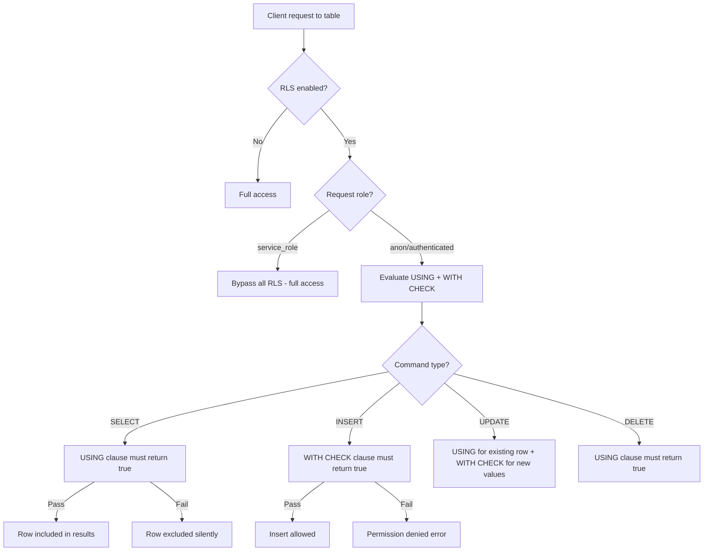

### Access Pattern by Role

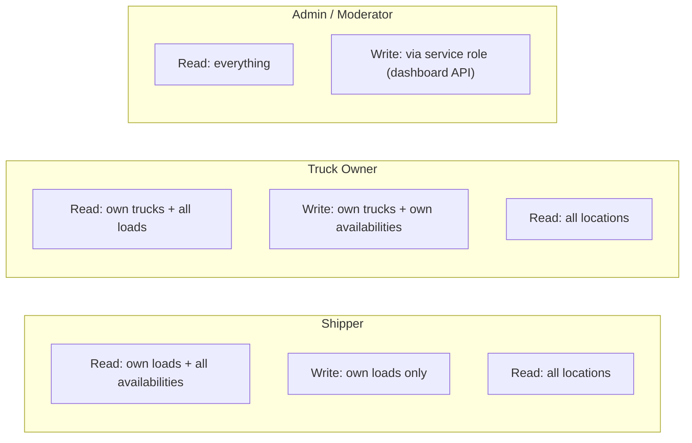

### 6.1 `users` (4 policies)

| Policy Name | Command | Roles | USING | WITH CHECK |
|---|---|---|---|---|
| `select own user` | SELECT | `public` | `auth.uid() = id` | — |
| `view users` | SELECT | `public` | `true` | — |
| `insert own user` | INSERT | `public` | — | `auth.uid() = id` |
| `update own user` | UPDATE | `public` | `auth.uid() = id` | — |

> **Note:** Two SELECT policies exist — `select own user` allows a user to see their own row; `view users` allows all authenticated users to see all users (public directory).

### 6.2 `truck_variants` (1 policy)

| Policy Name | Command | Roles | USING | WITH CHECK |
|---|---|---|---|---|
| `read truck variants` | SELECT | `public` | `true` | — |

### 6.3 `trucks` (4 policies)

| Policy Name | Command | Roles | USING | WITH CHECK |
|---|---|---|---|---|
| `view trucks` | SELECT | `public` | `owner_id = auth.uid() OR user.role IN ('admin','broker','moderator') OR true` | — |
| `insert trucks` | INSERT | `public` | — | `owner_id = auth.uid() AND user.role = 'truck_owner'` |
| `update trucks` | UPDATE | `public` | `(owner_id = auth.uid() AND verification_status = 'unverified') OR user.role = 'admin'` | — |
| `delete trucks` | DELETE | `public` | `owner_id = auth.uid() OR user.role = 'admin'` | — |

**Detailed USING/WITH CHECK clauses:**

- **`view trucks`** USING:
  ```sql
  (owner_id = auth.uid())
  OR (EXISTS (SELECT 1 FROM users WHERE users.id = auth.uid()
       AND users.role IN ('admin','broker','moderator')))
  OR true
  ```
- **`insert trucks`** WITH CHECK:
  ```sql
  (owner_id = auth.uid())
  AND (EXISTS (SELECT 1 FROM users WHERE users.id = auth.uid()
       AND users.role = 'truck_owner'))
  ```
- **`update trucks`** USING:
  ```sql
  ((owner_id = auth.uid() AND verification_status = 'unverified')
   OR (EXISTS (SELECT 1 FROM users WHERE users.id = auth.uid()
        AND users.role = 'admin')))
  ```
- **`delete trucks`** USING:
  ```sql
  (owner_id = auth.uid())
  OR (EXISTS (SELECT 1 FROM users WHERE users.id = auth.uid()
       AND users.role = 'admin'))
  ```

### 6.4 `locations` (1 policy)

| Policy Name | Command | Roles | USING | WITH CHECK |
|---|---|---|---|---|
| `read locations` | SELECT | `public` | `true` | — |

### 6.5 `availabilities` (4 policies)

| Policy Name | Command | Roles | USING | WITH CHECK |
|---|---|---|---|---|
| `view availabilities` | SELECT | `public` | *(see below)* | — |
| `insert availabilities` | INSERT | `public` | — | *(see below)* |
| `update availabilities` | UPDATE | `public` | *(see below)* | — |
| `delete availabilities` | DELETE | `public` | *(see below)* | — |

**Detailed clauses:**

- **`view availabilities`** USING:
  ```sql
  (owner_id = auth.uid())
  OR (EXISTS (SELECT 1 FROM users WHERE users.id = auth.uid()
       AND users.role IN ('admin','broker','moderator','shipper')))
  OR (status = 'available')
  ```
- **`insert availabilities`** WITH CHECK:
  ```sql
  (owner_id = auth.uid())
  AND (EXISTS (SELECT 1 FROM users WHERE users.id = auth.uid()
       AND users.role = 'truck_owner'))
  ```
- **`update availabilities`** USING:
  ```sql
  (owner_id = auth.uid())
  OR (EXISTS (SELECT 1 FROM users WHERE users.id = auth.uid()
       AND users.role IN ('admin','moderator')))
  ```
- **`delete availabilities`** USING:
  ```sql
  (owner_id = auth.uid())
  OR (EXISTS (SELECT 1 FROM users WHERE users.id = auth.uid()
       AND users.role = 'admin'))
  ```

### 6.6 `loads` (5 policies)

| Policy Name | Command | Roles | USING | WITH CHECK |
|---|---|---|---|---|
| `view loads` | SELECT | `public` | *(see below)* | — |
| `broker/admin view loads` | SELECT | `public` | *(see below)* | — |
| `insert loads` | INSERT | `public` | — | *(see below)* |
| `update loads` | UPDATE | `public` | *(see below)* | — |
| `delete loads` | DELETE | `public` | *(see below)* | — |

**Detailed clauses:**

- **`view loads`** USING:
  ```sql
  (posted_by = auth.uid())
  OR (EXISTS (SELECT 1 FROM users WHERE users.id = auth.uid()
       AND users.role IN ('truck_owner','broker','admin','moderator')))
  ```
- **`broker/admin view loads`** USING:
  ```sql
  EXISTS (SELECT 1 FROM users WHERE users.id = auth.uid()
       AND users.role IN ('admin','broker','moderator'))
  ```
- **`insert loads`** WITH CHECK:
  ```sql
  (posted_by = auth.uid())
  AND (EXISTS (SELECT 1 FROM users WHERE users.id = auth.uid()
       AND users.role = 'shipper'))
  ```
- **`update loads`** USING:
  ```sql
  (posted_by = auth.uid())
  OR (EXISTS (SELECT 1 FROM users WHERE users.id = auth.uid()
       AND users.role IN ('admin','moderator')))
  ```
- **`delete loads`** USING:
  ```sql
  (posted_by = auth.uid())
  OR (EXISTS (SELECT 1 FROM users WHERE users.id = auth.uid()
       AND users.role = 'admin'))
  ```

### 6.7 `admin_alerts` (4 policies)

| Policy Name | Command | Roles | USING | WITH CHECK |
|---|---|---|---|---|
| `view admin alerts` | SELECT | `public` | `user.role IN ('admin','moderator')` | — |
| `insert admin alerts` | INSERT | `public` | — | `true` |
| `update admin alerts` | UPDATE | `public` | `user.role IN ('admin','moderator')` | — |
| `delete admin alerts` | DELETE | `public` | `user.role = 'admin'` | — |

**Detailed clauses:**

- **`view admin alerts`** USING:
  ```sql
  EXISTS (SELECT 1 FROM users WHERE users.id = auth.uid()
       AND users.role IN ('admin','moderator'))
  ```
- **`insert admin alerts`** WITH CHECK: `true` (any authenticated user — intended for trigger/service inserts)
- **`update admin alerts`** USING:
  ```sql
  EXISTS (SELECT 1 FROM users WHERE users.id = auth.uid()
       AND users.role IN ('admin','moderator'))
  ```
- **`delete admin alerts`** USING:
  ```sql
  EXISTS (SELECT 1 FROM users WHERE users.id = auth.uid()
       AND users.role = 'admin')
  ```

### 6.8 `verification_submissions` (2 policies)

| Policy Name | Command | Roles | USING | WITH CHECK |
|---|---|---|---|---|
| `Users read own submissions` | SELECT | `authenticated` | *(see below)* | — |
| `Users insert own submissions` | INSERT | `authenticated` | — | *(see below)* |

**Detailed clauses:**

- **`Users read own submissions`** USING:
  ```sql
  (submitted_by = auth.uid())
  OR ((entity_type = 'truck') AND EXISTS (
    SELECT 1 FROM trucks
    WHERE trucks.id = verification_submissions.entity_id
      AND trucks.owner_id = auth.uid()
  ))
  ```
- **`Users insert own submissions`** WITH CHECK:
  ```sql
  (submitted_by = auth.uid())
  AND (
    ((entity_type = 'user') AND (entity_id = auth.uid()))
    OR
    ((entity_type = 'truck') AND EXISTS (
      SELECT 1 FROM trucks
      WHERE trucks.id = verification_submissions.entity_id
        AND trucks.owner_id = auth.uid()
    ))
  )
  ```

### 6.9 `verification_documents` (2 policies)

| Policy Name | Command | Roles | USING | WITH CHECK |
|---|---|---|---|---|
| `Users read own docs` | SELECT | `authenticated` | *(see below)* | — |
| `Users insert own docs` | INSERT | `authenticated` | — | *(see below)* |

**Detailed clauses:**

- **`Users read own docs`** USING:
  ```sql
  EXISTS (SELECT 1 FROM verification_submissions vs
    WHERE vs.id = verification_documents.submission_id
      AND vs.submitted_by = auth.uid())
  ```
- **`Users insert own docs`** WITH CHECK:
  ```sql
  EXISTS (SELECT 1 FROM verification_submissions vs
    WHERE vs.id = verification_documents.submission_id
      AND vs.submitted_by = auth.uid())
  ```

### 6.10 `audit_log` (1 policy)

| Policy Name | Command | Roles | USING | WITH CHECK |
|---|---|---|---|---|
| `Service role manages audit_log` | ALL | `service_role` | `true` | `true` |

> Only the `service_role` (backend/Edge Functions) can read or write audit logs. No client-side access.

### 6.11 `interests` (3 policies)

| Policy Name | Command | Roles | USING | WITH CHECK |
|---|---|---|---|---|
| `Service role full access` | ALL | `service_role` | `true` | `true` |
| `Users insert own interest` | INSERT | `authenticated` | — | `interested_by = auth.uid()` |
| `Users read own interests` | SELECT | `authenticated` | `interested_by = auth.uid() OR contacted_party = auth.uid()` | — |

### 6.12 Storage RLS — `storage.objects` (3 policies)

| Policy Name | Command | Roles | USING | WITH CHECK |
|---|---|---|---|---|
| `Users upload own verification docs` | INSERT | `authenticated` | — | *(see below)* |
| `Truck owners upload truck verification docs` | INSERT | `authenticated` | — | *(see below)* |
| `Users read own verification docs` | SELECT | `authenticated` | *(see below)* | — |

**Detailed clauses:**

- **`Users upload own verification docs`** WITH CHECK:
  ```sql
  bucket_id = 'verification-docs'
  AND (storage.foldername(name))[1] = 'user'
  AND (storage.foldername(name))[2] = auth.uid()::text
  ```
- **`Truck owners upload truck verification docs`** WITH CHECK:
  ```sql
  bucket_id = 'verification-docs'
  AND (storage.foldername(name))[1] = 'truck'
  AND EXISTS (SELECT 1 FROM trucks
    WHERE trucks.id::text = (storage.foldername(objects.name))[2]
      AND trucks.owner_id = auth.uid())
  ```
- **`Users read own verification docs`** USING:
  ```sql
  bucket_id = 'verification-docs'
  AND (
    ((storage.foldername(name))[1] = 'user'
     AND (storage.foldername(name))[2] = auth.uid()::text)
    OR
    ((storage.foldername(name))[1] = 'truck'
     AND EXISTS (SELECT 1 FROM trucks
       WHERE trucks.id::text = (storage.foldername(objects.name))[2]
         AND trucks.owner_id = auth.uid()))
  )
  ```

---

## 7. Storage

### 7.1 Bucket: `verification-docs`

| Property | Value |
|---|---|
| **Name** | `verification-docs` |
| **Public** | `false` (private — requires signed URLs) |
| **Max file size** | 10,485,760 bytes (10 MB) |
| **Allowed MIME types** | `image/jpeg`, `image/png`, `image/webp`, `application/pdf` |

### 7.2 Path Convention

```
{entity_type}/{entity_id}/{submission_id}/{doc_key}/{timestamp}-{filename}
```

**Examples:**
```
user/abc-123/sub-456/aadhaar_front/1712553600000-aadhaar.jpg
truck/truck-789/sub-012/rc_book/1712553600000-rc.pdf
```

### 7.3 Storage RLS Summary

- **Upload user docs:** Authenticated user can only upload to `user/{their_uid}/...`
- **Upload truck docs:** Authenticated user can only upload to `truck/{truck_id}/...` if they own that truck
- **Read docs:** Users can read files under their own user folder or any truck folder they own

---

## 8. Check Constraints

| Table | Constraint Name | Definition |
|---|---|---|
| `availabilities` | `check_dates` | `(available_till IS NULL) OR (available_till >= available_from)` |
| `loads` | `loads_advance_percentage_check` | `advance_percentage IS NULL OR (advance_percentage >= 1 AND advance_percentage <= 100)` |
| `loads` | `check_advance_logic` | `(payment_type = 'advance' AND advance_percentage = 100) OR (payment_type = 'partial_advance' AND advance_percentage >= 1 AND advance_percentage <= 99) OR (payment_type = 'after_delivery' AND advance_percentage IS NULL)` |
| `interests` | `interests_status_check` | `status IN ('interested', 'contacted', 'matched', 'expired')` |
| `verification_submissions` | `verification_submissions_entity_type_check` | `entity_type IN ('user', 'truck')` |
| `verification_submissions` | `verification_submissions_status_check` | `status IN ('submitted', 'reviewed')` |
| `verification_submissions` | `verification_submissions_review_decision_check` | `review_decision IS NULL OR review_decision IN ('verified', 'rejected')` |
| `verification_documents` | `verification_documents_entity_type_check` | `entity_type IN ('user', 'truck')` |

---

## 9. Row Counts

> Snapshot as of 2026-04-08

| Table | Row Count |
|---|---|
| `users` | 3 |
| `truck_variants` | 31 |
| `trucks` | 3 |
| `locations` | 2,166 |
| `availabilities` | 3 |
| `loads` | 2 |
| `admin_alerts` | 2 |
| `verification_submissions` | 7 |
| `verification_documents` | 4 |
| `audit_log` | 1 |
| `interests` | 0 |
| **Total** | **2,222** |

---

## 10. Entity Relationship Diagram (Mermaid)

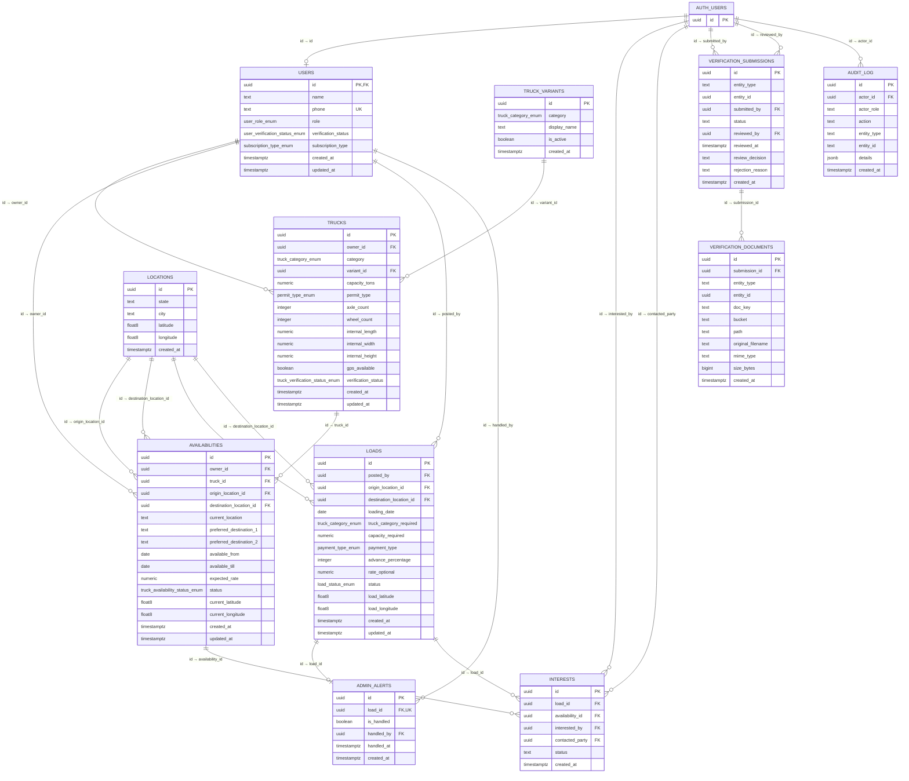

---

## 11. Data Flow Diagrams

### 11.1 User Registration Flow

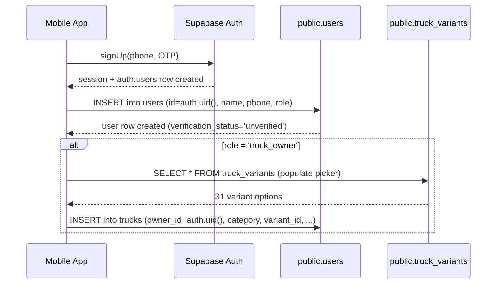

### 11.2 Verification Flow

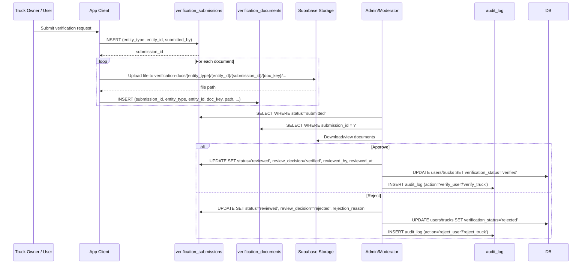

### 11.3 Interest / Lead Flow

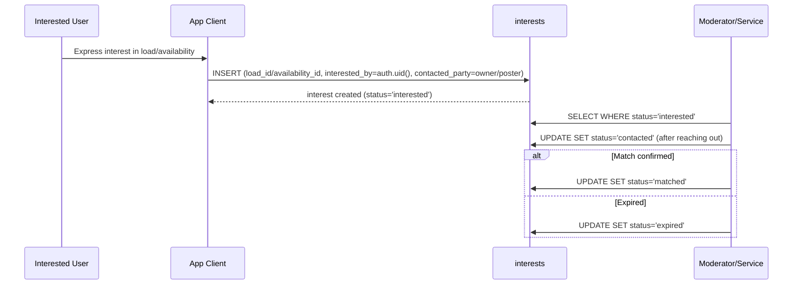

### 11.4 Load Posting Flow

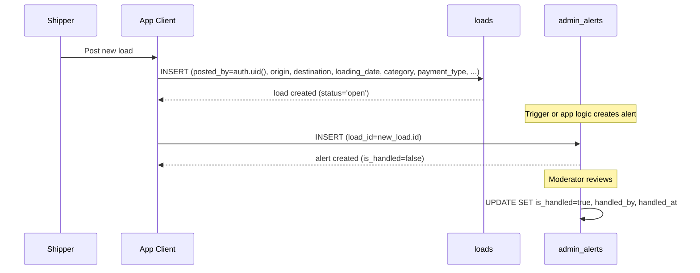

---

## 12. Migration History

| Version | Name | Applied |
|---|---|---|
| `20260408061953` | `add_verification_docs_infrastructure` | 2026-04-08 |
| `20260408102551` | `add_audit_log` | 2026-04-08 |
| `20260408104428` | `add_interests_table` | 2026-04-08 |

> **Note:** The base schema (users, trucks, truck_variants, locations, availabilities, loads, admin_alerts) was created before the migration system was initialized or via the Supabase Dashboard SQL editor. Only the three migrations above are tracked in `supabase_migrations.schema_migrations`.

---

## 13. Testing Guide for DBA

### 13.1 Verify RLS Works for Each Role

```sql
-- Test as a specific user (replace with actual user UUID)
-- In Supabase, use: SET request.jwt.claims = '{"sub":"<user-uuid>"}';

-- 1. Truck Owner should only INSERT trucks they own
SET role = 'authenticated';
SET request.jwt.claims = '{"sub":"<truck_owner_uuid>"}';
SELECT * FROM trucks;  -- should see own trucks
INSERT INTO trucks (owner_id, category) VALUES ('<other_user_uuid>', 'open');
-- ^ Should FAIL (RLS blocks)

-- 2. Shipper should only INSERT loads
SET request.jwt.claims = '{"sub":"<shipper_uuid>"}';
INSERT INTO loads (posted_by, origin_location_id, destination_location_id, loading_date, truck_category_required, payment_type)
VALUES ('<shipper_uuid>', '<loc1>', '<loc2>', '2026-04-10', 'open', 'advance');
-- ^ Should SUCCEED

-- 3. Broker should NOT insert loads
SET request.jwt.claims = '{"sub":"<broker_uuid>"}';
INSERT INTO loads (...) VALUES (...);
-- ^ Should FAIL

-- 4. Admin should be able to delete alerts
SET request.jwt.claims = '{"sub":"<admin_uuid>"}';
DELETE FROM admin_alerts WHERE id = '<alert_id>';
-- ^ Should SUCCEED

-- 5. Non-admin should NOT delete alerts
SET request.jwt.claims = '{"sub":"<non_admin_uuid>"}';
DELETE FROM admin_alerts WHERE id = '<alert_id>';
-- ^ Should FAIL

-- 6. Audit log: only service_role can read/write
SET role = 'authenticated';
SELECT * FROM audit_log;
-- ^ Should return 0 rows (no policy for authenticated)

SET role = 'service_role';
SELECT * FROM audit_log;
-- ^ Should return all rows
```

### 13.2 Test FK Constraints

```sql
-- 1. Cannot delete a location referenced by a load (ON DELETE RESTRICT)
DELETE FROM locations WHERE id = '<location_used_by_load>';
-- ^ Should FAIL with foreign_key_violation

-- 2. Deleting a user cascades to trucks, availabilities, loads
DELETE FROM auth.users WHERE id = '<test_user_uuid>';
-- ^ Should cascade: users row deleted → trucks deleted → availabilities deleted

-- 3. Deleting a truck cascades to availabilities
DELETE FROM trucks WHERE id = '<test_truck_uuid>';
-- ^ Should cascade: availabilities for that truck deleted

-- 4. Deleting a verification_submission cascades to verification_documents
DELETE FROM verification_submissions WHERE id = '<test_sub_uuid>';
-- ^ Should cascade: all related verification_documents deleted

-- 5. Cannot insert a truck with non-existent variant_id
INSERT INTO trucks (owner_id, category, variant_id) VALUES ('<valid_owner>', 'open', '00000000-0000-0000-0000-000000000000');
-- ^ Should FAIL with foreign_key_violation
```

### 13.3 Test Check Constraints

```sql
-- 1. available_till must be >= available_from
INSERT INTO availabilities (owner_id, truck_id, available_from, available_till)
VALUES ('<owner>', '<truck>', '2026-04-10', '2026-04-05');
-- ^ Should FAIL (check_dates)

-- 2. advance logic: payment_type='advance' requires advance_percentage=100
INSERT INTO loads (..., payment_type, advance_percentage) VALUES (..., 'advance', 50);
-- ^ Should FAIL (check_advance_logic)

-- 3. advance logic: payment_type='after_delivery' requires advance_percentage IS NULL
INSERT INTO loads (..., payment_type, advance_percentage) VALUES (..., 'after_delivery', 10);
-- ^ Should FAIL (check_advance_logic)

-- 4. advance_percentage must be 1-100 (or NULL)
INSERT INTO loads (..., payment_type, advance_percentage) VALUES (..., 'partial_advance', 0);
-- ^ Should FAIL (loads_advance_percentage_check)

-- 5. entity_type must be 'user' or 'truck'
INSERT INTO verification_submissions (entity_type, entity_id, submitted_by)
VALUES ('vehicle', '<id>', '<user>');
-- ^ Should FAIL (verification_submissions_entity_type_check)

-- 6. review_decision must be NULL, 'verified', or 'rejected'
UPDATE verification_submissions SET review_decision = 'approved' WHERE id = '<id>';
-- ^ Should FAIL (verification_submissions_review_decision_check)

-- 7. interests status must be one of the allowed values
INSERT INTO interests (..., status) VALUES (..., 'pending');
-- ^ Should FAIL (interests_status_check)
```

### 13.4 Test Enum Values

```sql
-- 1. Invalid role
INSERT INTO users (id, role) VALUES ('<uuid>', 'driver');
-- ^ Should FAIL (invalid input value for enum user_role_enum)

-- 2. Invalid truck category
INSERT INTO trucks (owner_id, category) VALUES ('<uuid>', 'van');
-- ^ Should FAIL (invalid input value for enum truck_category_enum)

-- 3. Invalid payment type
INSERT INTO loads (..., payment_type) VALUES (..., 'cod');
-- ^ Should FAIL (invalid input value for enum payment_type_enum)

-- 4. List all enum values
SELECT t.typname, e.enumlabel, e.enumsortorder
FROM pg_type t
JOIN pg_enum e ON t.oid = e.enumtypid
JOIN pg_namespace n ON t.typnamespace = n.oid
WHERE n.nspname = 'public'
ORDER BY t.typname, e.enumsortorder;
```

### 13.5 Verify Indexes Are Used

```sql
-- Run EXPLAIN ANALYZE on common query patterns:

-- 1. Lookup loads by route
EXPLAIN ANALYZE SELECT * FROM loads
WHERE origin_location_id = '<loc1>'
  AND destination_location_id = '<loc2>'
  AND loading_date = '2026-04-10';
-- Should use: idx_loads_route_date

-- 2. Open loads filter (partial index)
EXPLAIN ANALYZE SELECT * FROM loads WHERE status = 'open';
-- Should use: idx_open_loads

-- 3. Trucks by owner
EXPLAIN ANALYZE SELECT * FROM trucks WHERE owner_id = '<owner_uuid>';
-- Should use: idx_trucks_owner_id

-- 4. Availabilities by date range
EXPLAIN ANALYZE SELECT * FROM availabilities
WHERE available_from >= '2026-04-01' AND available_till <= '2026-04-30';
-- Should use: idx_availabilities_dates

-- 5. Audit log by entity
EXPLAIN ANALYZE SELECT * FROM audit_log
WHERE entity_type = 'user' AND entity_id = '<id>'
ORDER BY created_at DESC;
-- Should use: idx_audit_log_entity

-- 6. Verification submissions pending review
EXPLAIN ANALYZE SELECT * FROM verification_submissions
WHERE status = 'submitted' ORDER BY created_at DESC;
-- Should use: idx_vs_status

-- 7. Interests by load
EXPLAIN ANALYZE SELECT * FROM interests
WHERE load_id = '<load_uuid>' ORDER BY created_at DESC;
-- Should use: idx_interests_load
```

### 13.6 Storage RLS Test

```sql
-- Test via Supabase client SDK:
-- 1. User can upload to user/{their_uid}/...
-- 2. User CANNOT upload to user/{other_uid}/...
-- 3. Truck owner can upload to truck/{their_truck_id}/...
-- 4. User CANNOT upload to truck/{truck_they_dont_own}/...
-- 5. User can read files in their own folders only
```

---

## Appendix: Quick Reference

### Role-Permission Matrix

| Action | `truck_owner` | `broker` | `shipper` | `moderator` | `admin` |
|---|---|---|---|---|---|
| **users** — read own | Yes | Yes | Yes | Yes | Yes |
| **users** — read all | Yes | Yes | Yes | Yes | Yes |
| **users** — insert own | Yes | Yes | Yes | Yes | Yes |
| **users** — update own | Yes | Yes | Yes | Yes | Yes |
| **trucks** — view | Yes (own + all via `true`) | Yes | Yes* | Yes | Yes |
| **trucks** — insert | Yes (own) | No | No | No | No |
| **trucks** — update | Yes (own, unverified only) | No | No | No | Yes |
| **trucks** — delete | Yes (own) | No | No | No | Yes |
| **availabilities** — view | Yes (own + status=available) | Yes | Yes | Yes | Yes |
| **availabilities** — insert | Yes (own) | No | No | No | No |
| **availabilities** — update | Yes (own) | No | No | Yes | Yes |
| **availabilities** — delete | Yes (own) | No | No | No | Yes |
| **loads** — view | Yes | Yes | Yes (own) | Yes | Yes |
| **loads** — insert | No | No | Yes (own) | No | No |
| **loads** — update | No | No | Yes (own) | Yes | Yes |
| **loads** — delete | No | No | Yes (own) | No | Yes |
| **admin_alerts** — view | No | No | No | Yes | Yes |
| **admin_alerts** — insert | Yes | Yes | Yes | Yes | Yes |
| **admin_alerts** — update | No | No | No | Yes | Yes |
| **admin_alerts** — delete | No | No | No | No | Yes |
| **interests** — insert | Yes | Yes | Yes | Yes | Yes |
| **interests** — read | Yes (party) | Yes (party) | Yes (party) | Yes (party) | Yes (party) |
| **audit_log** | No | No | No | No | No (service_role only) |
| **locations** — read | Yes | Yes | Yes | Yes | Yes |
| **truck_variants** — read | Yes | Yes | Yes | Yes | Yes |
| **verification_submissions** — insert | Yes (own) | Yes (own) | Yes (own) | Yes (own) | Yes (own) |
| **verification_submissions** — read | Yes (own) | Yes (own) | Yes (own) | Yes (own) | Yes (own) |
| **verification_documents** — insert | Yes (own sub) | Yes (own sub) | Yes (own sub) | Yes (own sub) | Yes (own sub) |
| **verification_documents** — read | Yes (own sub) | Yes (own sub) | Yes (own sub) | Yes (own sub) | Yes (own sub) |

---

---

## Addendum: Tables Added Since Initial Documentation

### `interests` table

Tracks marketplace interactions (who expressed interest in which load/availability).

| Column | Data Type | Nullable | Default | Constraints |
|---|---|---|---|---|
| `id` | `uuid` | NO | `gen_random_uuid()` | PK |
| `load_id` | `uuid` | YES | — | FK → `loads.id` |
| `availability_id` | `uuid` | YES | — | FK → `availabilities.id` |
| `interested_by` | `uuid` | NO | — | FK → `auth.users.id` |
| `contacted_party` | `uuid` | NO | — | FK → `auth.users.id` |
| `status` | `text` | NO | `'interested'` | CHECK: `interested`, `contacted`, `matched`, `expired` |
| `created_at` | `timestamptz` | NO | `now()` | — |

**Indexes:** `interests_pkey`, `idx_interests_load`, `idx_interests_avail`, `idx_interests_by`, `idx_interests_status`

**RLS Policies:**
- `Users insert own interest` (INSERT, authenticated): `interested_by = auth.uid()`
- `Users read own interests` (SELECT, authenticated): `interested_by = auth.uid() OR contacted_party = auth.uid()`
- `Service role full access` (ALL, service_role): `true`

### `audit_log` table

Records all admin/moderator actions for accountability.

| Column | Data Type | Nullable | Default | Constraints |
|---|---|---|---|---|
| `id` | `uuid` | NO | `gen_random_uuid()` | PK |
| `actor_id` | `uuid` | YES | — | FK → `auth.users.id` |
| `actor_role` | `text` | YES | — | — |
| `action` | `text` | NO | — | — |
| `entity_type` | `text` | NO | — | — |
| `entity_id` | `text` | YES | — | — |
| `details` | `jsonb` | YES | `'{}'::jsonb` | — |
| `created_at` | `timestamptz` | NO | `now()` | — |

**Indexes:** `audit_log_pkey`, `idx_audit_log_created`, `idx_audit_log_action`, `idx_audit_log_entity`, `idx_audit_log_actor`

**RLS Policies:**
- `Service role manages audit_log` (ALL, service_role): `true`
- No public access (only the dashboard API writes/reads via service role)

### Interest status state machine

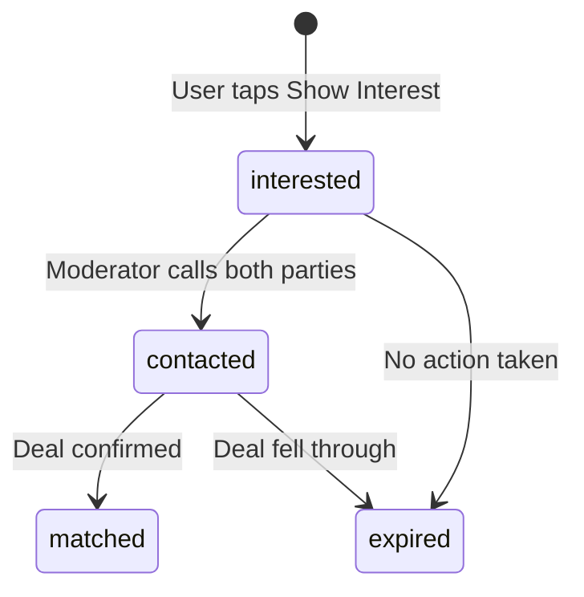

---

*End of documentation.*
