# LoadKaro System Architecture — Technical Documentation

> **Version:** 1.0 — April 2026
> **Scope:** Complete technical reference for the LoadKaro freight marketplace platform.

---

## Table of Contents

1. [System Overview](#1-system-overview)
2. [System Architecture Diagram](#2-system-architecture-diagram-mermaid)
3. [Authentication Flow](#3-authentication-flow)
4. [Data Flow: Core Marketplace](#4-data-flow-core-marketplace)
5. [Data Flow: Verification](#5-data-flow-verification)
6. [Data Flow: Admin Operations](#6-data-flow-admin-operations)
7. [Security Model](#7-security-model)
8. [Role Matrix](#8-role-matrix)
9. [API Reference](#9-api-reference)
10. [Environment Variables](#10-environment-variables)
11. [Deployment Architecture](#11-deployment-architecture)
12. [Monitoring & Observability](#12-monitoring--observability)
13. [Known Limitations & Future Work](#13-known-limitations--future-work)
14. [Testing Strategy](#14-testing-strategy)

---

## 1. System Overview

LoadKaro is a **two-sided freight marketplace** connecting Indian shippers with truck owners. The platform enables shippers to post loads requiring transport and truck owners to advertise availability, facilitating connections through phone calls and interest tracking. A moderation layer ensures verification of users and vehicles.

### Components

| Component | Stack | Purpose |
|-----------|-------|---------|
| **LoadKaro Mobile App** | React Native (Expo SDK 54), Zustand, React Navigation | Shipper & truck owner interface: post loads, manage trucks, create availabilities, browse marketplace, initiate contact |
| **Admin Dashboard** | Next.js 16 (App Router), shadcn/ui, TanStack Table, Tailwind CSS | Admin & moderator interface: verify users/trucks, manage all records, monitor KPIs, audit trail |
| **Supabase Backend** | PostgreSQL, Supabase Auth (phone OTP + email/password), Supabase Storage, Row Level Security | Data persistence, authentication, file storage, authorization enforcement |

### Key Design Decisions

- **Phone-first auth** — Indian market targets users comfortable with phone OTP; email/password is reserved for dashboard staff.
- **Service role for dashboard** — Dashboard API bypasses RLS using the service role key so admins/moderators can read and write all rows without per-user policies.
- **No real-time** — Marketplace operates on pull-based browsing (no WebSocket subscriptions or push notifications).
- **Call-based matching** — Users connect via phone calls (`tel:` links); the platform tracks interest but does not broker the conversation.

---

## 2. System Architecture Diagram (Mermaid)

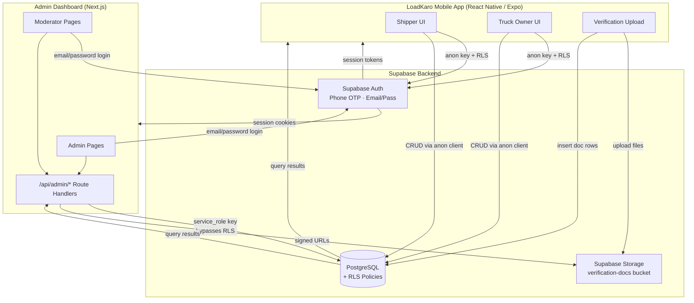
```mermaid
flowchart TB
    subgraph Mobile["LoadKaro Mobile App (React Native / Expo)"]
        MA[Shipper UI]
        MB[Truck Owner UI]
        MC[Verification Upload]
    end

    subgraph Dashboard["Admin Dashboard (Next.js)"]
        DA[Admin Pages]
        DM[Moderator Pages]
        DAPI["/api/admin/* Route Handlers"]
    end

    subgraph Supabase["Supabase Backend"]
        AUTH[Supabase Auth<br/>Phone OTP · Email/Pass]
        DB[(PostgreSQL<br/>+ RLS Policies)]
        STORE[Supabase Storage<br/>verification-docs bucket]
    end

    MA -->|anon key + RLS| AUTH
    MB -->|anon key + RLS| AUTH
    MA -->|CRUD via anon client| DB
    MB -->|CRUD via anon client| DB
    MC -->|upload files| STORE
    MC -->|insert doc rows| DB

    DA -->|email/password login| AUTH
    DM -->|email/password login| AUTH
    DA --> DAPI
    DM --> DAPI
    DAPI -->|service_role key<br/>bypasses RLS| DB
    DAPI -->|signed URLs| STORE

    AUTH -->|session tokens| Mobile
    AUTH -->|session cookies| Dashboard
    DB -->|query results| Mobile
    DB -->|query results| DAPI
```

### Data Flow Summary

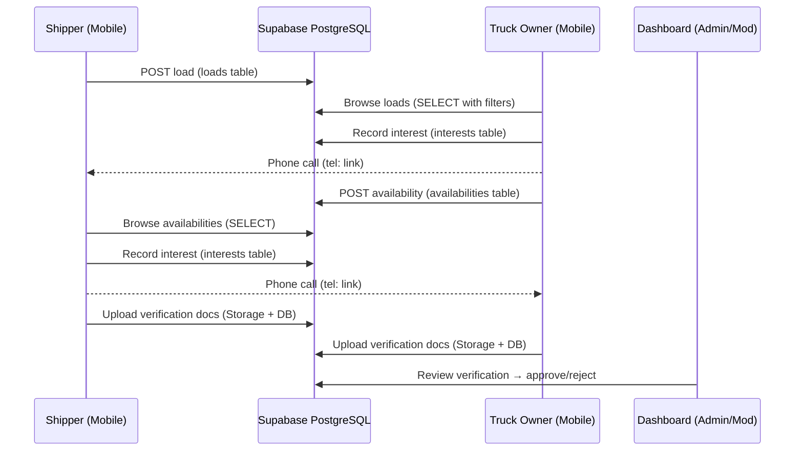
```mermaid
sequenceDiagram
    participant S as Shipper (Mobile)
    participant DB as Supabase PostgreSQL
    participant T as Truck Owner (Mobile)
    participant D as Dashboard (Admin/Mod)

    S->>DB: POST load (loads table)
    T->>DB: Browse loads (SELECT with filters)
    T->>DB: Record interest (interests table)
    T-->>S: Phone call (tel: link)

    T->>DB: POST availability (availabilities table)
    S->>DB: Browse availabilities (SELECT)
    S->>DB: Record interest (interests table)
    S-->>T: Phone call (tel: link)

    S->>DB: Upload verification docs (Storage + DB)
    T->>DB: Upload verification docs (Storage + DB)
    D->>DB: Review verification → approve/reject
```

---

## 3. Authentication Flow

### 3.1 Mobile App — Phone OTP

The mobile app uses Supabase Auth's phone OTP flow exclusively. Two modes exist: **Register** (new user) and **Sign In** (returning user).

#### Registration Flow

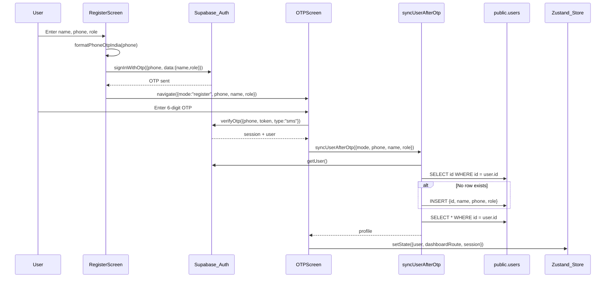
```mermaid
sequenceDiagram
    participant U as User
    participant RS as RegisterScreen
    participant Auth as Supabase_Auth
    participant OTP as OTPScreen
    participant Sync as syncUserAfterOtp
    participant DB as public.users
    participant Store as Zustand_Store

    U->>RS: Enter name, phone, role
    RS->>RS: formatPhoneOtpIndia(phone)
    RS->>Auth: signInWithOtp({phone, data:{name,role}})
    Auth-->>RS: OTP sent
    RS->>OTP: navigate({mode:"register", phone, name, role})
    U->>OTP: Enter 6-digit OTP
    OTP->>Auth: verifyOtp({phone, token, type:"sms"})
    Auth-->>OTP: session + user
    OTP->>Sync: syncUserAfterOtp({mode, phone, name, role})
    Sync->>Auth: getUser()
    Sync->>DB: SELECT id WHERE id = user.id
    alt No row exists
        Sync->>DB: INSERT {id, name, phone, role}
    end
    Sync->>DB: SELECT * WHERE id = user.id
    Sync-->>OTP: profile
    OTP->>Store: setState({user, dashboardRoute, session})
```

#### Sign-In Flow

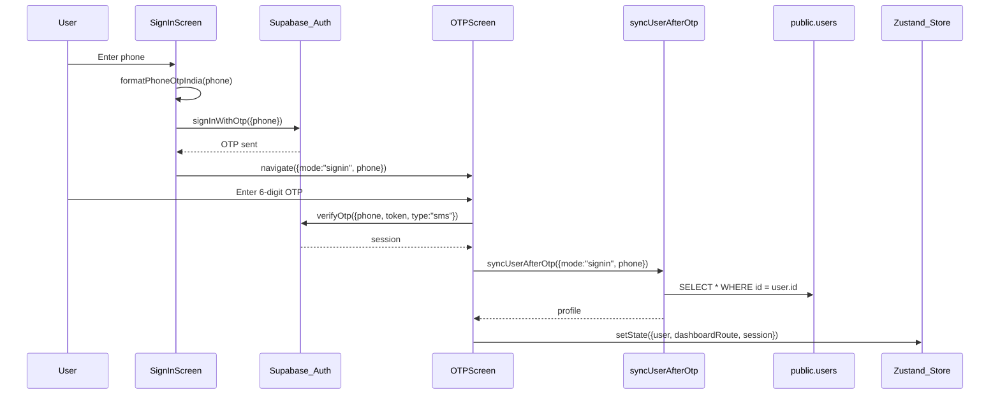
```mermaid
sequenceDiagram
    participant U as User
    participant SI as SignInScreen
    participant Auth as Supabase_Auth
    participant OTP as OTPScreen
    participant Sync as syncUserAfterOtp
    participant DB as public.users
    participant Store as Zustand_Store

    U->>SI: Enter phone
    SI->>SI: formatPhoneOtpIndia(phone)
    SI->>Auth: signInWithOtp({phone})
    Auth-->>SI: OTP sent
    SI->>OTP: navigate({mode:"signin", phone})
    U->>OTP: Enter 6-digit OTP
    OTP->>Auth: verifyOtp({phone, token, type:"sms"})
    Auth-->>OTP: session
    OTP->>Sync: syncUserAfterOtp({mode:"signin", phone})
    Sync->>DB: SELECT * WHERE id = user.id
    Sync-->>OTP: profile
    OTP->>Store: setState({user, dashboardRoute, session})
```

#### OTP Verification Detail

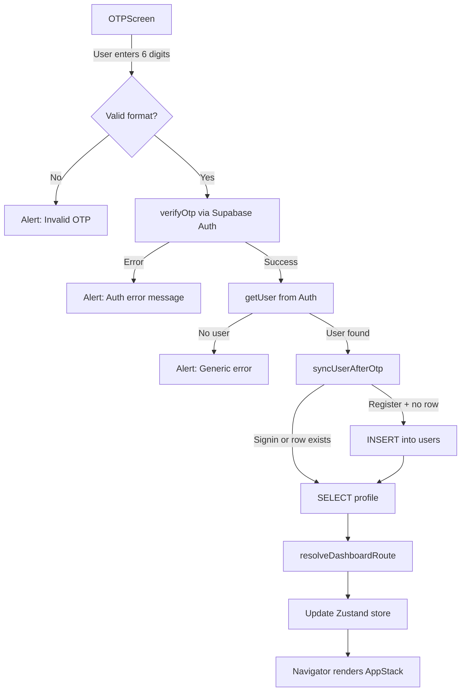
```mermaid
flowchart TD
    A[OTPScreen] -->|User enters 6 digits| B{Valid format?}
    B -->|No| C[Alert: Invalid OTP]
    B -->|Yes| D[verifyOtp via Supabase Auth]
    D -->|Error| E[Alert: Auth error message]
    D -->|Success| F[getUser from Auth]
    F -->|No user| G[Alert: Generic error]
    F -->|User found| H[syncUserAfterOtp]
    H -->|Register + no row| I[INSERT into users]
    H -->|Signin or row exists| J[SELECT profile]
    I --> J
    J --> K[resolveDashboardRoute]
    K --> L[Update Zustand store]
    L --> M[Navigator renders AppStack]
```

#### Session Lifecycle (Zustand — `authStore.ts`)

- **`initializeAuth()`**: Called on app mount. Gets existing session via `getSession()`, fetches public user profile if session exists, sets `isReady: true`, then installs `onAuthStateChange` listener.
- **Auth listener debounce**: 400ms delay (`AUTH_LISTENER_FETCH_DELAY_MS`) before `fetchPublicUser()` to avoid racing the OTP insert during registration.
- **Error resilience**: If `fetchPublicUser()` fails and a user already exists in state, the existing user is preserved (protects against transient errors during OTP race).
- **`signOut()`**: Calls `supabase.auth.signOut()`, clears user, resets `dashboardRoute` to default (`ShipperDashboard`).
- **Navigator key**: `RootNavigator` uses `key={dashboardRoute}` to force a full re-mount when the dashboard route changes (e.g., role switch).

### 3.2 Admin Dashboard — Email/Password

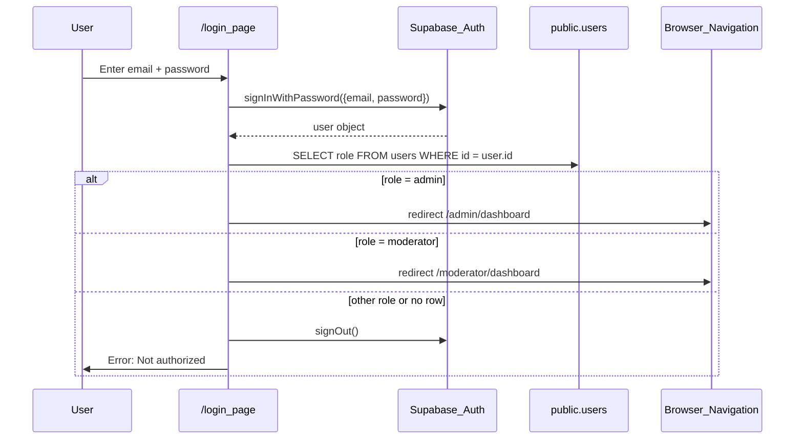
```mermaid
sequenceDiagram
    participant U as User
    participant Login as /login_page
    participant Auth as Supabase_Auth
    participant DB as public.users
    participant Nav as Browser_Navigation

    U->>Login: Enter email + password
    Login->>Auth: signInWithPassword({email, password})
    Auth-->>Login: user object
    Login->>DB: SELECT role FROM users WHERE id = user.id
    alt role = admin
        Login->>Nav: redirect /admin/dashboard
    else role = moderator
        Login->>Nav: redirect /moderator/dashboard
    else other role or no row
        Login->>Auth: signOut()
        Login->>U: Error: Not authorized
    end
```

#### Middleware (`middleware.ts`)

Runs on matched paths: `/admin/:path*`, `/moderator/:path*`, `/login`, `/api/admin/:path*`.

| Path | Rule |
|------|------|
| `/admin/*` | Requires authenticated user with `role === "admin"` in `public.users`; else redirect to `/login?next=...` |
| `/moderator/*` | Requires authenticated user with `role === "moderator"`; else redirect to `/login?next=...` |
| `/login` | If user is already authenticated with a dashboard role, redirect to their default dashboard (or `next` param if safe) |
| `/api/admin/*` | Middleware runs; bypass mode skips cookie auth but API handlers still call `requireDashboardAccess()` |

#### Dashboard Auth Bypass (Development Only)

For local development without Supabase Auth users:

- **Env flags**: `DASHBOARD_BYPASS_AUTH=true` (server) and/or `NEXT_PUBLIC_DASHBOARD_BYPASS_AUTH=true` (client)
- **Cookie**: `lk-bypass-role` — value `"admin"` or `"moderator"` (default: `"admin"`)
- **Login UI**: When bypass enabled, shows buttons that set the cookie and navigate directly to dashboards without Supabase login
- **API behavior**: `requireDashboardAccess()` returns `{ ok: true, bypass: true, role: <from cookie>, userId: null }`

**WARNING: Never enable bypass in production.**

### 3.3 API Route Authentication (`requireDashboardAccess`)

Every `/api/admin/*` route handler calls `requireDashboardAccess()`:

```
requireDashboardAccess()
  ├─ IF isDashboardAuthBypassed():
  │   └─ Return { ok: true, bypass: true, role: parseBypassRole(cookie), userId: null }
  ├─ ELSE:
  │   ├─ createSupabaseServerAuthClient() (reads session from cookies)
  │   ├─ supabase.auth.getUser()
  │   ├─ IF no user → Return { ok: false, response: 401 Unauthorized }
  │   ├─ getDashboardRoleForUser(supabase, userId):
  │   │   └─ SELECT role FROM users WHERE id = userId → only "admin" or "moderator" accepted
  │   ├─ IF no dashboard role → Return { ok: false, response: 403 Forbidden }
  │   └─ Return { ok: true, bypass: false, role, userId }
```

### 3.4 Service Role (RLS Bypass)

- `createServiceRoleClient()` creates a Supabase client with `SUPABASE_SERVICE_ROLE_KEY`
- Options: `{ auth: { persistSession: false, autoRefreshToken: false } }`
- All `/api/admin/*` data routes use this client for database operations
- `hasServiceRoleKey()` returns `false` if the key is missing; API routes return **503** with setup instructions

---

## 4. Data Flow: Core Marketplace

### 4.1 Load Posting (Shipper)

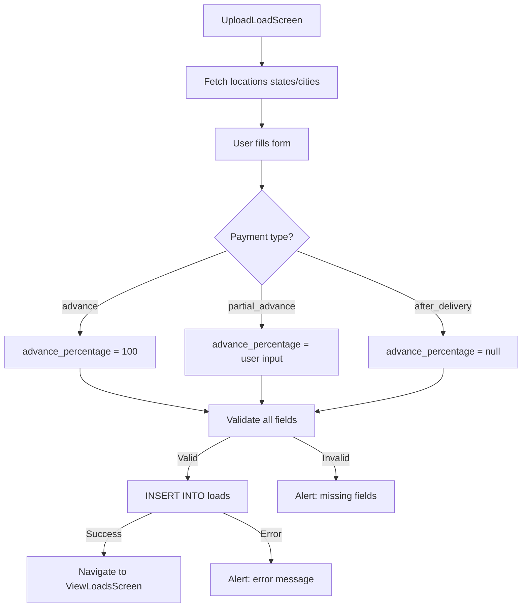
```mermaid
flowchart TD
    A[UploadLoadScreen] --> B[Fetch locations states/cities]
    B --> C[User fills form]
    C --> D{Payment type?}
    D -->|advance| E["advance_percentage = 100"]
    D -->|partial_advance| F["advance_percentage = user input"]
    D -->|after_delivery| G["advance_percentage = null"]
    E --> H[Validate all fields]
    F --> H
    G --> H
    H -->|Valid| I["INSERT INTO loads"]
    H -->|Invalid| J[Alert: missing fields]
    I -->|Success| K[Navigate to ViewLoadsScreen]
    I -->|Error| L[Alert: error message]
```

### 4.2 Load Browsing & Interest (Truck Owner)

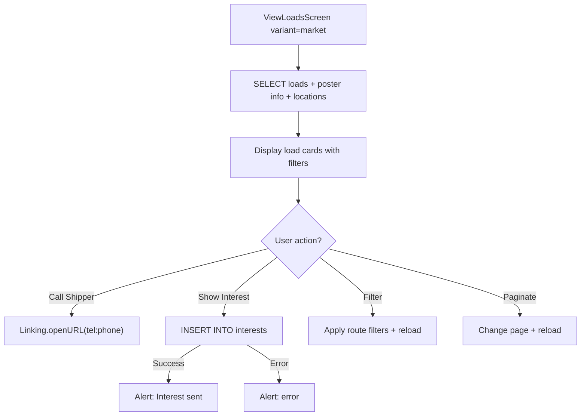
```mermaid
flowchart TD
    A[ViewLoadsScreen variant=market] --> B["SELECT loads + poster info + locations"]
    B --> C[Display load cards with filters]
    C --> D{User action?}
    D -->|Call Shipper| E["Linking.openURL(tel:phone)"]
    D -->|Show Interest| F["INSERT INTO interests"]
    D -->|Filter| G[Apply route filters + reload]
    D -->|Paginate| H[Change page + reload]
    F -->|Success| I[Alert: Interest sent]
    F -->|Error| J[Alert: error]
```

### 4.3 Viewing Own Loads (Shipper)

```
ViewLoadsScreen (variant: "posted")
  ├─ Same query shape, filtered by posted_by = currentUser.id
  └─ No call/interest buttons
```

### 4.4 Truck Management (Truck Owner)

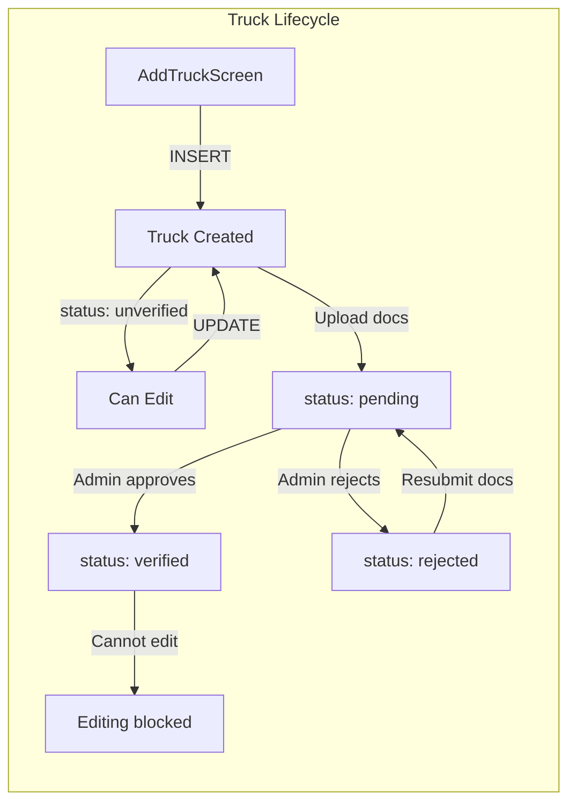
```mermaid
flowchart LR
    subgraph TruckLifecycle["Truck Lifecycle"]
        Add[AddTruckScreen] -->|INSERT| Created[Truck Created]
        Created -->|status: unverified| Edit[Can Edit]
        Edit -->|UPDATE| Created
        Created -->|Upload docs| Pending[status: pending]
        Pending -->|Admin approves| Verified[status: verified]
        Pending -->|Admin rejects| Rejected[status: rejected]
        Rejected -->|Resubmit docs| Pending
        Verified -->|Cannot edit| Locked[Editing blocked]
    end
```

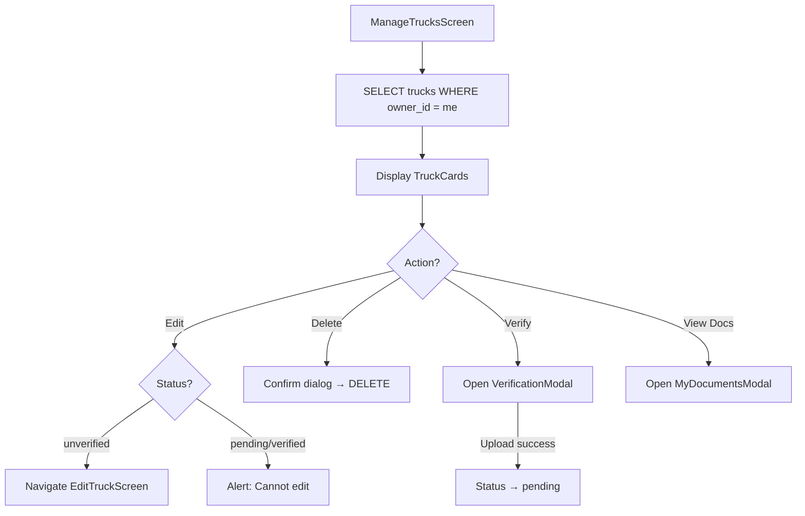
```mermaid
flowchart TD
    A[ManageTrucksScreen] --> B["SELECT trucks WHERE owner_id = me"]
    B --> C[Display TruckCards]
    C --> D{Action?}
    D -->|Edit| E{Status?}
    E -->|unverified| F[Navigate EditTruckScreen]
    E -->|pending/verified| G[Alert: Cannot edit]
    D -->|Delete| H[Confirm dialog → DELETE]
    D -->|Verify| I[Open VerificationModal]
    D -->|View Docs| J[Open MyDocumentsModal]
    I -->|Upload success| K[Status → pending]
```

### 4.5 Availability Posting (Truck Owner)

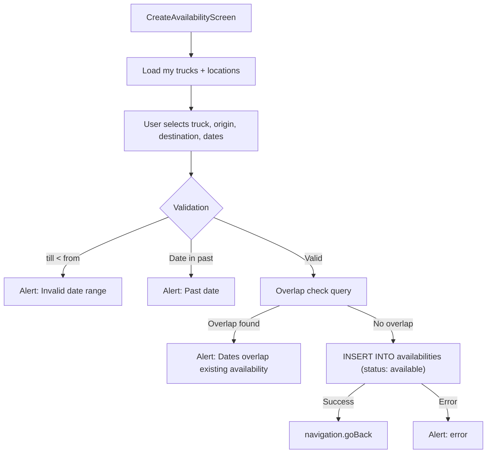
```mermaid
flowchart TD
    A[CreateAvailabilityScreen] --> B[Load my trucks + locations]
    B --> C[User selects truck, origin, destination, dates]
    C --> D{Validation}
    D -->|till < from| E[Alert: Invalid date range]
    D -->|Date in past| F[Alert: Past date]
    D -->|Valid| G[Overlap check query]
    G -->|Overlap found| H[Alert: Dates overlap existing availability]
    G -->|No overlap| I["INSERT INTO availabilities (status: available)"]
    I -->|Success| J[navigation.goBack]
    I -->|Error| K[Alert: error]
```

### 4.6 Availability Browsing & Interest (Shipper)

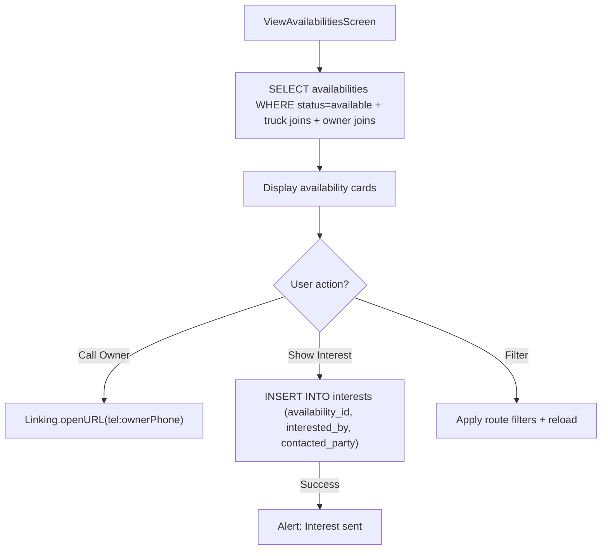
```mermaid
flowchart TD
    A[ViewAvailabilitiesScreen] --> B["SELECT availabilities WHERE status=available + truck joins + owner joins"]
    B --> C[Display availability cards]
    C --> D{User action?}
    D -->|Call Owner| E["Linking.openURL(tel:ownerPhone)"]
    D -->|Show Interest| F["INSERT INTO interests (availability_id, interested_by, contacted_party)"]
    D -->|Filter| G[Apply route filters + reload]
    F -->|Success| H[Alert: Interest sent]
```

### 4.7 Availability Management (Truck Owner)

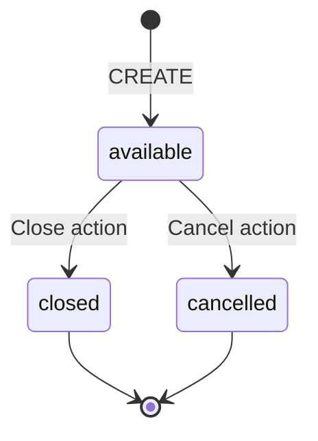
```mermaid
stateDiagram-v2
    [*] --> available: CREATE
    available --> closed: Close action
    available --> cancelled: Cancel action
    closed --> [*]
    cancelled --> [*]
```

### 4.8 Pagination

All list screens use `PAGE_SIZE = 20` with offset-based pagination via Supabase `.range(from, to)`.

---

## 5. Data Flow: Verification

### 5.1 Mobile Upload Flow

Verification applies to both **users** (KYC) and **trucks** (vehicle documents).

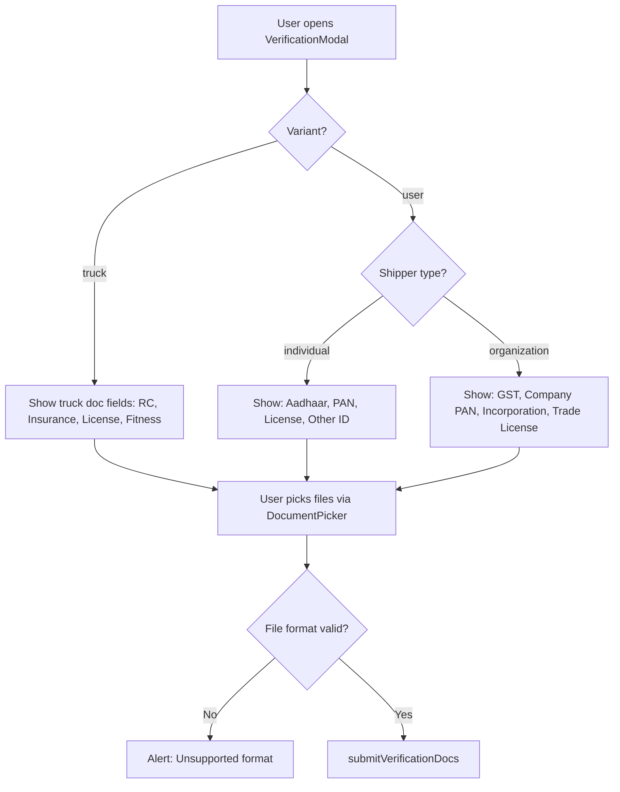
```mermaid
flowchart TD
    A[User opens VerificationModal] --> B{Variant?}
    B -->|truck| C[Show truck doc fields: RC, Insurance, License, Fitness]
    B -->|user| D{Shipper type?}
    D -->|individual| E[Show: Aadhaar, PAN, License, Other ID]
    D -->|organization| F[Show: GST, Company PAN, Incorporation, Trade License]
    C --> G[User picks files via DocumentPicker]
    E --> G
    F --> G
    G --> H{File format valid?}
    H -->|No| I[Alert: Unsupported format]
    H -->|Yes| J[submitVerificationDocs]
```

#### `submitVerificationDocs` Pipeline

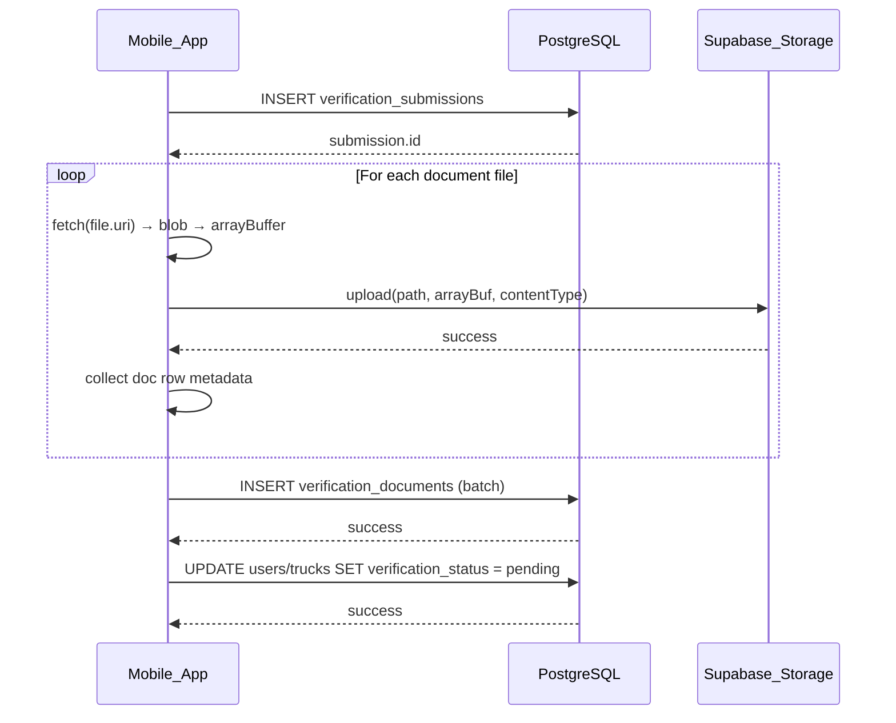
```mermaid
sequenceDiagram
    participant App as Mobile_App
    participant DB as PostgreSQL
    participant Storage as Supabase_Storage

    App->>DB: INSERT verification_submissions
    DB-->>App: submission.id

    loop For each document file
        App->>App: fetch(file.uri) → blob → arrayBuffer
        App->>Storage: upload(path, arrayBuf, contentType)
        Storage-->>App: success
        App->>App: collect doc row metadata
    end

    App->>DB: INSERT verification_documents (batch)
    DB-->>App: success

    App->>DB: UPDATE users/trucks SET verification_status = pending
    DB-->>App: success
```

#### Document Keys by Variant

**Truck verification:**
| Key | Label |
|-----|-------|
| `registration_certificate` | Registration Certificate (RC) |
| `insurance` | Insurance Policy |
| `driver_license` | Current Driver's License |
| `fitness_certificate` | Fitness Certificate |

**User KYC — Individual:**
| Key | Label |
|-----|-------|
| `aadhar` | Aadhaar card |
| `pan` | PAN card |
| `driving_license` | Driving License |
| `other_kyc` | Other valid ID (Voter ID, Passport, etc.) |

**User KYC — Organization:**
| Key | Label |
|-----|-------|
| `gst_certificate` | GST Certificate |
| `company_pan` | Company PAN card |
| `incorporation_certificate` | Certificate of Incorporation / Registration |
| `trade_license` | Trade License / MSME / Udyam Certificate |

### 5.2 Viewing Submitted Documents (Mobile)

```
MyDocumentsModal
  ├─ Load latest submission:
  │   SELECT * FROM verification_submissions
  │   WHERE entity_type = ... AND entity_id = ...
  │   ORDER BY created_at DESC LIMIT 1
  ├─ Load documents:
  │   SELECT * FROM verification_documents
  │   WHERE submission_id = ...
  ├─ View file: supabase.storage.from(doc.bucket).createSignedUrl(doc.path, 300)
  │   └─ Linking.openURL(signedUrl) — opens in browser/viewer
  └─ "Change documents" → re-opens VerificationModal
```

### 5.3 Dashboard Review Flow

```
Admin/Moderator → /admin/verifications or /moderator/verifications
  ├─ Load pending users: users WHERE verification_status = "pending"
  ├─ Load pending trucks: trucks WHERE verification_status = "pending"
  ├─ For each entity → VerificationDocsModal
  │   ├─ GET /api/admin/verification/submissions?entity_type=...&entity_id=...
  │   ├─ GET /api/admin/verification/documents?submission_id=...
  │   ├─ View file: POST /api/admin/verification/signed-url { bucket, path }
  │   │   └─ Returns signed URL valid for 300 seconds
  │   └─ Decision:
  │       POST /api/admin/verification/decision
  │       { entity_type, entity_id, submission_id, decision: "verified"|"rejected", reason? }
  │
  └─ Decision Handler:
      ├─ UPDATE (users or trucks) SET verification_status = decision WHERE id = entity_id
      ├─ UPDATE verification_submissions SET
      │   status = "reviewed", review_decision = decision,
      │   reviewed_at = ISO timestamp, reviewed_by = actorId,
      │   rejection_reason = reason (if rejected)
      └─ writeAuditLog({ action: "review_verification", entityType, entityId, details })
```

### 5.4 Inline Verification (CommonDataTable)

The `CommonDataTable` component supports inline verification status changes via `PATCH /api/admin/row` when the current status is in `verificationTriggerStatuses` (default: `["pending", "unverified"]`).

---

## 6. Data Flow: Admin Operations

### 6.1 Generic Data Listing (`GET /api/admin/data`)

All data tables in the dashboard fetch through a single API endpoint:

```
GET /api/admin/data?table=...&select=...&page=...&pageSize=...
    &sortColumn=...&sortAsc=...&searchColumn=...&searchValue=...
    &filters={JSON}&dateColumn=...&dateFrom=...&dateTo=...
```

- Uses `createServiceRoleClient()` to bypass RLS
- Supports PostgREST-style `select` with embedded joins (e.g., `users!trucks_owner_id_fkey(name)`)
- Pagination: offset-based with `range(from, to)`, max `pageSize` = 100
- Search: UUID → `.eq()`, otherwise `.ilike(column, %value%)`
- Filters: arbitrary column → value pairs as JSON string
- Date range: `gte(dateColumn, dateFrom)` and `lte(dateColumn, dateTo)`

### 6.2 Record Updates (`PATCH /api/admin/row`)

```
PATCH /api/admin/row
Body: { table, id, idField?: "id", patch: { column: value, ... } }

Flow:
  ├─ requireDashboardAccess() → role + userId
  ├─ Validate table in ALLOWED_TABLES
  ├─ Check admin-only table restrictions
  ├─ filterPatchByAllowlist(table, role, patch):
  │   ├─ Strip SENSITIVE fields (phone, email) always
  │   ├─ Keep only columns in the role's allowlist for that table
  │   └─ Return null if no fields remain → 400 error
  ├─ Special handling for admin_alerts.is_handled:
  │   └─ Add handled_at (ISO timestamp) and handled_by (userId)
  ├─ UPDATE table SET sanitized WHERE idField = id
  ├─ writeAuditLog({ action: deriveAction(), entityType: table, entityId: id, details })
  └─ Return { ok: true }
```

#### Action Derivation (`deriveAction`)

| Condition | Action |
|-----------|--------|
| `admin_alerts` + `is_handled === true` | `mark_alert_handled` |
| `users`/`trucks` + `verification_status === "verified"` | `verify_user` / `verify_truck` |
| `users`/`trucks` + `verification_status === "rejected"` | `reject_user` / `reject_truck` |
| `status === "closed"` | `close_record` |
| Everything else | `update_record` |

### 6.3 Record Deletion (`DELETE /api/admin/row`)

```
DELETE /api/admin/row
Body: { table, id, idField?: "id" }

Restrictions:
  ├─ Admin only (moderator → 403)
  ├─ admin_alerts cannot be deleted (403)
  └─ writeAuditLog({ action: "delete_record", entityType: table, entityId: id })
```

### 6.4 Global Search (`GET /api/admin/search`)

```
GET /api/admin/search?q=...

Parallel search on 3 tables (5 results each):
  ├─ users: search by name/phone (ilike) or exact ID (UUID)
  ├─ trucks: search by category (ilike) or exact ID; embeds owner name
  └─ loads: search by truck_category_required (ilike) or exact ID; embeds origin/destination cities

Returns: { results: [{ type, id, title, subtitle }] }
Minimum query length: 2 characters
```

### 6.5 Moderator Creation Flow

Admin-only, two-step OTP flow:

```
Step 1: POST /api/admin/moderator/send-otp
  Body: { phone: "+91XXXXXXXXXX" }
  ├─ Validate phone: /^\+\d{10,15}$/
  ├─ Check users table for existing phone → 409 if exists
  └─ supabase.auth.signInWithOtp({ phone }) → sends OTP

Step 2: POST /api/admin/moderator/create
  Body: { phone, otp, name }
  ├─ supabase.auth.verifyOtp({ phone, token: otp, type: "sms" })
  ├─ Check if users row exists for auth user ID:
  │   ├─ IF exists: UPDATE users SET role = "moderator", name = name
  │   └─ IF not: INSERT INTO users { id, name, phone, role: "moderator", verification_status: "verified" }
  │       └─ writeAuditLog({ action: "create_moderator", entityType: "user", entityId })
  └─ Return { ok: true, userId }
```

### 6.6 Audit Logging

Every mutation through `/api/admin/*` is recorded:

```typescript
writeAuditLog({
  actorId: string | null,     // user.id (null in bypass mode)
  actorRole: string,          // "admin" | "moderator"
  action: AuditAction,        // see table below
  entityType: string,         // table name or "user"/"truck" for verification
  entityId: string,           // row ID
  details: Record<string, unknown>  // { fields: patchData } or { decision, submissionId }
})

→ INSERT INTO audit_log { actor_id, actor_role, action, entity_type, entity_id, details }
```

**Audit Actions:**

| Action | Trigger |
|--------|---------|
| `update_record` | Generic PATCH (no special conditions) |
| `delete_record` | DELETE any row |
| `verify_user` | PATCH users.verification_status = "verified" |
| `reject_user` | PATCH users.verification_status = "rejected" |
| `verify_truck` | PATCH trucks.verification_status = "verified" |
| `reject_truck` | PATCH trucks.verification_status = "rejected" |
| `mark_alert_handled` | PATCH admin_alerts.is_handled = true |
| `close_record` | PATCH any record.status = "closed" |
| `create_moderator` | New moderator user inserted |
| `review_verification` | Verification decision via dedicated endpoint |

Audit writes are fire-and-forget (`void writeAuditLog(...)`) — failures are logged to console but do not block the response.

---

## 7. Security Model

### 7.1 Row Level Security (RLS)

RLS is enabled on all tables in the Supabase PostgreSQL database. Policies enforce per-row access control based on the authenticated user's identity.

**Mobile app (anon key):** All queries go through RLS. Users can only read/write rows relevant to their role and identity.

**Dashboard (service role key):** Bypasses RLS entirely. Access control is enforced at the application layer through middleware, `requireDashboardAccess()`, table allowlists, and patch allowlists.

### 7.2 Patch Allowlist (Dashboard)

The `filterPatchByAllowlist()` function restricts which columns each dashboard role can update:

| Table | Admin Can Patch | Moderator Can Patch |
|-------|-----------------|---------------------|
| `users` | `name`, `role`, `verification_status`, `subscription_type` | `verification_status` |
| `loads` | `loading_date`, `truck_category_required`, `capacity_required`, `payment_type`, `advance_percentage`, `rate_optional`, `status`, `origin_location_id`, `destination_location_id` | `status` |
| `trucks` | `category`, `variant_id`, `capacity_tons`, `gps_available`, `permit_type`, `verification_status` | `verification_status` |
| `availabilities` | `available_from`, `available_till`, `expected_rate`, `status`, `current_location`, `preferred_destination_1`, `preferred_destination_2`, `origin_location_id`, `destination_location_id` | `status` |
| `admin_alerts` | `is_handled` | *(none — moderator cannot patch)* |
| `interests` | `status` | `status` |

**Globally stripped fields:** `phone` and `email` are always removed from any patch payload before processing.

### 7.3 Table Access Restrictions

| Operation | Allowed Tables | Admin Only |
|-----------|---------------|------------|
| **GET** (data) | `loads`, `availabilities`, `trucks`, `users`, `admin_alerts`, `locations`, `truck_variants`, `verification_submissions`, `verification_documents`, `audit_log`, `interests` | `admin_alerts` |
| **PATCH** (row) | `loads`, `availabilities`, `trucks`, `users`, `admin_alerts`, `interests` | `admin_alerts` |
| **DELETE** (row) | `loads`, `availabilities`, `trucks`, `users`, `interests` | All (moderator cannot delete) |

`admin_alerts` cannot be deleted even by admins.

### 7.4 Storage Security

- **Bucket:** `verification-docs` — configured as **private** in Supabase
- **Upload:** Mobile app uploads via authenticated anon client; path-based policies restrict uploads to the user's own entity path (`{entityType}/{entityId}/...`)
- **Read:** Dashboard generates short-lived signed URLs (300 seconds) via the service role client; only the `verification-docs` bucket is whitelisted in the API
- **Mobile read:** Uses signed URLs via the anon client (`createSignedUrl(path, 300)`)

### 7.5 Phone Validation

Indian mobile number validation (`formatPhoneOtpIndia`):
- Strips all non-digits
- Accepts: 10 digits, 12 digits starting with `91`, 11 digits starting with `0`
- Validates national number against `/^[6-9]\d{9}$/` (Indian mobile numbers start with 6-9)
- Returns E.164 format: `+91XXXXXXXXXX`

Dashboard moderator creation validates: `/^\+\d{10,15}$/` (international format).

### 7.6 Select Parameter Sanitization

The `GET /api/admin/data` endpoint validates the `select` parameter:
- Max length: 8000 characters
- Pattern: `/^[\w\-,.*! ():]+$/` (prevents SQL injection through PostgREST select)
- Sort column: `/^[\w]+$/`

---

## 8. Role Matrix

### 8.1 Mobile App Capabilities

| Capability | Shipper | Truck Owner | Broker | Admin | Moderator |
|-----------|---------|-------------|--------|-------|-----------|
| **Registration** | Yes (via app) | Yes (via app) | No (not in UI) | No | No (created by admin) |
| **Dashboard** | ShipperDashboard | TruckOwnerDashboard | BrokerDashboard (empty) | AdminDashboard (empty) | ModeratorDashboard (empty) |
| **Post Load** | Yes | — | — | — | — |
| **View Own Loads** | Yes (variant: posted) | — | — | — | — |
| **Browse Market Loads** | — | Yes (variant: market) | — | — | — |
| **Add Trucks** | — | Yes | — | — | — |
| **Manage Trucks** | — | Yes (edit, delete) | — | — | — |
| **Create Availability** | — | Yes | — | — | — |
| **Manage Availabilities** | — | Yes (close, cancel) | — | — | — |
| **Browse Availabilities** | Yes | — | — | — | — |
| **Call (tel: link)** | Yes (truck owners) | Yes (shippers) | — | — | — |
| **Record Interest** | Yes (on availabilities) | Yes (on loads) | — | — | — |
| **User KYC Upload** | Yes | Yes | — | — | — |
| **Truck Verification Upload** | — | Yes | — | — | — |
| **View Own Documents** | Yes | Yes | — | — | — |
| **Profile Edit (name)** | Yes | Yes | Yes | Yes | Yes |

### 8.2 Dashboard Capabilities

| Capability | Admin | Moderator |
|-----------|-------|-----------|
| **Login** | Email/password | Email/password |
| **Dashboard KPIs** | Full stats grid | Full stats grid |
| **View Users** | Yes (all columns editable per allowlist) | Yes (verification_status only) |
| **User Detail Page** | Yes (`/admin/users/[id]`) | No |
| **View Trucks** | Yes (editable) | Yes (verification_status only) |
| **Truck Detail Page** | Yes (`/admin/trucks/[id]`) | No |
| **View Loads** | Yes (editable) | Yes (status only) |
| **View Availabilities** | Yes (editable) | Yes (status only) |
| **View Shippers** | Yes | Yes |
| **View Truck Owners** | Yes | Yes |
| **View Leads (Interests)** | Yes | No |
| **View Alerts** | Yes | No |
| **Verify/Reject Users** | Yes | Yes |
| **Verify/Reject Trucks** | Yes | Yes |
| **View Verification Docs** | Yes | Yes |
| **Delete Records** | Yes (except admin_alerts) | No |
| **Add Moderator** | Yes | No |
| **Activity Log** | Yes | No |
| **Global Search** | Yes | Yes |

### 8.3 Dashboard Navigation

**Admin Sidebar:**
- Overview: Dashboard
- Operations: Loads, Availabilities, Leads, Alerts
- Users & Vehicles: Users, Shippers, Truck Owners, Trucks
- Verification: Verifications
- Settings: Add Moderator, Activity Log

**Moderator Sidebar:**
- Overview: Dashboard
- Operations: Loads, Availabilities *(no Leads, no Alerts)*
- Users & Vehicles: Users, Shippers, Truck Owners, Trucks
- Verification: Verifications
- *(no Settings section)*

### 8.4 Dashboard Button Config (Mobile)

| Role | Dashboard Buttons |
|------|-------------------|
| `shipper` | Upload Loads, View Previous Loads, View Availabilities, My Profile |
| `truck_owner` | Find Return Load, Add Trucks, Manage Trucks, Manage Availabilities, View Loads, My Profile |
| `admin` | *(empty — header + logout only)* |
| `broker` | *(empty — header + logout only)* |
| `moderator` | *(empty — header + logout only)* |

---

## 9. API Reference

### 9.1 Dashboard API Routes

All routes are prefixed with `/api/admin/` and require `requireDashboardAccess()` + `hasServiceRoleKey()`.

---

#### `GET /api/admin/data`

**Purpose:** Generic paginated data listing for any allowed table.

| Parameter | Type | Required | Default | Description |
|-----------|------|----------|---------|-------------|
| `table` | query | Yes | — | Table name (see allowed list) |
| `select` | query | No | `*` | PostgREST select expression with embeds |
| `page` | query | No | `1` | Page number (1-indexed) |
| `pageSize` | query | No | `25` | Rows per page (max 100) |
| `sortColumn` | query | No | `id` | Column to sort by |
| `sortAsc` | query | No | `true` | Sort ascending (`"false"` for descending) |
| `searchColumn` | query | No | — | Column to search in |
| `searchValue` | query | No | — | Search value (UUID → eq, else ilike) |
| `filters` | query | No | `{}` | JSON string of `{ column: value }` pairs |
| `dateColumn` | query | No | — | Column for date range filter |
| `dateFrom` | query | No | — | Start date (gte) |
| `dateTo` | query | No | — | End date (lte) |

**Auth:** Admin or Moderator. `admin_alerts` table → admin only.

**Response 200:**
```json
{ "data": [...], "count": 123 }
```

**Error responses:** `400` (invalid params), `403` (forbidden table for role), `503` (missing service role key).

---

#### `PATCH /api/admin/row`

**Purpose:** Update a single row in an allowed table.

**Body:**
```json
{
  "table": "users",
  "id": "uuid-here",
  "idField": "id",
  "patch": { "verification_status": "verified" }
}
```

| Field | Type | Required | Default | Description |
|-------|------|----------|---------|-------------|
| `table` | string | Yes | — | Table name |
| `id` | string | Yes | — | Row identifier value |
| `idField` | string | No | `"id"` | Column name for the identifier |
| `patch` | object | Yes | — | Key-value pairs to update (filtered by allowlist) |

**Auth:** Admin or Moderator (filtered by patch allowlist per role).

**Response 200:** `{ "ok": true }`

**Side effects:** Writes to `audit_log`. For `admin_alerts.is_handled = true`, also sets `handled_at` and `handled_by`.

**Error responses:** `400` (invalid body, no allowed fields), `403` (forbidden table/role), `503` (no service role key).

---

#### `DELETE /api/admin/row`

**Purpose:** Delete a single row.

**Body:**
```json
{
  "table": "trucks",
  "id": "uuid-here",
  "idField": "id"
}
```

**Auth:** Admin only. `admin_alerts` cannot be deleted.

**Response 200:** `{ "ok": true }`

**Side effects:** Writes `delete_record` to `audit_log`.

---

#### `GET /api/admin/search`

**Purpose:** Global search across users, trucks, and loads.

| Parameter | Type | Required | Description |
|-----------|------|----------|-------------|
| `q` | query | Yes | Search query (min 2 chars) |

**Auth:** Admin or Moderator.

**Response 200:**
```json
{
  "results": [
    { "type": "user", "id": "...", "title": "John Doe", "subtitle": "shipper · +919876543210" },
    { "type": "truck", "id": "...", "title": "container · 15 tons", "subtitle": "Owner: Jane" },
    { "type": "load", "id": "...", "title": "open · open", "subtitle": "Mumbai → Delhi · 2026-04-15" }
  ]
}
```

---

#### `POST /api/admin/moderator/send-otp`

**Purpose:** Send OTP to a phone number for moderator creation.

**Body:**
```json
{ "phone": "+919876543210" }
```

**Auth:** Admin only.

**Validation:** Phone must match `/^\+\d{10,15}$/`. Checks if phone already exists in `users` table → **409** if so.

**Response 200:** `{ "ok": true, "message": "OTP sent to +91..." }`

---

#### `POST /api/admin/moderator/create`

**Purpose:** Verify OTP and create/upgrade moderator account.

**Body:**
```json
{ "phone": "+919876543210", "otp": "123456", "name": "Moderator Name" }
```

**Auth:** Admin only.

**Validation:** Phone format, OTP min length 4, name non-empty.

**Response 200:**
```json
{ "ok": true, "message": "Moderator created: Name (+91...)", "userId": "uuid" }
```

**Side effects:** Writes `create_moderator` to `audit_log` (only for new inserts, not role upgrades).

---

#### `GET /api/admin/verification/submissions`

**Purpose:** List verification submissions for an entity.

| Parameter | Type | Required | Description |
|-----------|------|----------|-------------|
| `entity_type` | query | Yes | `"user"` or `"truck"` |
| `entity_id` | query | No | Filter to specific entity |
| `status` | query | No | `"submitted"` or `"reviewed"` |

**Auth:** Admin or Moderator.

**Response 200:** `{ "data": [...] }` ordered by `created_at` descending.

---

#### `GET /api/admin/verification/documents`

**Purpose:** List document rows for a specific submission.

| Parameter | Type | Required | Description |
|-----------|------|----------|-------------|
| `submission_id` | query | Yes | Submission UUID |

**Auth:** Admin or Moderator.

**Response 200:** `{ "data": [...] }` ordered by `created_at` ascending.

---

#### `POST /api/admin/verification/signed-url`

**Purpose:** Generate a short-lived signed URL for viewing a stored document.

**Body:**
```json
{ "bucket": "verification-docs", "path": "user/uuid/sub-uuid/aadhar/16xxx-file.jpg" }
```

**Auth:** Admin or Moderator.

**Validation:** Only `bucket === "verification-docs"` is allowed.

**Response 200:** `{ "signedUrl": "https://..." }` (valid for 300 seconds).

---

#### `POST /api/admin/verification/decision`

**Purpose:** Approve or reject a verification submission.

**Body:**
```json
{
  "entity_type": "user",
  "entity_id": "uuid",
  "submission_id": "uuid",
  "decision": "verified",
  "reason": "Optional rejection reason"
}
```

**Auth:** Admin or Moderator.

**Updates:**
1. `users`/`trucks` → `verification_status = decision`
2. `verification_submissions` → `status = "reviewed"`, `review_decision`, `reviewed_at`, `reviewed_by`, `rejection_reason`

**Side effects:** Writes `review_verification` to `audit_log`.

**Response 200:** `{ "ok": true }`

---

## 10. Environment Variables

### 10.1 Mobile App (`LoadKaro/.env`)

| Variable | Required | Description |
|----------|----------|-------------|
| `EXPO_PUBLIC_SUPABASE_URL` | Yes | Supabase project URL (e.g., `https://xxx.supabase.co`) |
| `EXPO_PUBLIC_SUPABASE_ANON_KEY` | Yes | Supabase anonymous/public key |
| `EXPO_PUBLIC_SUPABASE_KEY` | No | Alias for anon key (fallback if `ANON_KEY` not set) |

The app checks `isSupabaseConfigured = Boolean(supabaseUrl && supabaseAnonKey)` and logs a warning if not configured. A placeholder client is created that will fail gracefully.

### 10.2 Admin Dashboard (`admin-dashboard/.env.local`)

| Variable | Required | Scope | Description |
|----------|----------|-------|-------------|
| `NEXT_PUBLIC_SUPABASE_URL` | Yes | Client + Server | Supabase project URL |
| `NEXT_PUBLIC_SUPABASE_ANON_KEY` | Yes | Client + Server | Supabase anonymous/public key |
| `NEXT_PUBLIC_SUPABASE_KEY` | No | Client + Server | Alias for anon key |
| `SUPABASE_SERVICE_ROLE_KEY` | Yes* | Server only | Service role secret — required for all `/api/admin/*` data operations; bypasses RLS |
| `DASHBOARD_BYPASS_AUTH` | No | Server | Set `"true"` to skip auth in middleware and API routes (dev only) |
| `NEXT_PUBLIC_DASHBOARD_BYPASS_AUTH` | No | Client + Server | Set `"true"` to show bypass buttons on login page (dev only) |

\* Without `SUPABASE_SERVICE_ROLE_KEY`, all API routes return **503** with setup instructions.

### 10.3 Expo → Next.js Environment Mapping

`next.config.ts` maps Expo-prefixed env vars to Next.js public vars:

```
EXPO_PUBLIC_SUPABASE_URL     → NEXT_PUBLIC_SUPABASE_URL
EXPO_PUBLIC_SUPABASE_ANON_KEY → NEXT_PUBLIC_SUPABASE_ANON_KEY
EXPO_PUBLIC_SUPABASE_KEY     → NEXT_PUBLIC_SUPABASE_KEY
```

This allows sharing a single `.env` file across both projects if desired. The middleware also falls back to `EXPO_PUBLIC_*` vars when `NEXT_PUBLIC_*` are not set.

---

## 11. Deployment Architecture

### 11.1 Mobile App

| Aspect | Detail |
|--------|--------|
| **Framework** | Expo SDK 54, managed workflow |
| **Runtime** | React Native 0.81.5, React 19.1.0 |
| **Build** | `expo build` / `eas build` for iOS and Android |
| **OTA Updates** | Expo Updates (if configured in `app.json`) |
| **Entry Point** | `index.js` → `registerRootComponent(App)` |
| **App Config** | `app.json`: name "LoadKaro", slug "loadkaro", `@react-native-community/datetimepicker` plugin |
| **State Management** | Zustand (single `authStore`) |
| **Navigation** | React Navigation (Native Stack only — no tabs) |
| **Supabase Client** | `@supabase/supabase-js` with `AsyncStorage` adapter |

### 11.2 Admin Dashboard

| Aspect | Detail |
|--------|--------|
| **Framework** | Next.js 16.2.2 (App Router, Turbopack) |
| **Runtime** | React 19.2.4 |
| **Deployment** | Vercel-compatible (standard Next.js deployment) |
| **UI Library** | shadcn/ui + Tailwind CSS + Lucide icons |
| **Tables** | TanStack React Table |
| **Supabase Clients** | `@supabase/ssr` (browser + server auth), `@supabase/supabase-js` (service role) |
| **CSS** | Tailwind CSS with PostCSS, `tw-animate-css` |

### 11.3 Database

| Aspect | Detail |
|--------|--------|
| **Provider** | Supabase (hosted PostgreSQL) |
| **Auth** | Supabase Auth (phone OTP for mobile, email/password for dashboard) |
| **Storage** | Supabase Storage with private `verification-docs` bucket |
| **Security** | Row Level Security (RLS) enabled on all tables |
| **Client Libraries** | `@supabase/supabase-js` (mobile + dashboard service role), `@supabase/ssr` (dashboard server/client auth) |

### 11.4 Database Schema (Inferred from Application Code)

#### `users` table

| Column | Type | Notes |
|--------|------|-------|
| `id` | UUID | Primary key (matches Supabase Auth user ID) |
| `name` | text | User's display name |
| `phone` | text | E.164 format (+91XXXXXXXXXX) |
| `role` | enum | `shipper`, `truck_owner`, `broker`, `admin`, `moderator` |
| `verification_status` | enum | `unverified`, `pending`, `verified`, `rejected` |
| `subscription_type` | text | (Referenced in patch allowlist, not used in mobile app) |
| `created_at` | timestamptz | Auto-generated |

#### `loads` table

| Column | Type | Notes |
|--------|------|-------|
| `id` | UUID | Primary key |
| `posted_by` | UUID | FK → `users.id` (fkey: `loads_posted_by_fkey`) |
| `origin_location_id` | UUID | FK → `locations.id` (fkey: `loads_origin_location_id_fkey`) |
| `destination_location_id` | UUID | FK → `locations.id` (fkey: `loads_destination_location_id_fkey`) |
| `loading_date` | date | Must not be in the past |
| `truck_category_required` | enum | Truck category enum |
| `capacity_required` | numeric | In tons |
| `payment_type` | enum | `advance`, `partial_advance`, `after_delivery` |
| `advance_percentage` | numeric | 100 for advance, user-input for partial, null for after_delivery |
| `rate_optional` | numeric | Optional rate field |
| `status` | enum | `open`, `matched`, `cancelled`, `closed` |
| `created_at` | timestamptz | Auto-generated |

#### `trucks` table

| Column | Type | Notes |
|--------|------|-------|
| `id` | UUID | Primary key |
| `owner_id` | UUID | FK → `users.id` (fkey: `trucks_owner_id_fkey`) |
| `category` | enum | `open`, `container`, `lcv`, `mini_pickup`, `trailer`, `tipper`, `tanker`, `dumper`, `bulker` |
| `variant_id` | UUID | FK → `truck_variants.id` |
| `capacity_tons` | numeric | Truck capacity in tons |
| `permit_type` | enum | `national_permit`, `state_permit`, `all_india_permit`, `goods_carriage`, `contract_carriage` |
| `axle_count` | integer | Number of axles |
| `wheel_count` | integer | Number of wheels |
| `gps_available` | boolean | GPS tracking availability |
| `verification_status` | enum | `unverified`, `pending`, `verified`, `rejected` |
| `created_at` | timestamptz | Auto-generated |

#### `truck_variants` table

| Column | Type | Notes |
|--------|------|-------|
| `id` | UUID | Primary key |
| `name` | text | Variant name |
| `category` | text | Optional category association |
| `is_active` | boolean | Whether this variant is selectable |

#### `availabilities` table

| Column | Type | Notes |
|--------|------|-------|
| `id` | UUID | Primary key |
| `owner_id` | UUID | FK → `users.id` |
| `truck_id` | UUID | FK → `trucks.id` |
| `origin_location_id` | UUID | FK → `locations.id` (fkey: `availabilities_origin_location_id_fkey`) |
| `destination_location_id` | UUID | FK → `locations.id` (fkey: `availabilities_destination_location_id_fkey`) |
| `available_from` | date | Start of availability window |
| `available_till` | date | End of availability window |
| `expected_rate` | numeric | (Referenced in patch allowlist) |
| `current_location` | text | (Referenced in patch allowlist) |
| `preferred_destination_1` | text | (Referenced in patch allowlist) |
| `preferred_destination_2` | text | (Referenced in patch allowlist) |
| `status` | enum | `available`, `closed`, `cancelled` |
| `created_at` | timestamptz | Auto-generated |

#### `locations` table

| Column | Type | Notes |
|--------|------|-------|
| `id` | UUID | Primary key |
| `city` | text | City name |
| `state` | text | State name |

#### `interests` table

| Column | Type | Notes |
|--------|------|-------|
| `id` | UUID | Primary key |
| `load_id` | UUID | FK → `loads.id` (nullable — set for load interests) |
| `availability_id` | UUID | FK → `availabilities.id` (nullable — set for availability interests) |
| `interested_by` | UUID | FK → `users.id` (fkey: `interests_interested_by_fkey`) — who expressed interest |
| `contacted_party` | UUID | FK → `users.id` (fkey: `interests_contacted_party_fkey`) — who was contacted |
| `status` | enum | `interested`, `contacted`, `matched`, `expired` |
| `created_at` | timestamptz | Auto-generated |

#### `verification_submissions` table

| Column | Type | Notes |
|--------|------|-------|
| `id` | UUID | Primary key |
| `entity_type` | text | `"user"` or `"truck"` |
| `entity_id` | UUID | ID of the user or truck being verified |
| `submitted_by` | UUID | FK → `users.id` |
| `status` | text | `"submitted"` (default) or `"reviewed"` |
| `review_decision` | text | `"verified"` or `"rejected"` (set after review) |
| `reviewed_at` | timestamptz | ISO timestamp of review |
| `reviewed_by` | UUID | FK → `users.id` (reviewer) |
| `rejection_reason` | text | Reason for rejection |
| `created_at` | timestamptz | Auto-generated |

#### `verification_documents` table

| Column | Type | Notes |
|--------|------|-------|
| `id` | UUID | Primary key |
| `submission_id` | UUID | FK → `verification_submissions.id` |
| `entity_type` | text | `"user"` or `"truck"` |
| `entity_id` | UUID | Denormalized entity reference |
| `doc_key` | text | Document type key (e.g., `aadhar`, `registration_certificate`) |
| `bucket` | text | Storage bucket name (`"verification-docs"`) |
| `path` | text | Full storage path |
| `original_filename` | text | Original uploaded filename |
| `mime_type` | text | MIME type (`image/jpeg`, `application/pdf`, etc.) |
| `size_bytes` | integer | File size in bytes |
| `created_at` | timestamptz | Auto-generated |

#### `admin_alerts` table

| Column | Type | Notes |
|--------|------|-------|
| `id` | UUID | Primary key |
| `load_id` | UUID | FK → `loads.id` (fkey: `admin_alerts_load_id_fkey`) |
| `is_handled` | boolean | Whether the alert has been addressed |
| `handled_at` | timestamptz | When the alert was handled |
| `handled_by` | UUID | FK → `users.id` (who handled it) |
| `created_at` | timestamptz | Auto-generated |

#### `audit_log` table

| Column | Type | Notes |
|--------|------|-------|
| `id` | UUID | Primary key |
| `actor_id` | UUID | FK → `users.id` (nullable in bypass mode) |
| `actor_role` | text | `"admin"` or `"moderator"` |
| `action` | text | One of the `AuditAction` values |
| `entity_type` | text | Table name or `"user"`/`"truck"` |
| `entity_id` | text | Row ID |
| `details` | jsonb | Additional context (patch fields, decision info) |
| `created_at` | timestamptz | Auto-generated |

### 11.5 Enum Values (Postgres)

| Enum | Values |
|------|--------|
| `user_role` | `admin`, `moderator`, `shipper`, `truck_owner`, `broker` |
| `verification_status` | `unverified`, `pending`, `verified`, `rejected` |
| `truck_category` | `open`, `container`, `lcv`, `mini_pickup`, `trailer`, `tipper`, `tanker`, `dumper`, `bulker` |
| `permit_type_enum` | `national_permit`, `state_permit`, `all_india_permit`, `goods_carriage`, `contract_carriage` |
| `payment_type` | `advance`, `partial_advance`, `after_delivery` |
| `load_status` | `open`, `matched`, `cancelled`, `closed` |
| `availability_status` | `available`, `closed`, `cancelled` |
| `interest_status` | `interested`, `contacted`, `matched`, `expired` |
| `load_rate_visibility_enum` | *(exists in DB but unused in application code)* |

### 11.6 Foreign Key Relationships (from code)

```
users.id ← loads.posted_by (loads_posted_by_fkey)
users.id ← trucks.owner_id (trucks_owner_id_fkey)
users.id ← interests.interested_by (interests_interested_by_fkey)
users.id ← interests.contacted_party (interests_contacted_party_fkey)
users.id ← availabilities.owner_id
locations.id ← loads.origin_location_id (loads_origin_location_id_fkey)
locations.id ← loads.destination_location_id (loads_destination_location_id_fkey)
locations.id ← availabilities.origin_location_id (availabilities_origin_location_id_fkey)
locations.id ← availabilities.destination_location_id (availabilities_destination_location_id_fkey)
loads.id ← admin_alerts.load_id (admin_alerts_load_id_fkey)
trucks.id ← availabilities.truck_id
truck_variants.id ← trucks.variant_id
verification_submissions.id ← verification_documents.submission_id
```

---

## 12. Monitoring & Observability

### 12.1 Audit Log

Every admin/moderator mutation is recorded in the `audit_log` table with actor identity, action type, entity reference, and a JSON `details` blob. The activity log page (`/admin/activity-log`) provides a filterable, paginated view of all audit entries with filters on:
- `action` (dropdown from `AuditAction` values)
- `entity_type` (table name)
- Date range on `created_at`

### 12.2 Sidebar Badge Counts (Real-time Polling)

The `DashboardShell` component polls for badge counts every **60 seconds** using the browser Supabase client:

| Badge | Query | Displayed On |
|-------|-------|-------------|
| Unhandled Alerts | `SELECT count(*) FROM admin_alerts WHERE is_handled = false` | "Alerts" nav item |
| Pending Verifications | `SELECT count(*) FROM users WHERE verification_status = 'pending'` + `SELECT count(*) FROM trucks WHERE verification_status = 'pending'` | "Verifications" nav item (sum) |

### 12.3 Dashboard KPI Cards (`StatsGrid`)

The dashboard overview page renders a `StatsGrid` with the following KPIs computed server-side via `fetchDashboardStats()`:

**Row 1 — Totals:**
| KPI | Query |
|-----|-------|
| Total Users | `SELECT count(*) FROM users` |
| Total Trucks | `SELECT count(*) FROM trucks` |
| Total Loads | `SELECT count(*) FROM loads` |
| Total Availabilities | `SELECT count(*) FROM availabilities` |

**Row 2 — Active/Pending:**
| KPI | Query |
|-----|-------|
| Open Loads | `SELECT count(*) FROM loads WHERE status = 'open'` |
| Active Availabilities | `SELECT count(*) FROM availabilities WHERE status = 'available'` |
| Pending Verifications | Users pending + Trucks pending |
| Unhandled Alerts | `SELECT count(*) FROM admin_alerts WHERE is_handled = false` |

**Breakdowns:**
| Breakdown | Values |
|-----------|--------|
| Users by Role | `shipper`, `truck_owner`, `broker`, `admin`, `moderator` |
| Loads by Status | `open`, `matched`, `cancelled`, `closed` |

Each KPI card links to its respective data table page.

### 12.4 Application Logging

- **Mobile app**: `lib/logger.js` provides `logger.log`, `logger.warn` (dev-only via `__DEV__`), and `logger.error`
- **Dashboard**: Standard `console.warn` for non-critical failures (audit write failures, stats query errors)
- **No external logging service** is integrated

---

## 13. Known Limitations & Future Work

### Current Limitations

| Area | Limitation | Impact |
|------|-----------|--------|
| **Push Notifications** | Not implemented | Users must open the app to see new loads/availabilities; no real-time alerts |
| **Duplicate Interest Prevention** | No uniqueness check on `interests` inserts | A user can express interest in the same load/availability multiple times |
| **In-App Messaging** | Not available | All communication happens via phone calls (`tel:` links); no chat or in-app negotiation |
| **Payment Tracking** | Not implemented | `payment_type` and `advance_percentage` are informational only; no transaction tracking |
| **Broker Role** | Empty dashboard in mobile app | Brokers can register but have no functionality; dashboard buttons array is empty |
| **Admin/Moderator Mobile UI** | Empty dashboards | Admin and moderator roles route to empty dashboards in the mobile app (all admin work happens in the web dashboard) |
| **`load_rate_visibility_enum`** | Exists in Postgres but unused | May have been planned for controlling rate visibility; not implemented in any application code |
| **Audit Log for Role Upgrades** | Missing audit entry | When an existing user is upgraded to moderator via `/api/admin/moderator/create`, no audit log entry is written |
| **Real-time Updates** | Polling only | Sidebar badges poll every 60s; no Supabase Realtime subscriptions for live data |
| **Bulk Operations** | Single-row only | Dashboard delete/update operates on one row at a time (bulk delete loops individual calls) |
| **TypeScript Coverage** | Mixed JS/TS | Mobile app has JS screens with TS configs/types; some typing gaps (e.g., `ProfileScreen` missing from `AppStackParamList`) |
| **Offline Support** | None | App requires network connectivity for all operations |

### Future Work Opportunities

1. **Push notifications** via Expo Push Notifications or Firebase Cloud Messaging for new loads, interest received, verification status changes
2. **Duplicate interest prevention** with a unique constraint on `(load_id, interested_by)` and `(availability_id, interested_by)`
3. **In-app messaging** or chat system to reduce reliance on phone calls
4. **Payment integration** with Indian payment gateways (Razorpay, PhonePe) for advance payments
5. **Broker marketplace** features: load aggregation, multi-party matching, commission tracking
6. **Rate visibility controls** using the existing `load_rate_visibility_enum`
7. **Supabase Realtime** subscriptions for live dashboard updates and mobile marketplace feeds
8. **Geolocation tracking** for trucks with `gps_available = true`
9. **Analytics dashboard** with trend charts, conversion funnels, and marketplace health metrics
10. **i18n/l10n** — `constants/strings.ts` is already structured for future internationalization
11. **Automated matching** algorithm based on route, truck type, and capacity requirements

---

## 14. Testing Strategy

### 14.1 Unit Testing Targets

**Pure functions — no Supabase/network dependency:**

| Module | Function | Test Cases |
|--------|----------|------------|
| `utils/phone.js` | `formatPhoneOtpIndia()` | Valid 10-digit (starting 6-9), 12-digit with 91 prefix, 11-digit with 0 prefix; invalid: <10 digits, starting 1-5, non-digits, empty |
| `utils/authErrors.ts` | `getAuthErrorMessage()` | OTP errors (invalid/expired), duplicate phone (23505), missing role (23502), generic fallback |
| `config/roleRoutes.ts` | `normalizeRoleKey()` | Standard keys, aliases (`truckowner` → `truck_owner`), case insensitivity, spaces/hyphens → underscores, null/undefined handling |
| `config/roleRoutes.ts` | `resolveDashboardRoute()` | All valid roles, invalid role → default (`ShipperDashboard`), null/undefined |
| `config/dashboardButtons.ts` | `getDashboardButtonKeys()` | Each role returns correct button array, invalid role → empty array |
| `lib/verificationUpload.js` | `validateFileFormats()` | Valid extensions (jpg, png, pdf, webp), invalid extensions (.exe, .doc), empty entries |
| `lib/admin/patch-allowlist.ts` | `filterPatchByAllowlist()` | Each table × role combination, sensitive field stripping (phone, email), empty result → null, unknown table → null |
| `lib/audit.ts` | `writeAuditLog()` | Entry shape validation, missing service role key → early return |
| `lib/auth/bypass.ts` | `isDashboardAuthBypassed()` | Env flag true/false/"true", `parseBypassRole()` for "admin"/"moderator"/undefined |

### 14.2 Integration Testing Targets

| Flow | What to Test |
|------|-------------|
| **Auth: Register** | `signInWithOtp` → `verifyOtp` → `syncUserAfterOtp` inserts user row → `loadUserProfile` returns correct profile |
| **Auth: Sign-In** | Existing user → `verifyOtp` → profile loaded without insert |
| **Auth: Dashboard Login** | Email/password → role check → redirect to correct dashboard |
| **CRUD: Loads** | Insert load → list with filters → paginate → verify joins (poster, locations) |
| **CRUD: Trucks** | Insert truck → list by owner → edit → delete → verify cascade behavior |
| **CRUD: Availabilities** | Create with overlap check → list active → close/cancel → verify status |
| **Interest: Load** | Browse market loads → express interest → verify insert with correct `contacted_party` |
| **Interest: Availability** | Browse availabilities → express interest → verify insert |
| **Verification: Upload** | Create submission → upload files to storage → insert doc rows → status set to pending |
| **Verification: Review** | Dashboard decision endpoint → entity status updated → submission marked reviewed → audit log written |
| **Admin: Patch** | PATCH with allowlist → verify only allowed fields applied → audit logged |
| **Admin: Delete** | DELETE as admin → verify deletion → audit logged; DELETE as moderator → 403 |
| **Moderator Creation** | Send OTP → verify OTP → user created with role "moderator" → audit logged |

### 14.3 End-to-End Testing Flows

**Flow 1: Shipper Journey**
```
Register (shipper) → Post Load → View Own Loads → Browse Availabilities → Call Truck Owner → Express Interest
```

**Flow 2: Truck Owner Journey**
```
Register (truck_owner) → Add Truck → Upload Truck Verification → Create Availability → Browse Market Loads → Call Shipper → Express Interest
```

**Flow 3: Verification Lifecycle**
```
Mobile: Upload KYC docs → Status: pending
Dashboard: Review submission → View documents → Approve → Status: verified
Dashboard: Re-upload → Status: pending → Reject with reason → Status: rejected
```

**Flow 4: Admin Operations**
```
Login as admin → View dashboard KPIs → Search for user → Edit user record → Verify truck → Create moderator → View activity log
```

**Flow 5: Moderator Operations**
```
Login as moderator → View loads → Change load status → Verify user → Cannot delete records (403) → Cannot access alerts (403)
```

**Flow 6: Full Marketplace Cycle**
```
Shipper registers → Posts load (Mumbai → Delhi, open body, 10 tons)
Truck Owner registers → Adds truck (open body, 15 tons) → Creates availability (Mumbai → Delhi)
Truck Owner browses loads → Sees shipper's load → Calls shipper → Records interest
Shipper browses availabilities → Sees truck owner's availability → Calls → Records interest
Moderator reviews both users' KYC → Approves
Admin marks load as matched → Closes availability
```

### 14.4 Test Infrastructure Recommendations

| Layer | Tool | Notes |
|-------|------|-------|
| Unit | Jest / Vitest | Pure function tests; mock Supabase client for service layer tests |
| Integration | Jest + Supabase local (Docker) | Test against real PostgreSQL with seed data; verify RLS policies |
| E2E (Mobile) | Detox / Maestro | Simulate OTP flow with test phone numbers (Supabase test mode) |
| E2E (Dashboard) | Playwright / Cypress | Full browser automation against local Next.js + Supabase |
| API | Supertest / Playwright API | Test all `/api/admin/*` endpoints with different role tokens |

---

## Appendix A: File Structure

### Mobile App (`LoadKaro/`)

```
LoadKaro/
├── App.js                          # Root: GestureHandlerRootView + SafeAreaProvider + RootNavigator
├── index.js                        # registerRootComponent(App)
├── app.json                        # Expo config
├── package.json                    # Dependencies
├── tsconfig.json                   # TypeScript config
├── .env.example                    # Environment template
│
├── components/
│   ├── LabeledInput.js             # Reusable text input with label
│   ├── PrimaryButton.js            # Styled action button
│   ├── SelectField.js              # Dropdown select component
│   ├── PaginationBar.js            # Page navigation controls
│   ├── RouteLocationFilters.js     # Origin/destination filter UI
│   ├── RoleToggle.js               # Shipper/Truck Owner toggle
│   ├── TruckCard.js                # Truck display card
│   ├── VerificationBadge.js        # Status badge (verified/pending/rejected)
│   ├── VerificationModal.js        # Document upload modal
│   └── MyDocumentsModal.js         # View submitted documents modal
│
├── config/
│   ├── roleRoutes.ts               # Role → screen name mapping
│   ├── dashboardButtons.ts         # Per-role dashboard button config
│   ├── dashboardUi.ts              # Dashboard UI copy
│   ├── verificationUi.ts           # Verification field definitions + copy
│   ├── truckFieldConfig.ts         # Truck form field configuration
│   ├── truckLabels.ts              # Truck display labels
│   ├── availabilityLabels.ts       # Availability display labels
│   ├── shipperLabels.ts            # Shipper-specific labels
│   └── listScreenLabels.ts         # List screen copy
│
├── constants/
│   ├── truckEnums.ts               # Truck categories, permit types
│   ├── strings.ts                  # App-wide UI copy
│   └── pagination.js               # PAGE_SIZE = 20
│
├── hooks/
│   └── useLocations.js             # States/cities from locations table
│
├── lib/
│   ├── supabase.js                 # Supabase client initialization
│   ├── verificationUpload.js       # Document upload pipeline
│   └── logger.js                   # Dev-only logging utility
│
├── navigation/
│   ├── RootNavigator.js            # Auth stack + App stack (native stack)
│   └── types.ts                    # Navigation param types
│
├── screens/
│   ├── LandingScreen.js            # Entry: Register / Sign In
│   ├── RegisterScreen.js           # Name + phone + role → OTP
│   ├── SignInScreen.js             # Phone → OTP
│   ├── OTPScreen.js                # 6-digit OTP verification
│   ├── RoleDashboardScreen.js      # Per-role dashboard (single component)
│   ├── ProfileScreen.js            # View/edit profile
│   ├── UploadLoadScreen.js         # Post a new load
│   ├── ViewLoadsScreen.js          # Browse loads (posted/market variants)
│   ├── ViewAvailabilitiesScreen.js # Browse truck availabilities
│   ├── AddTruckScreen.js           # Register a new truck
│   ├── ManageTrucksScreen.js       # List/edit/delete trucks
│   ├── EditTruckScreen.js          # Edit truck details
│   ├── CreateAvailabilityScreen.js # Post truck availability
│   └── ManageAvailabilitiesScreen.js # List/close/cancel availabilities
│
├── services/
│   ├── loadUserProfile.js          # Fetch public.users row for current user
│   └── syncUserAfterOtp.js         # Register insert + profile load after OTP
│
├── store/
│   └── authStore.ts                # Zustand auth state management
│
├── types/
│   └── publicUser.ts               # PublicUser type definition
│
└── utils/
    ├── phone.js                    # Indian phone number validation
    └── authErrors.ts               # Auth error message mapping
```

### Admin Dashboard (`admin-dashboard/`)

```
admin-dashboard/
├── middleware.ts                    # Auth + role gating middleware
├── next.config.ts                  # Env mapping, Turbopack config
├── package.json                    # Dependencies
├── tsconfig.json                   # TypeScript config (@ → ./src/*)
├── components.json                 # shadcn/ui configuration
├── .env.example                    # Environment template
│
└── src/
    ├── app/
    │   ├── layout.tsx              # Root layout
    │   ├── globals.css             # Global styles
    │   ├── page.tsx                # Root redirect → /login
    │   │
    │   ├── login/
    │   │   └── page.tsx            # Email/password + bypass login
    │   │
    │   ├── admin/
    │   │   ├── layout.tsx          # DashboardShell role="admin"
    │   │   ├── dashboard/page.tsx  # KPI stats grid
    │   │   ├── users/page.tsx      # Users data table
    │   │   ├── users/[id]/page.tsx # User detail + embedded tables
    │   │   ├── shippers/page.tsx   # Shippers data table
    │   │   ├── truck-owners/page.tsx
    │   │   ├── trucks/page.tsx     # Trucks data table
    │   │   ├── trucks/[id]/page.tsx # Truck detail + docs
    │   │   ├── loads/page.tsx
    │   │   ├── availabilities/page.tsx
    │   │   ├── leads/page.tsx      # Interests table
    │   │   ├── alerts/page.tsx     # Admin alerts + mark handled
    │   │   ├── verifications/page.tsx # Verification queue + docs modal
    │   │   ├── add-moderator/page.tsx # Moderator OTP creation
    │   │   └── activity-log/page.tsx # Audit log viewer
    │   │
    │   ├── moderator/
    │   │   ├── layout.tsx          # DashboardShell role="moderator"
    │   │   ├── dashboard/page.tsx
    │   │   ├── users/page.tsx
    │   │   ├── shippers/page.tsx
    │   │   ├── truck-owners/page.tsx
    │   │   ├── trucks/page.tsx
    │   │   ├── loads/page.tsx
    │   │   ├── availabilities/page.tsx
    │   │   └── verifications/page.tsx
    │   │
    │   └── api/admin/
    │       ├── data/route.ts       # GET — generic data listing
    │       ├── row/route.ts        # PATCH + DELETE — record mutations
    │       ├── search/route.ts     # GET — global search
    │       ├── moderator/
    │       │   ├── send-otp/route.ts  # POST — send OTP
    │       │   └── create/route.ts    # POST — create moderator
    │       └── verification/
    │           ├── submissions/route.ts # GET — list submissions
    │           ├── documents/route.ts   # GET — list documents
    │           ├── signed-url/route.ts  # POST — generate signed URL
    │           └── decision/route.ts    # POST — approve/reject
    │
    ├── components/
    │   ├── dashboard/
    │   │   ├── dashboard-shell.tsx  # Sidebar + top bar + badge polling
    │   │   ├── global-search.tsx    # Search bar component
    │   │   └── stats-grid.tsx       # KPI card grid
    │   ├── admin/
    │   │   ├── common-data-table.tsx # Generic data table component
    │   │   └── verification-docs-modal.tsx # Document review modal
    │   ├── shippers/
    │   │   └── shippers-table.tsx
    │   └── ui/                      # shadcn/ui primitives
    │       ├── alert-dialog.tsx
    │       ├── badge.tsx
    │       ├── button.tsx
    │       ├── card.tsx
    │       ├── dialog.tsx
    │       ├── input.tsx
    │       ├── label.tsx
    │       ├── scroll-area.tsx
    │       ├── select.tsx
    │       ├── separator.tsx
    │       └── table.tsx
    │
    ├── lib/
    │   ├── utils.ts                 # cn() class name utility
    │   ├── audit.ts                 # writeAuditLog()
    │   ├── auth/
    │   │   ├── bypass.ts            # Auth bypass helpers
    │   │   ├── dashboard-access.ts  # requireDashboardAccess()
    │   │   └── dashboard-role.ts    # getDashboardRoleForUser()
    │   ├── admin/
    │   │   └── patch-allowlist.ts   # filterPatchByAllowlist()
    │   ├── schema/
    │   │   └── enums.ts             # Canonical enum option lists
    │   └── supabase/
    │       ├── client.ts            # Browser Supabase client
    │       ├── server.ts            # Server Supabase client (anon)
    │       ├── server-auth.ts       # Server auth client (cookie-based)
    │       ├── service-role.ts      # Service role client (RLS bypass)
    │       ├── env.ts               # getSupabaseEnv()
    │       └── queries/
    │           └── stats.ts         # fetchDashboardStats()
    │
    └── types/
        └── users.ts                 # User type definitions
```

---

## Appendix B: Supabase Client Matrix

| Client | Created By | Key Used | RLS | Persistence | Used In |
|--------|-----------|----------|-----|-------------|---------|
| Mobile anon | `lib/supabase.js` | `EXPO_PUBLIC_SUPABASE_ANON_KEY` | Yes | `AsyncStorage` | All mobile screens & services |
| Dashboard browser | `createSupabaseBrowserClient()` | `NEXT_PUBLIC_SUPABASE_ANON_KEY` | Yes | Cookies | Login page, sidebar badge counts |
| Dashboard server (anon) | `createSupabaseServerClient()` | `NEXT_PUBLIC_SUPABASE_ANON_KEY` | Yes | Read-only cookies | Stats fallback (if no service key) |
| Dashboard server (auth) | `createSupabaseServerAuthClient()` | `NEXT_PUBLIC_SUPABASE_ANON_KEY` | Yes | Read/write cookies | Middleware, `requireDashboardAccess()` |
| Dashboard service role | `createServiceRoleClient()` | `SUPABASE_SERVICE_ROLE_KEY` | **No** | None (`persistSession: false`) | All `/api/admin/*` data routes |

---

## Appendix C: Navigation Map (Mobile)

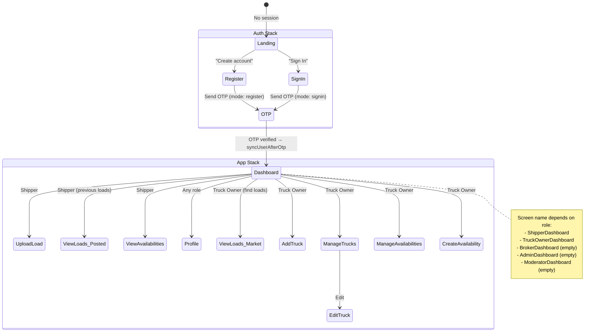
```mermaid
stateDiagram-v2
    [*] --> Landing: No session

    state "Auth Stack" as Auth {
        Landing --> Register: "Create account"
        Landing --> SignIn: "Sign In"
        Register --> OTP: Send OTP (mode: register)
        SignIn --> OTP: Send OTP (mode: signin)
    }

    OTP --> Dashboard: OTP verified → syncUserAfterOtp

    state "App Stack" as App {
        Dashboard --> UploadLoad: Shipper
        Dashboard --> ViewLoads_Posted: Shipper (previous loads)
        Dashboard --> ViewAvailabilities: Shipper
        Dashboard --> Profile: Any role

        Dashboard --> ViewLoads_Market: Truck Owner (find loads)
        Dashboard --> AddTruck: Truck Owner
        Dashboard --> ManageTrucks: Truck Owner
        Dashboard --> ManageAvailabilities: Truck Owner
        Dashboard --> CreateAvailability: Truck Owner

        ManageTrucks --> EditTruck: Edit
    }

    note right of Dashboard
        Screen name depends on role:
        - ShipperDashboard
        - TruckOwnerDashboard
        - BrokerDashboard (empty)
        - AdminDashboard (empty)
        - ModeratorDashboard (empty)
    end note
```

---

---

## 15. Multi-Language (i18n) System

### Supported Languages

| Code | Language | Native | Status |
|------|----------|--------|--------|
| `en` | English | English | Complete (master) |
| `hi` | Hindi | हिन्दी | Complete |
| `te` | Telugu | తెలుగు | Complete |
| `kn` | Kannada | ಕನ್ನಡ | Complete |

### Architecture

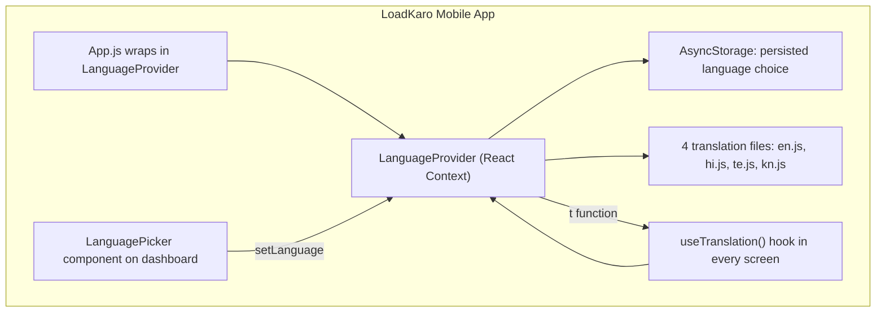
```mermaid
flowchart TD
    subgraph MobileApp["LoadKaro Mobile App"]
        AppJS["App.js wraps in LanguageProvider"]
        Provider["LanguageProvider (React Context)"]
        Storage["AsyncStorage: persisted language choice"]
        Translations["4 translation files: en.js, hi.js, te.js, kn.js"]
        Hook["useTranslation() hook in every screen"]
        Picker["LanguagePicker component on dashboard"]
    end

    AppJS --> Provider
    Provider --> Storage
    Provider --> Translations
    Hook --> Provider
    Picker -->|setLanguage| Provider
    Provider -->|t function| Hook
```

### Key design decisions

- **No heavy library** — Pure React Context + plain JS objects. No i18next/react-intl overhead. Simple enough for the team to maintain.
- **Flat key structure** — All ~250 keys are flat strings (`t('call_shipper')`), no nested namespaces. Easy to search and maintain.
- **Fallback chain** — `t('key')` checks current language first, then falls back to English, then returns the raw key. App never crashes due to missing translation.
- **Persistence** — Language choice saved in AsyncStorage, survives app restarts.
- **Dashboard not translated** — Admin/moderator dashboard remains English-only (admin staff are expected to be English-literate). Only the mobile app is multi-language.

### Coverage

~250 translation keys covering: auth flow, dashboard, profile, verification (3 variants), truck management, loads marketplace, availabilities marketplace, pagination, filters, error messages, empty states, and all UI labels.

---

## 16. Marketplace Connection System

### Interest/Lead Tracking

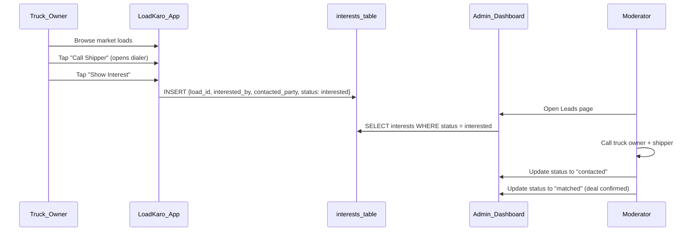
```mermaid
sequenceDiagram
    participant TruckOwner as Truck_Owner
    participant App as LoadKaro_App
    participant DB as interests_table
    participant Dashboard as Admin_Dashboard
    participant Moderator as Moderator

    TruckOwner->>App: Browse market loads
    TruckOwner->>App: Tap "Call Shipper" (opens dialer)
    TruckOwner->>App: Tap "Show Interest"
    App->>DB: INSERT {load_id, interested_by, contacted_party, status: interested}
    
    Moderator->>Dashboard: Open Leads page
    Dashboard->>DB: SELECT interests WHERE status = interested
    Moderator->>Moderator: Call truck owner + shipper
    Moderator->>Dashboard: Update status to "contacted"
    Moderator->>Dashboard: Update status to "matched" (deal confirmed)
```

### Trust indicators on marketplace cards

- Shipper verification badge (verified/pending/unverified/rejected) shown on load cards
- Truck verification badge shown on availability cards
- Rate displayed in ₹ when available

---

## 17. Audit Logging

Every admin/moderator action is logged in the `audit_log` table:

| Action | When logged |
|--------|------------|
| `update_record` | Any PATCH via admin API |
| `delete_record` | Any DELETE via admin API |
| `verify_user` | User verification approved |
| `reject_user` | User verification rejected |
| `verify_truck` | Truck verification approved |
| `reject_truck` | Truck verification rejected |
| `mark_alert_handled` | Alert marked as handled |
| `close_record` | Record status set to closed |
| `create_moderator` | New moderator created via OTP |
| `review_verification` | Verification decision made |

Each entry records: `actor_id`, `actor_role`, `action`, `entity_type`, `entity_id`, `details` (JSONB), `created_at`.

---

*This document is the master technical reference for the LoadKaro platform. Update it when adding new features, tables, API endpoints, or changing authentication/security behavior.*
