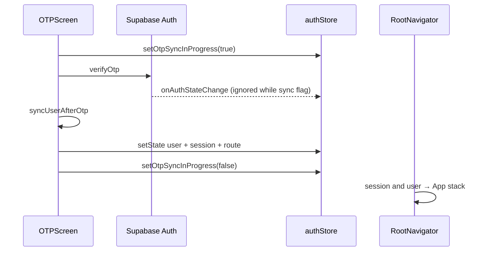

# LoadKaro QA — Implementation History

**Last updated:** 2026-05-23  
**Purpose:** Restore context from the QA review and fix pass. Use this file (not the Cursor plan file) to resume work or onboard another session.

**Source documents (user-provided):**
- `LoadKaro Application report.docx` — E2E QA report (mostly passed)
- `defect in webapplication.xlsx` — 24 tracked defects (mobile + admin dashboard)

**Related plan (read-only reference):** `.cursor/plans/loadkaro_qa_issues_review_446662b8.plan.md`

---

## Executive summary

| Category | Count | Notes |
|----------|-------|--------|
| Fixed in code (P1/P2) | 7 workstreams | All plan todos completed |
| Already OK / verify only | 2 | Export CSV disabled when empty; Handled at/by em dash |
| By design / no code change | 3 | Luhn IDs, Close button rules, Expired in Validity column |
| Not implemented (P3) | 0 | P3 items completed in follow-up pass (2026-05-23) |

The Word report said **passed**; the Excel log captured edge cases. **DEF_001** (OTP hang) was the only hard/mobile-blocking item.

---

## Issue checklist (from Excel + plan)

### Mobile

| ID | Issue | Severity | Status | Notes |
|----|-------|----------|--------|-------|
| DEF_001 | OTP failure, “Something went wrong”, hang, blank screen, session | P1 High | **Fixed** | See [OTP fix](#def_001--otp-sessionprofile-race) |
| DEF_002 | Upload: no delete, no file size info | P2 Medium | **Fixed** | `VerificationModal.js` |

### Admin dashboard — high

| ID | Issue | Severity | Status | Notes |
|----|-------|----------|--------|-------|
| BUG-010 | Raw “Forbidden” on Alerts | High | **Fixed** | Friendly 403 message; moderators already lack Alerts nav |
| Loads | Invalid rate (e.g. ₹8) | P1 High | **Fixed** | Min ₹100 on mobile post; ⚠ on dashboard for &lt; 100 |

### Availabilities

| ID | Issue | Status | Notes |
|----|-------|--------|-------|
| BUG-001 | “Available from from” label typo | **Fixed** | `dateFilter.label` → `"Date"` (template adds “ from” / “ to”) |
| BUG-002 | ID format `AVL - 00000 - -` confusing | **By design** | Luhn check-digit UI; optional: add tooltip later |
| BUG-003 | Placeholder “Search current location…” | **Fixed** | → “Search route or location…” |
| BUG-004 | Date filters only mm/dd/yyyy | **Fixed** | Labels show “Date from” / “Date to” |
| BUG-005 | Status vs Expired mixed | **Clarified** | “Expired” is in Validity column, not Status |
| BUG-006 | “Remaining” column confusing | **Fixed** | Renamed to **Validity** |
| BUG-007 | Edit vs Edit+Close inconsistent | **By design** | Close only when status ≠ closed |
| BUG-008 | Filter alignment | **Fixed** | `items-end` + grouped route filters |
| BUG-009 | Route filters separated | **Fixed** | Origin/dest grouped in dashed boxes |

### Alerts

| ID | Issue | Status | Notes |
|----|-------|--------|-------|
| BUG-010 | Forbidden message | **Fixed** | (see above) |
| BUG-011 | Empty page shows full table shell | **Fixed** | Icon + “No records found” + hint |
| BUG-012 | Search placeholder unclear | **Fixed** | “Search by alert or load ID…” |
| BUG-013 | Pagination at 0 rows | **Fixed** | Hidden when `total === 0` |
| BUG-014 | Large blank empty area | **Fixed** | With BUG-011 |
| BUG-015 | Export enabled with no data | **Already OK** | `disabled={rows.length === 0}` |
| BUG-016 | Empty Handled at/by | **Already OK** | `formatAlertWhen` / `HandledByCell` use “—” |
| BUG-017 | Search persists across modules | **Fixed** | Reset filters on `tableName` change |

### Dashboard / loads (other)

| ID | Issue | Status | Notes |
|----|-------|--------|-------|
| DEF_003 | Availability breakdown unclear | **Fixed** | `availabilitiesByStatus` chart on dashboard |
| Loads DEF_001 | Load ID suffix inconsistent | **By design** | `LD-#####-#` Luhn format |
| Loads DEF_003 | Status open/closed casing | **Fixed** | `formatStatusLabel` in `StatusBadge` |
| Loads DEF_004 | Filter validation missing | **Fixed** | Date from ≤ to validation in `fetchRows` |
| BUG-002 | ID format confusing | **Fixed** | Helper text under ID search |
| BUG-017 regression | `?q=` cleared on mount | **Fixed** | Reset only on table change; apply `initialSearchValue` separately |
| Dashboard stats | Unhandled alerts count wrong | **Fixed** | Boolean coercion for `is_handled` in `stats.ts` |
| Dashboard rate edit | Could save ₹8 via inline edit | **Fixed** | `validateRateValue` on inline/modal save |

---

## Implementation details

### DEF_001 — OTP session/profile race

**Symptom:** After OTP, user saw generic error, long spinner, or blank screen. `onAuthStateChange` set `session` before `public.users` profile loaded; `RootNavigator` showed full-screen spinner when `session && !user`.

**Fix strategy:**
1. **`_otpSyncInProgress`** — While `OTPScreen` runs `syncUserAfterOtp`, skip auth listener store updates so OTP screen stays mounted.
2. **Atomic success** — After sync, set `{ user, dashboardRoute, session }` together in `OTPScreen`.
3. **Failed profile fetch** — If no existing user and `loadUserProfile` fails, sign out (escape infinite spinner).
4. **Safety timeout** — `RootNavigator` signs out after 15s if still `session && !user`.

**Files changed:**
| File | Change |
|------|--------|
| `LoadKaro/store/authStore.ts` | `_otpSyncInProgress`, `setOtpSyncInProgress`, listener guard, sign-out on failed fetch |
| `LoadKaro/screens/OTPScreen.js` | Sync flag, loading UI, atomic `setState` after sync |
| `LoadKaro/navigation/RootNavigator.js` | `STUCK_SPINNER_TIMEOUT_MS = 15_000` |
| `LoadKaro/i18n/en.js` (+ hi, te, kn) | `verifying` key |

**Env / backend (not code):** `EXPO_PUBLIC_SUPABASE_*`, SMS provider, RLS on `users`, sign-in vs register in `syncUserAfterOtp.js`.

---

### BUG-010 — Forbidden on Alerts

**Files:**
- `admin-dashboard/src/components/admin/common-data-table.tsx` — Map HTTP 403 to friendly message.
- `admin-dashboard/src/components/dashboard/dashboard-shell.tsx` — `MODERATOR_SECTIONS` already omits Alerts (no change needed).

---

### Availabilities UX batch

**Files:**
- `admin-dashboard/src/app/admin/availabilities/page.tsx` — placeholder, `dateFilter.label: "Date"`, column `Validity`.
- `admin-dashboard/src/components/admin/common-data-table.tsx` — route filter grouping, empty state, pagination hide, search reset, 403 message.

---

### Alerts UX batch

**Files:**
- `admin-dashboard/src/app/admin/alerts/page.tsx` — search placeholder.
- `admin-dashboard/src/components/admin/common-data-table.tsx` — shared table improvements (see above).

---

### Loads invalid rate

**Files:**
- `LoadKaro/screens/UploadLoadScreen.js` — reject rate &lt; ₹100 when provided.
- `LoadKaro/i18n/*.js` — `rate_too_low`.
- `admin-dashboard/src/app/admin/loads/page.tsx` — show `⚠` when rate &lt; 100 (does not block edit).

---

### DEF_002 — Verification upload

**Files:**
- `LoadKaro/components/VerificationModal.js` — delete/replace, 5 MB limit, size hint, client-side size check.
- `LoadKaro/i18n/*.js` — `max_file_size`, `file_too_large`.

---

### DEF_003 — Dashboard availability breakdown

**Files:**
- `admin-dashboard/src/lib/supabase/queries/stats.ts` — `availabilitiesByStatus` (`available`, `closed`, `cancelled`).
- `admin-dashboard/src/components/dashboard/stats-grid.tsx` — “Availabilities by status” `BreakdownBar`.

---

## Architecture (OTP flow — after fix)



---

## Retest checklist

### Mobile (Expo / APK)
- [ ] Register with new phone → OTP → lands on correct role dashboard
- [ ] Sign in existing user → OTP → no blank spinner hang
- [ ] Wrong OTP → clear error (not stuck spinner)
- [ ] Verification modal: upload, delete file, try file &gt; 5 MB
- [ ] Post load with rate 8 → blocked; rate 500 → OK

### Admin dashboard
- [ ] Login as **admin** → Dashboard shows availability breakdown bar
- [ ] Availabilities: labels “Date from/to”, “Validity”, route filter groups, search placeholder
- [ ] Alerts: empty state, no pagination when 0 rows, search placeholder
- [ ] Loads: suspicious low rates show ⚠
- [ ] Navigate Loads → Availabilities → Alerts: search/filters do not leak (BUG-017)
- [ ] Login as **moderator** → no Alerts in sidebar; no raw Forbidden if URL forced

---

## Follow-up pass (2026-05-23)

Additional bugs found when re-auditing the QA fixes:

1. **BUG-017 regression** — `useEffect([tableName])` cleared search on first mount, breaking global-search deep links (`?q=LD-…`).
2. **Unhandled alerts badge** — `countTable` used string `"false"` for boolean `is_handled`.
3. **P3 items** — Status labels, date validation, ID helper, dashboard rate edit validation.

---

## P3 backlog

All P3 items from the original plan are now implemented.

---

## Quick file index

```
mobile App/
  QA_IMPLEMENTATION_HISTORY.md          ← this file
  LoadKaro/
    store/authStore.ts                  ← OTP sync flag
    screens/OTPScreen.js
    navigation/RootNavigator.js
    screens/UploadLoadScreen.js         ← rate validation
    components/VerificationModal.js     ← upload delete + size
    i18n/en.js, hi.js, te.js, kn.js
  admin-dashboard/
    src/components/admin/common-data-table.tsx   ← table UX hub
    src/app/admin/availabilities/page.tsx
    src/app/admin/alerts/page.tsx
    src/app/admin/loads/page.tsx
    src/lib/supabase/queries/stats.ts
    src/components/dashboard/stats-grid.tsx
    src/components/dashboard/dashboard-shell.tsx
```

---

## How to resume in a new chat

Paste or @-mention this file and say:

> Continue from QA_IMPLEMENTATION_HISTORY.md — [retest X / implement P3 / fix regression Y]

Do **not** rely on the Cursor plan file for implementation state; this history file is the project record.

---

## Session log

| Date | Action |
|------|--------|
| 2026-05-23 | QA docs reviewed; plan created; all 7 todos implemented and verified in repo |
| 2026-05-23 | Re-audit: fixed BUG-017 regression, stats boolean filter, P3 items, rate edit validation |
